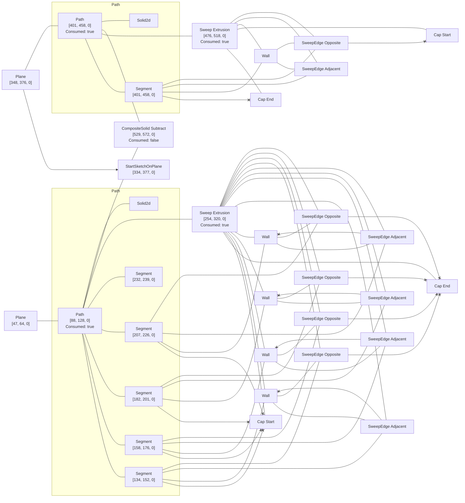

```mermaid
flowchart LR
  subgraph path11 [Path]
    11["Path<br>[88, 128, 0]<br>Consumed: true"]
      %% [ProgramBodyItem { index: 1 }, VariableDeclarationDeclaration, VariableDeclarationInit, PipeBodyItem { index: 0 }]
    12["Segment<br>[134, 152, 0]"]
      %% [ProgramBodyItem { index: 1 }, VariableDeclarationDeclaration, VariableDeclarationInit, PipeBodyItem { index: 1 }]
    13["Segment<br>[158, 176, 0]"]
      %% [ProgramBodyItem { index: 1 }, VariableDeclarationDeclaration, VariableDeclarationInit, PipeBodyItem { index: 2 }]
    14["Segment<br>[182, 201, 0]"]
      %% [ProgramBodyItem { index: 1 }, VariableDeclarationDeclaration, VariableDeclarationInit, PipeBodyItem { index: 3 }]
    15["Segment<br>[207, 226, 0]"]
      %% [ProgramBodyItem { index: 1 }, VariableDeclarationDeclaration, VariableDeclarationInit, PipeBodyItem { index: 4 }]
    16["Segment<br>[232, 239, 0]"]
      %% [ProgramBodyItem { index: 1 }, VariableDeclarationDeclaration, VariableDeclarationInit, PipeBodyItem { index: 5 }]
    25[Solid2d]
  end
  subgraph path20 [Path]
    20["Path<br>[401, 458, 0]<br>Consumed: true"]
      %% [ProgramBodyItem { index: 4 }, VariableDeclarationDeclaration, VariableDeclarationInit]
    21["Segment<br>[401, 458, 0]"]
      %% [ProgramBodyItem { index: 4 }, VariableDeclarationDeclaration, VariableDeclarationInit]
    24[Solid2d]
  end
  1["Cap End"]
    %% face_code_ref=Missing NodePath
  2["Cap End"]
    %% face_code_ref=Missing NodePath
  3["Cap Start"]
    %% face_code_ref=Missing NodePath
  4["Cap Start"]
    %% face_code_ref=Missing NodePath
  5[Wall]
    %% face_code_ref=Missing NodePath
  6[Wall]
    %% face_code_ref=Missing NodePath
  7[Wall]
    %% face_code_ref=Missing NodePath
  8[Wall]
    %% face_code_ref=Missing NodePath
  9[Wall]
    %% face_code_ref=Missing NodePath
  10["Plane<br>[47, 64, 0]"]
    %% [ProgramBodyItem { index: 0 }, VariableDeclarationDeclaration, VariableDeclarationInit]
  17["Sweep Extrusion<br>[254, 320, 0]<br>Consumed: true"]
    %% [ProgramBodyItem { index: 2 }, VariableDeclarationDeclaration, VariableDeclarationInit]
  18["StartSketchOnPlane<br>[334, 377, 0]"]
    %% [ProgramBodyItem { index: 3 }, VariableDeclarationDeclaration, VariableDeclarationInit]
  19["Plane<br>[348, 376, 0]"]
    %% [ProgramBodyItem { index: 3 }, VariableDeclarationDeclaration, VariableDeclarationInit, CallKwUnlabeledArg]
  22["Sweep Extrusion<br>[476, 518, 0]<br>Consumed: true"]
    %% [ProgramBodyItem { index: 5 }, VariableDeclarationDeclaration, VariableDeclarationInit]
  23["CompositeSolid Subtract<br>[529, 572, 0]<br>Consumed: false"]
    %% [ProgramBodyItem { index: 6 }, VariableDeclarationDeclaration, VariableDeclarationInit]
  26["SweepEdge Adjacent"]
  27["SweepEdge Adjacent"]
  28["SweepEdge Adjacent"]
  29["SweepEdge Adjacent"]
  30["SweepEdge Adjacent"]
  31["SweepEdge Opposite"]
  32["SweepEdge Opposite"]
  33["SweepEdge Opposite"]
  34["SweepEdge Opposite"]
  35["SweepEdge Opposite"]
  17 --- 1
  31 <--x 1
  32 <--x 1
  33 <--x 1
  34 <--x 1
  21 <--x 2
  22 --- 2
  12 <--x 3
  13 <--x 3
  14 <--x 3
  15 <--x 3
  17 --- 3
  22 --- 4
  35 <--x 4
  12 --- 5
  17 --- 5
  5 --- 26
  26 <--x 5
  5 --- 31
  13 --- 6
  17 --- 6
  6 --- 27
  27 <--x 6
  6 --- 32
  14 --- 7
  17 --- 7
  7 --- 28
  28 <--x 7
  7 --- 33
  15 --- 8
  17 --- 8
  8 --- 29
  29 <--x 8
  8 --- 34
  21 --- 9
  22 --- 9
  9 --- 30
  9 --- 35
  10 --- 11
  11 --- 12
  11 --- 13
  11 --- 14
  11 --- 15
  11 --- 16
  11 ---- 17
  11 --- 23
  11 --- 25
  12 --- 26
  12 --- 31
  13 --- 27
  13 --- 32
  14 --- 28
  14 --- 33
  15 --- 29
  15 --- 34
  17 --- 26
  17 --- 27
  17 --- 28
  17 --- 29
  17 --- 31
  17 --- 32
  17 --- 33
  17 --- 34
  19 x--> 18
  19 --- 20
  20 --- 21
  20 ---- 22
  20 --- 23
  20 --- 24
  21 --- 30
  21 --- 35
  22 --- 30
  22 --- 35
```
