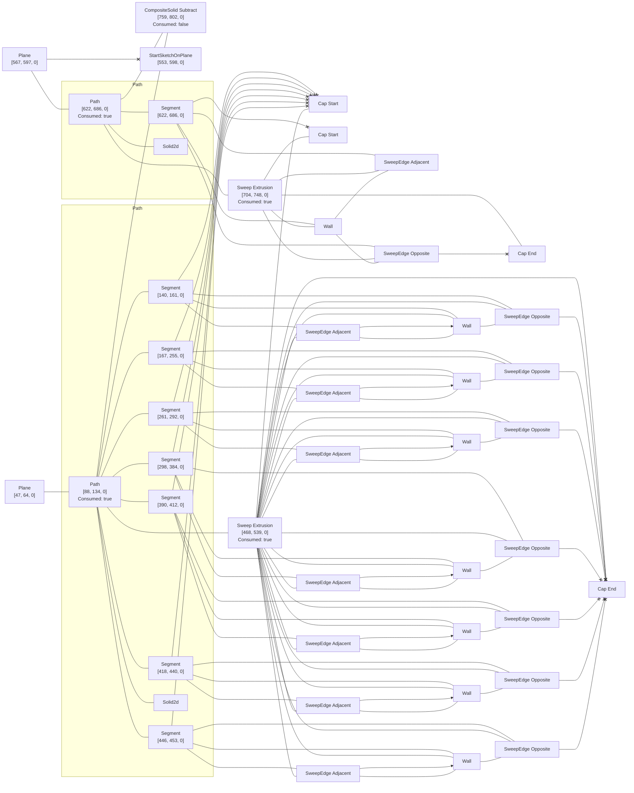

```mermaid
flowchart LR
  subgraph path7 [Path]
    7["Path<br>[88, 134, 0]<br>Consumed: true"]
      %% [ProgramBodyItem { index: 1 }, VariableDeclarationDeclaration, VariableDeclarationInit, PipeBodyItem { index: 0 }]
    10["Segment<br>[140, 161, 0]"]
      %% [ProgramBodyItem { index: 1 }, VariableDeclarationDeclaration, VariableDeclarationInit, PipeBodyItem { index: 1 }]
    11["Segment<br>[167, 255, 0]"]
      %% [ProgramBodyItem { index: 1 }, VariableDeclarationDeclaration, VariableDeclarationInit, PipeBodyItem { index: 2 }]
    12["Segment<br>[261, 292, 0]"]
      %% [ProgramBodyItem { index: 1 }, VariableDeclarationDeclaration, VariableDeclarationInit, PipeBodyItem { index: 3 }]
    13["Segment<br>[298, 384, 0]"]
      %% [ProgramBodyItem { index: 1 }, VariableDeclarationDeclaration, VariableDeclarationInit, PipeBodyItem { index: 4 }]
    14["Segment<br>[390, 412, 0]"]
      %% [ProgramBodyItem { index: 1 }, VariableDeclarationDeclaration, VariableDeclarationInit, PipeBodyItem { index: 5 }]
    15["Segment<br>[418, 440, 0]"]
      %% [ProgramBodyItem { index: 1 }, VariableDeclarationDeclaration, VariableDeclarationInit, PipeBodyItem { index: 6 }]
    16["Segment<br>[446, 453, 0]"]
      %% [ProgramBodyItem { index: 1 }, VariableDeclarationDeclaration, VariableDeclarationInit, PipeBodyItem { index: 7 }]
    19[Solid2d]
  end
  subgraph path6 [Path]
    6["Path<br>[622, 686, 0]<br>Consumed: true"]
      %% [ProgramBodyItem { index: 4 }, VariableDeclarationDeclaration, VariableDeclarationInit]
    17["Segment<br>[622, 686, 0]"]
      %% [ProgramBodyItem { index: 4 }, VariableDeclarationDeclaration, VariableDeclarationInit]
    18[Solid2d]
  end
  8["Plane<br>[47, 64, 0]"]
    %% [ProgramBodyItem { index: 0 }, VariableDeclarationDeclaration, VariableDeclarationInit]
  21["Sweep Extrusion<br>[468, 539, 0]<br>Consumed: true"]
    %% [ProgramBodyItem { index: 2 }, VariableDeclarationDeclaration, VariableDeclarationInit]
  39[Wall]
    %% face_code_ref=Missing NodePath
  40[Wall]
    %% face_code_ref=Missing NodePath
  41[Wall]
    %% face_code_ref=Missing NodePath
  42[Wall]
    %% face_code_ref=Missing NodePath
  43[Wall]
    %% face_code_ref=Missing NodePath
  44[Wall]
    %% face_code_ref=Missing NodePath
  45[Wall]
    %% face_code_ref=Missing NodePath
  3["Cap Start"]
    %% face_code_ref=Missing NodePath
  1["Cap End"]
    %% face_code_ref=Missing NodePath
  31["SweepEdge Opposite"]
  23["SweepEdge Adjacent"]
  32["SweepEdge Opposite"]
  24["SweepEdge Adjacent"]
  33["SweepEdge Opposite"]
  25["SweepEdge Adjacent"]
  34["SweepEdge Opposite"]
  26["SweepEdge Adjacent"]
  35["SweepEdge Opposite"]
  27["SweepEdge Adjacent"]
  36["SweepEdge Opposite"]
  28["SweepEdge Adjacent"]
  37["SweepEdge Opposite"]
  29["SweepEdge Adjacent"]
  9["Plane<br>[567, 597, 0]"]
    %% [ProgramBodyItem { index: 3 }, VariableDeclarationDeclaration, VariableDeclarationInit, CallKwUnlabeledArg]
  22["Sweep Extrusion<br>[704, 748, 0]<br>Consumed: true"]
    %% [ProgramBodyItem { index: 5 }, VariableDeclarationDeclaration, VariableDeclarationInit]
  46[Wall]
    %% face_code_ref=Missing NodePath
  4["Cap Start"]
    %% face_code_ref=Missing NodePath
  2["Cap End"]
    %% face_code_ref=Missing NodePath
  38["SweepEdge Opposite"]
  30["SweepEdge Adjacent"]
  5["CompositeSolid Subtract<br>[759, 802, 0]<br>Consumed: false"]
    %% [ProgramBodyItem { index: 6 }, VariableDeclarationDeclaration, VariableDeclarationInit]
  20["StartSketchOnPlane<br>[553, 598, 0]"]
    %% [ProgramBodyItem { index: 3 }, VariableDeclarationDeclaration, VariableDeclarationInit]
  21 --- 1
  31 <--x 1
  32 <--x 1
  33 <--x 1
  34 <--x 1
  35 <--x 1
  36 <--x 1
  37 <--x 1
  22 --- 2
  38 <--x 2
  10 <--x 3
  11 <--x 3
  12 <--x 3
  13 <--x 3
  14 <--x 3
  15 <--x 3
  16 <--x 3
  21 --- 3
  17 <--x 4
  22 --- 4
  6 --- 5
  7 --- 5
  9 --- 6
  6 --- 17
  6 --- 18
  6 ---- 22
  8 --- 7
  7 --- 10
  7 --- 11
  7 --- 12
  7 --- 13
  7 --- 14
  7 --- 15
  7 --- 16
  7 --- 19
  7 ---- 21
  9 <--x 20
  10 --- 23
  10 --- 31
  10 --- 39
  11 --- 24
  11 --- 32
  11 --- 40
  12 --- 25
  12 --- 33
  12 --- 41
  13 --- 26
  13 --- 34
  13 --- 42
  14 --- 27
  14 --- 35
  14 --- 43
  15 --- 28
  15 --- 36
  15 --- 44
  16 --- 29
  16 --- 37
  16 --- 45
  17 --- 30
  17 --- 38
  17 --- 46
  21 --- 23
  21 --- 24
  21 --- 25
  21 --- 26
  21 --- 27
  21 --- 28
  21 --- 29
  21 --- 31
  21 --- 32
  21 --- 33
  21 --- 34
  21 --- 35
  21 --- 36
  21 --- 37
  21 --- 39
  21 --- 40
  21 --- 41
  21 --- 42
  21 --- 43
  21 --- 44
  21 --- 45
  22 --- 30
  22 --- 38
  22 --- 46
  39 --- 23
  23 x--> 39
  40 --- 24
  24 x--> 40
  41 --- 25
  25 x--> 41
  42 --- 26
  26 x--> 42
  43 --- 27
  27 x--> 43
  44 --- 28
  28 x--> 44
  45 --- 29
  29 x--> 45
  46 --- 30
  39 --- 31
  40 --- 32
  41 --- 33
  42 --- 34
  43 --- 35
  44 --- 36
  45 --- 37
  46 --- 38
```
