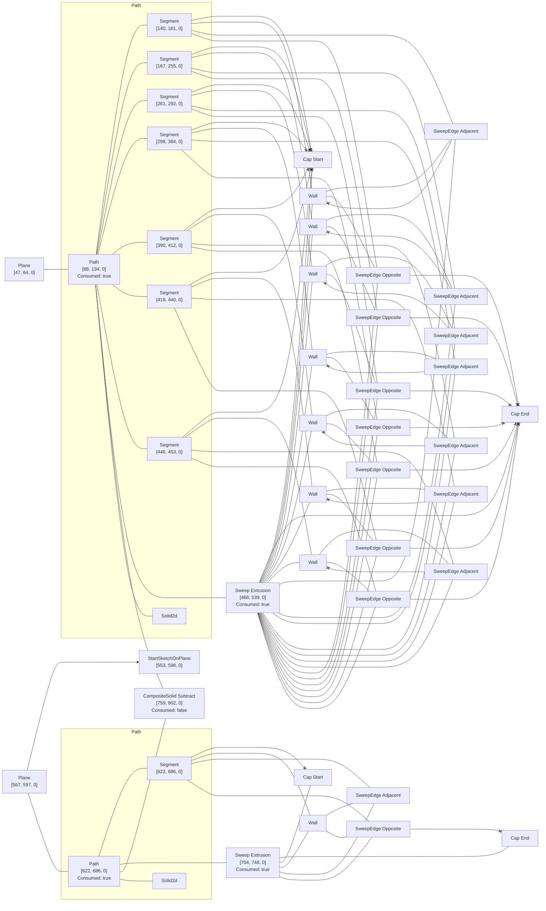

```mermaid
flowchart LR
  subgraph path14 [Path]
    14["Path<br>[88, 134, 0]<br>Consumed: true"]
      %% [ProgramBodyItem { index: 1 }, VariableDeclarationDeclaration, VariableDeclarationInit, PipeBodyItem { index: 0 }]
    15["Segment<br>[140, 161, 0]"]
      %% [ProgramBodyItem { index: 1 }, VariableDeclarationDeclaration, VariableDeclarationInit, PipeBodyItem { index: 1 }]
    16["Segment<br>[167, 255, 0]"]
      %% [ProgramBodyItem { index: 1 }, VariableDeclarationDeclaration, VariableDeclarationInit, PipeBodyItem { index: 2 }]
    17["Segment<br>[261, 292, 0]"]
      %% [ProgramBodyItem { index: 1 }, VariableDeclarationDeclaration, VariableDeclarationInit, PipeBodyItem { index: 3 }]
    18["Segment<br>[298, 384, 0]"]
      %% [ProgramBodyItem { index: 1 }, VariableDeclarationDeclaration, VariableDeclarationInit, PipeBodyItem { index: 4 }]
    19["Segment<br>[390, 412, 0]"]
      %% [ProgramBodyItem { index: 1 }, VariableDeclarationDeclaration, VariableDeclarationInit, PipeBodyItem { index: 5 }]
    20["Segment<br>[418, 440, 0]"]
      %% [ProgramBodyItem { index: 1 }, VariableDeclarationDeclaration, VariableDeclarationInit, PipeBodyItem { index: 6 }]
    21["Segment<br>[446, 453, 0]"]
      %% [ProgramBodyItem { index: 1 }, VariableDeclarationDeclaration, VariableDeclarationInit, PipeBodyItem { index: 7 }]
    30[Solid2d]
  end
  subgraph path25 [Path]
    25["Path<br>[622, 686, 0]<br>Consumed: true"]
      %% [ProgramBodyItem { index: 4 }, VariableDeclarationDeclaration, VariableDeclarationInit]
    26["Segment<br>[622, 686, 0]"]
      %% [ProgramBodyItem { index: 4 }, VariableDeclarationDeclaration, VariableDeclarationInit]
    29[Solid2d]
  end
  1["Cap End"]
    %% face_code_ref=Missing NodePath
  2["Cap End"]
    %% face_code_ref=Missing NodePath
  3["Cap Start"]
    %% face_code_ref=Missing NodePath
  4["Cap Start"]
    %% face_code_ref=Missing NodePath
  5[Wall]
    %% face_code_ref=Missing NodePath
  6[Wall]
    %% face_code_ref=Missing NodePath
  7[Wall]
    %% face_code_ref=Missing NodePath
  8[Wall]
    %% face_code_ref=Missing NodePath
  9[Wall]
    %% face_code_ref=Missing NodePath
  10[Wall]
    %% face_code_ref=Missing NodePath
  11[Wall]
    %% face_code_ref=Missing NodePath
  12[Wall]
    %% face_code_ref=Missing NodePath
  13["Plane<br>[47, 64, 0]"]
    %% [ProgramBodyItem { index: 0 }, VariableDeclarationDeclaration, VariableDeclarationInit]
  22["Sweep Extrusion<br>[468, 539, 0]<br>Consumed: true"]
    %% [ProgramBodyItem { index: 2 }, VariableDeclarationDeclaration, VariableDeclarationInit]
  23["StartSketchOnPlane<br>[553, 598, 0]"]
    %% [ProgramBodyItem { index: 3 }, VariableDeclarationDeclaration, VariableDeclarationInit]
  24["Plane<br>[567, 597, 0]"]
    %% [ProgramBodyItem { index: 3 }, VariableDeclarationDeclaration, VariableDeclarationInit, CallKwUnlabeledArg]
  27["Sweep Extrusion<br>[704, 748, 0]<br>Consumed: true"]
    %% [ProgramBodyItem { index: 5 }, VariableDeclarationDeclaration, VariableDeclarationInit]
  28["CompositeSolid Subtract<br>[759, 802, 0]<br>Consumed: false"]
    %% [ProgramBodyItem { index: 6 }, VariableDeclarationDeclaration, VariableDeclarationInit]
  31["SweepEdge Adjacent"]
  32["SweepEdge Adjacent"]
  33["SweepEdge Adjacent"]
  34["SweepEdge Adjacent"]
  35["SweepEdge Adjacent"]
  36["SweepEdge Adjacent"]
  37["SweepEdge Adjacent"]
  38["SweepEdge Adjacent"]
  39["SweepEdge Opposite"]
  40["SweepEdge Opposite"]
  41["SweepEdge Opposite"]
  42["SweepEdge Opposite"]
  43["SweepEdge Opposite"]
  44["SweepEdge Opposite"]
  45["SweepEdge Opposite"]
  46["SweepEdge Opposite"]
  22 --- 1
  39 <--x 1
  40 <--x 1
  41 <--x 1
  42 <--x 1
  43 <--x 1
  44 <--x 1
  45 <--x 1
  27 --- 2
  46 <--x 2
  15 <--x 3
  16 <--x 3
  17 <--x 3
  18 <--x 3
  19 <--x 3
  20 <--x 3
  21 <--x 3
  22 --- 3
  26 <--x 4
  27 --- 4
  15 --- 5
  22 --- 5
  5 --- 31
  31 <--x 5
  5 --- 39
  16 --- 6
  22 --- 6
  6 --- 32
  32 <--x 6
  6 --- 40
  17 --- 7
  22 --- 7
  7 --- 33
  33 <--x 7
  7 --- 41
  18 --- 8
  22 --- 8
  8 --- 34
  34 <--x 8
  8 --- 42
  19 --- 9
  22 --- 9
  9 --- 35
  35 <--x 9
  9 --- 43
  20 --- 10
  22 --- 10
  10 --- 36
  36 <--x 10
  10 --- 44
  21 --- 11
  22 --- 11
  11 --- 37
  37 <--x 11
  11 --- 45
  26 --- 12
  27 --- 12
  12 --- 38
  12 --- 46
  13 --- 14
  14 --- 15
  14 --- 16
  14 --- 17
  14 --- 18
  14 --- 19
  14 --- 20
  14 --- 21
  14 ---- 22
  14 --- 28
  14 --- 30
  15 --- 31
  15 --- 39
  16 --- 32
  16 --- 40
  17 --- 33
  17 --- 41
  18 --- 34
  18 --- 42
  19 --- 35
  19 --- 43
  20 --- 36
  20 --- 44
  21 --- 37
  21 --- 45
  22 --- 31
  22 --- 32
  22 --- 33
  22 --- 34
  22 --- 35
  22 --- 36
  22 --- 37
  22 --- 39
  22 --- 40
  22 --- 41
  22 --- 42
  22 --- 43
  22 --- 44
  22 --- 45
  24 x--> 23
  24 --- 25
  25 --- 26
  25 ---- 27
  25 --- 28
  25 --- 29
  26 --- 38
  26 --- 46
  27 --- 38
  27 --- 46
```
