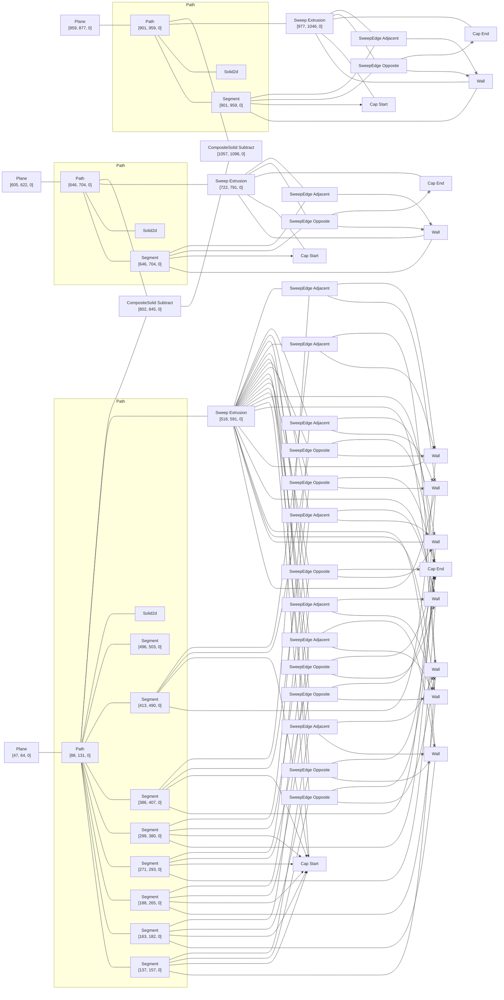

```mermaid
flowchart LR
  subgraph path4 [Path]
    4["Path<br>[88, 131, 0]"]
      %% [ProgramBodyItem { index: 1 }, VariableDeclarationDeclaration, VariableDeclarationInit, PipeBodyItem { index: 0 }]
    7["Segment<br>[137, 157, 0]"]
      %% [ProgramBodyItem { index: 1 }, VariableDeclarationDeclaration, VariableDeclarationInit, PipeBodyItem { index: 1 }]
    8["Segment<br>[163, 182, 0]"]
      %% [ProgramBodyItem { index: 1 }, VariableDeclarationDeclaration, VariableDeclarationInit, PipeBodyItem { index: 2 }]
    9["Segment<br>[188, 265, 0]"]
      %% [ProgramBodyItem { index: 1 }, VariableDeclarationDeclaration, VariableDeclarationInit, PipeBodyItem { index: 3 }]
    10["Segment<br>[271, 293, 0]"]
      %% [ProgramBodyItem { index: 1 }, VariableDeclarationDeclaration, VariableDeclarationInit, PipeBodyItem { index: 4 }]
    11["Segment<br>[299, 380, 0]"]
      %% [ProgramBodyItem { index: 1 }, VariableDeclarationDeclaration, VariableDeclarationInit, PipeBodyItem { index: 5 }]
    12["Segment<br>[386, 407, 0]"]
      %% [ProgramBodyItem { index: 1 }, VariableDeclarationDeclaration, VariableDeclarationInit, PipeBodyItem { index: 6 }]
    13["Segment<br>[413, 490, 0]"]
      %% [ProgramBodyItem { index: 1 }, VariableDeclarationDeclaration, VariableDeclarationInit, PipeBodyItem { index: 7 }]
    14["Segment<br>[496, 503, 0]"]
      %% [ProgramBodyItem { index: 1 }, VariableDeclarationDeclaration, VariableDeclarationInit, PipeBodyItem { index: 8 }]
    19[Solid2d]
  end
  subgraph path5 [Path]
    5["Path<br>[646, 704, 0]"]
      %% [ProgramBodyItem { index: 4 }, VariableDeclarationDeclaration, VariableDeclarationInit]
    15["Segment<br>[646, 704, 0]"]
      %% [ProgramBodyItem { index: 4 }, VariableDeclarationDeclaration, VariableDeclarationInit]
    17[Solid2d]
  end
  subgraph path6 [Path]
    6["Path<br>[901, 959, 0]"]
      %% [ProgramBodyItem { index: 8 }, VariableDeclarationDeclaration, VariableDeclarationInit]
    16["Segment<br>[901, 959, 0]"]
      %% [ProgramBodyItem { index: 8 }, VariableDeclarationDeclaration, VariableDeclarationInit]
    18[Solid2d]
  end
  1["Plane<br>[47, 64, 0]"]
    %% [ProgramBodyItem { index: 0 }, VariableDeclarationDeclaration, VariableDeclarationInit]
  2["Plane<br>[605, 622, 0]"]
    %% [ProgramBodyItem { index: 3 }, VariableDeclarationDeclaration, VariableDeclarationInit]
  3["Plane<br>[859, 877, 0]"]
    %% [ProgramBodyItem { index: 7 }, VariableDeclarationDeclaration, VariableDeclarationInit]
  20["Sweep Extrusion<br>[518, 591, 0]"]
    %% [ProgramBodyItem { index: 2 }, VariableDeclarationDeclaration, VariableDeclarationInit]
  21["Sweep Extrusion<br>[722, 791, 0]"]
    %% [ProgramBodyItem { index: 5 }, VariableDeclarationDeclaration, VariableDeclarationInit]
  22["Sweep Extrusion<br>[977, 1046, 0]"]
    %% [ProgramBodyItem { index: 9 }, VariableDeclarationDeclaration, VariableDeclarationInit]
  23["CompositeSolid Subtract<br>[802, 845, 0]"]
    %% [ProgramBodyItem { index: 6 }, VariableDeclarationDeclaration, VariableDeclarationInit]
  24["CompositeSolid Subtract<br>[1057, 1096, 0]"]
    %% [ProgramBodyItem { index: 10 }, VariableDeclarationDeclaration, VariableDeclarationInit]
  25[Wall]
  26[Wall]
  27[Wall]
  28[Wall]
  29[Wall]
  30[Wall]
  31[Wall]
  32[Wall]
  33[Wall]
  34["Cap Start"]
  35["Cap Start"]
  36["Cap Start"]
  37["Cap End"]
  38["Cap End"]
  39["Cap End"]
  40["SweepEdge Opposite"]
  41["SweepEdge Opposite"]
  42["SweepEdge Opposite"]
  43["SweepEdge Opposite"]
  44["SweepEdge Opposite"]
  45["SweepEdge Opposite"]
  46["SweepEdge Opposite"]
  47["SweepEdge Opposite"]
  48["SweepEdge Opposite"]
  49["SweepEdge Adjacent"]
  50["SweepEdge Adjacent"]
  51["SweepEdge Adjacent"]
  52["SweepEdge Adjacent"]
  53["SweepEdge Adjacent"]
  54["SweepEdge Adjacent"]
  55["SweepEdge Adjacent"]
  56["SweepEdge Adjacent"]
  57["SweepEdge Adjacent"]
  1 --- 4
  2 --- 5
  3 --- 6
  4 --- 7
  4 --- 8
  4 --- 9
  4 --- 10
  4 --- 11
  4 --- 12
  4 --- 13
  4 --- 14
  4 --- 19
  4 ---- 20
  4 --- 23
  5 --- 15
  5 --- 17
  5 ---- 21
  5 --- 23
  6 --- 16
  6 --- 18
  6 ---- 22
  6 --- 24
  7 --- 32
  7 x--> 36
  7 --- 45
  7 --- 50
  8 --- 29
  8 x--> 36
  8 --- 42
  8 --- 53
  9 --- 28
  9 x--> 36
  9 --- 44
  9 --- 51
  10 --- 30
  10 x--> 36
  10 --- 41
  10 --- 54
  11 --- 27
  11 x--> 36
  11 --- 43
  11 --- 55
  12 --- 26
  12 x--> 36
  12 --- 47
  12 --- 56
  13 --- 31
  13 x--> 36
  13 --- 46
  13 --- 52
  15 --- 25
  15 x--> 35
  15 --- 40
  15 --- 49
  16 --- 33
  16 x--> 34
  16 --- 48
  16 --- 57
  20 --- 26
  20 --- 27
  20 --- 28
  20 --- 29
  20 --- 30
  20 --- 31
  20 --- 32
  20 --- 36
  20 --- 39
  20 --- 41
  20 --- 42
  20 --- 43
  20 --- 44
  20 --- 45
  20 --- 46
  20 --- 47
  20 --- 50
  20 --- 51
  20 --- 52
  20 --- 53
  20 --- 54
  20 --- 55
  20 --- 56
  21 --- 25
  21 --- 35
  21 --- 38
  21 --- 40
  21 --- 49
  22 --- 33
  22 --- 34
  22 --- 37
  22 --- 48
  22 --- 57
  23 --- 24
  40 <--x 25
  49 <--x 25
  47 <--x 26
  55 <--x 26
  56 <--x 26
  43 <--x 27
  54 <--x 27
  55 <--x 27
  44 <--x 28
  51 <--x 28
  53 <--x 28
  42 <--x 29
  50 <--x 29
  53 <--x 29
  41 <--x 30
  51 <--x 30
  54 <--x 30
  46 <--x 31
  52 <--x 31
  56 <--x 31
  45 <--x 32
  50 <--x 32
  52 <--x 32
  48 <--x 33
  57 <--x 33
  48 <--x 37
  40 <--x 38
  41 <--x 39
  42 <--x 39
  43 <--x 39
  44 <--x 39
  45 <--x 39
  46 <--x 39
  47 <--x 39
```
