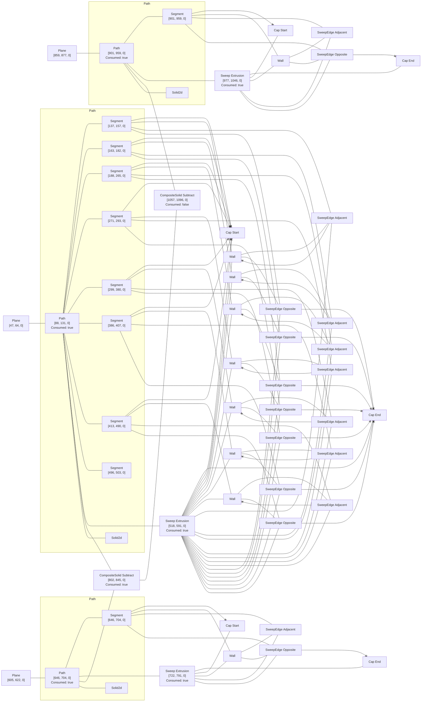

```mermaid
flowchart LR
  subgraph path17 [Path]
    17["Path<br>[88, 131, 0]<br>Consumed: true"]
      %% [ProgramBodyItem { index: 1 }, VariableDeclarationDeclaration, VariableDeclarationInit, PipeBodyItem { index: 0 }]
    18["Segment<br>[137, 157, 0]"]
      %% [ProgramBodyItem { index: 1 }, VariableDeclarationDeclaration, VariableDeclarationInit, PipeBodyItem { index: 1 }]
    19["Segment<br>[163, 182, 0]"]
      %% [ProgramBodyItem { index: 1 }, VariableDeclarationDeclaration, VariableDeclarationInit, PipeBodyItem { index: 2 }]
    20["Segment<br>[188, 265, 0]"]
      %% [ProgramBodyItem { index: 1 }, VariableDeclarationDeclaration, VariableDeclarationInit, PipeBodyItem { index: 3 }]
    21["Segment<br>[271, 293, 0]"]
      %% [ProgramBodyItem { index: 1 }, VariableDeclarationDeclaration, VariableDeclarationInit, PipeBodyItem { index: 4 }]
    22["Segment<br>[299, 380, 0]"]
      %% [ProgramBodyItem { index: 1 }, VariableDeclarationDeclaration, VariableDeclarationInit, PipeBodyItem { index: 5 }]
    23["Segment<br>[386, 407, 0]"]
      %% [ProgramBodyItem { index: 1 }, VariableDeclarationDeclaration, VariableDeclarationInit, PipeBodyItem { index: 6 }]
    24["Segment<br>[413, 490, 0]"]
      %% [ProgramBodyItem { index: 1 }, VariableDeclarationDeclaration, VariableDeclarationInit, PipeBodyItem { index: 7 }]
    25["Segment<br>[496, 503, 0]"]
      %% [ProgramBodyItem { index: 1 }, VariableDeclarationDeclaration, VariableDeclarationInit, PipeBodyItem { index: 8 }]
    38[Solid2d]
  end
  subgraph path28 [Path]
    28["Path<br>[646, 704, 0]<br>Consumed: true"]
      %% [ProgramBodyItem { index: 4 }, VariableDeclarationDeclaration, VariableDeclarationInit]
    29["Segment<br>[646, 704, 0]"]
      %% [ProgramBodyItem { index: 4 }, VariableDeclarationDeclaration, VariableDeclarationInit]
    37[Solid2d]
  end
  subgraph path33 [Path]
    33["Path<br>[901, 959, 0]<br>Consumed: true"]
      %% [ProgramBodyItem { index: 8 }, VariableDeclarationDeclaration, VariableDeclarationInit]
    34["Segment<br>[901, 959, 0]"]
      %% [ProgramBodyItem { index: 8 }, VariableDeclarationDeclaration, VariableDeclarationInit]
    39[Solid2d]
  end
  1["Cap End"]
    %% face_code_ref=Missing NodePath
  2["Cap End"]
    %% face_code_ref=Missing NodePath
  3["Cap End"]
    %% face_code_ref=Missing NodePath
  4["Cap Start"]
    %% face_code_ref=Missing NodePath
  5["Cap Start"]
    %% face_code_ref=Missing NodePath
  6["Cap Start"]
    %% face_code_ref=Missing NodePath
  7[Wall]
    %% face_code_ref=Missing NodePath
  8[Wall]
    %% face_code_ref=Missing NodePath
  9[Wall]
    %% face_code_ref=Missing NodePath
  10[Wall]
    %% face_code_ref=Missing NodePath
  11[Wall]
    %% face_code_ref=Missing NodePath
  12[Wall]
    %% face_code_ref=Missing NodePath
  13[Wall]
    %% face_code_ref=Missing NodePath
  14[Wall]
    %% face_code_ref=Missing NodePath
  15[Wall]
    %% face_code_ref=Missing NodePath
  16["Plane<br>[47, 64, 0]"]
    %% [ProgramBodyItem { index: 0 }, VariableDeclarationDeclaration, VariableDeclarationInit]
  26["Sweep Extrusion<br>[518, 591, 0]<br>Consumed: true"]
    %% [ProgramBodyItem { index: 2 }, VariableDeclarationDeclaration, VariableDeclarationInit]
  27["Plane<br>[605, 622, 0]"]
    %% [ProgramBodyItem { index: 3 }, VariableDeclarationDeclaration, VariableDeclarationInit]
  30["Sweep Extrusion<br>[722, 791, 0]<br>Consumed: true"]
    %% [ProgramBodyItem { index: 5 }, VariableDeclarationDeclaration, VariableDeclarationInit]
  31["CompositeSolid Subtract<br>[802, 845, 0]<br>Consumed: true"]
    %% [ProgramBodyItem { index: 6 }, VariableDeclarationDeclaration, VariableDeclarationInit]
  32["Plane<br>[859, 877, 0]"]
    %% [ProgramBodyItem { index: 7 }, VariableDeclarationDeclaration, VariableDeclarationInit]
  35["Sweep Extrusion<br>[977, 1046, 0]<br>Consumed: true"]
    %% [ProgramBodyItem { index: 9 }, VariableDeclarationDeclaration, VariableDeclarationInit]
  36["CompositeSolid Subtract<br>[1057, 1096, 0]<br>Consumed: false"]
    %% [ProgramBodyItem { index: 10 }, VariableDeclarationDeclaration, VariableDeclarationInit]
  40["SweepEdge Adjacent"]
  41["SweepEdge Adjacent"]
  42["SweepEdge Adjacent"]
  43["SweepEdge Adjacent"]
  44["SweepEdge Adjacent"]
  45["SweepEdge Adjacent"]
  46["SweepEdge Adjacent"]
  47["SweepEdge Adjacent"]
  48["SweepEdge Adjacent"]
  49["SweepEdge Opposite"]
  50["SweepEdge Opposite"]
  51["SweepEdge Opposite"]
  52["SweepEdge Opposite"]
  53["SweepEdge Opposite"]
  54["SweepEdge Opposite"]
  55["SweepEdge Opposite"]
  56["SweepEdge Opposite"]
  57["SweepEdge Opposite"]
  26 --- 1
  49 <--x 1
  50 <--x 1
  51 <--x 1
  52 <--x 1
  53 <--x 1
  54 <--x 1
  55 <--x 1
  30 --- 2
  56 <--x 2
  35 --- 3
  57 <--x 3
  18 <--x 4
  19 <--x 4
  20 <--x 4
  21 <--x 4
  22 <--x 4
  23 <--x 4
  24 <--x 4
  26 --- 4
  29 <--x 5
  30 --- 5
  34 <--x 6
  35 --- 6
  18 --- 7
  26 --- 7
  7 --- 40
  40 <--x 7
  7 --- 49
  19 --- 8
  26 --- 8
  8 --- 41
  41 <--x 8
  8 --- 50
  20 --- 9
  26 --- 9
  9 --- 42
  42 <--x 9
  9 --- 51
  21 --- 10
  26 --- 10
  10 --- 43
  43 <--x 10
  10 --- 52
  22 --- 11
  26 --- 11
  11 --- 44
  44 <--x 11
  11 --- 53
  23 --- 12
  26 --- 12
  12 --- 45
  45 <--x 12
  12 --- 54
  24 --- 13
  26 --- 13
  13 --- 46
  46 <--x 13
  13 --- 55
  29 --- 14
  30 --- 14
  14 --- 47
  14 --- 56
  34 --- 15
  35 --- 15
  15 --- 48
  15 --- 57
  16 --- 17
  17 --- 18
  17 --- 19
  17 --- 20
  17 --- 21
  17 --- 22
  17 --- 23
  17 --- 24
  17 --- 25
  17 ---- 26
  17 --- 31
  17 --- 38
  18 --- 40
  18 --- 49
  19 --- 41
  19 --- 50
  20 --- 42
  20 --- 51
  21 --- 43
  21 --- 52
  22 --- 44
  22 --- 53
  23 --- 45
  23 --- 54
  24 --- 46
  24 --- 55
  26 --- 40
  26 --- 41
  26 --- 42
  26 --- 43
  26 --- 44
  26 --- 45
  26 --- 46
  26 --- 49
  26 --- 50
  26 --- 51
  26 --- 52
  26 --- 53
  26 --- 54
  26 --- 55
  27 --- 28
  28 --- 29
  28 ---- 30
  28 --- 31
  28 --- 37
  29 --- 47
  29 --- 56
  30 --- 47
  30 --- 56
  31 --- 36
  32 --- 33
  33 --- 34
  33 ---- 35
  33 --- 36
  33 --- 39
  34 --- 48
  34 --- 57
  35 --- 48
  35 --- 57
```
