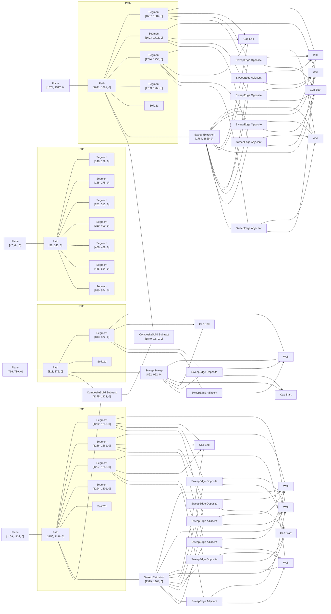

```mermaid
flowchart LR
  subgraph path5 [Path]
    5["Path<br>[88, 140, 0]"]
    9["Segment<br>[146, 179, 0]"]
    10["Segment<br>[185, 275, 0]"]
    11["Segment<br>[281, 313, 0]"]
    12["Segment<br>[319, 400, 0]"]
    13["Segment<br>[406, 439, 0]"]
    14["Segment<br>[445, 534, 0]"]
    15["Segment<br>[540, 574, 0]"]
  end
  subgraph path6 [Path]
    6["Path<br>[813, 872, 0]"]
    16["Segment<br>[813, 872, 0]"]
    27[Solid2d]
  end
  subgraph path7 [Path]
    7["Path<br>[1156, 1196, 0]"]
    17["Segment<br>[1202, 1230, 0]"]
    18["Segment<br>[1236, 1261, 0]"]
    19["Segment<br>[1267, 1288, 0]"]
    20["Segment<br>[1294, 1301, 0]"]
    26[Solid2d]
  end
  subgraph path8 [Path]
    8["Path<br>[1621, 1661, 0]"]
    21["Segment<br>[1667, 1687, 0]"]
    22["Segment<br>[1693, 1718, 0]"]
    23["Segment<br>[1724, 1753, 0]"]
    24["Segment<br>[1759, 1766, 0]"]
    25[Solid2d]
  end
  1["Plane<br>[47, 64, 0]"]
  2["Plane<br>[766, 789, 0]"]
  3["Plane<br>[1109, 1132, 0]"]
  4["Plane<br>[1574, 1597, 0]"]
  28["Sweep Sweep<br>[892, 952, 0]"]
  29["Sweep Extrusion<br>[1319, 1364, 0]"]
  30["Sweep Extrusion<br>[1784, 1829, 0]"]
  31["CompositeSolid Subtract<br>[1375, 1423, 0]"]
  32["CompositeSolid Subtract<br>[1840, 1879, 0]"]
  33[Wall]
  34[Wall]
  35[Wall]
  36[Wall]
  37[Wall]
  38[Wall]
  39[Wall]
  40["Cap Start"]
  41["Cap Start"]
  42["Cap Start"]
  43["Cap End"]
  44["Cap End"]
  45["Cap End"]
  46["SweepEdge Opposite"]
  47["SweepEdge Opposite"]
  48["SweepEdge Opposite"]
  49["SweepEdge Opposite"]
  50["SweepEdge Opposite"]
  51["SweepEdge Opposite"]
  52["SweepEdge Opposite"]
  53["SweepEdge Adjacent"]
  54["SweepEdge Adjacent"]
  55["SweepEdge Adjacent"]
  56["SweepEdge Adjacent"]
  57["SweepEdge Adjacent"]
  58["SweepEdge Adjacent"]
  59["SweepEdge Adjacent"]
  1 --- 5
  2 --- 6
  3 --- 7
  4 --- 8
  5 --- 9
  5 --- 10
  5 --- 11
  5 --- 12
  5 --- 13
  5 --- 14
  5 --- 15
  6 --- 16
  6 --- 27
  6 ---- 28
  6 --- 31
  7 --- 17
  7 --- 18
  7 --- 19
  7 --- 20
  7 --- 26
  7 ---- 29
  7 --- 31
  8 --- 21
  8 --- 22
  8 --- 23
  8 --- 24
  8 --- 25
  8 ---- 30
  8 --- 32
  16 --- 33
  16 x--> 43
  16 --- 46
  16 --- 53
  17 --- 38
  17 x--> 44
  17 --- 50
  17 --- 59
  18 --- 37
  18 x--> 44
  18 --- 52
  18 --- 57
  19 --- 39
  19 x--> 44
  19 --- 51
  19 --- 58
  21 --- 35
  21 x--> 45
  21 --- 47
  21 --- 54
  22 --- 36
  22 x--> 45
  22 --- 48
  22 --- 56
  23 --- 34
  23 x--> 45
  23 --- 49
  23 --- 55
  28 --- 33
  28 --- 40
  28 --- 43
  28 --- 46
  28 --- 53
  29 --- 37
  29 --- 38
  29 --- 39
  29 --- 41
  29 --- 44
  29 --- 50
  29 --- 51
  29 --- 52
  29 --- 57
  29 --- 58
  29 --- 59
  30 --- 34
  30 --- 35
  30 --- 36
  30 --- 42
  30 --- 45
  30 --- 47
  30 --- 48
  30 --- 49
  30 --- 54
  30 --- 55
  30 --- 56
  31 --- 32
  46 <--x 33
  53 <--x 33
  49 <--x 34
  55 <--x 34
  56 <--x 34
  47 <--x 35
  54 <--x 35
  55 <--x 35
  48 <--x 36
  54 <--x 36
  56 <--x 36
  52 <--x 37
  57 <--x 37
  59 <--x 37
  50 <--x 38
  58 <--x 38
  59 <--x 38
  51 <--x 39
  57 <--x 39
  58 <--x 39
  46 <--x 40
  50 <--x 41
  51 <--x 41
  52 <--x 41
  47 <--x 42
  48 <--x 42
  49 <--x 42
```
