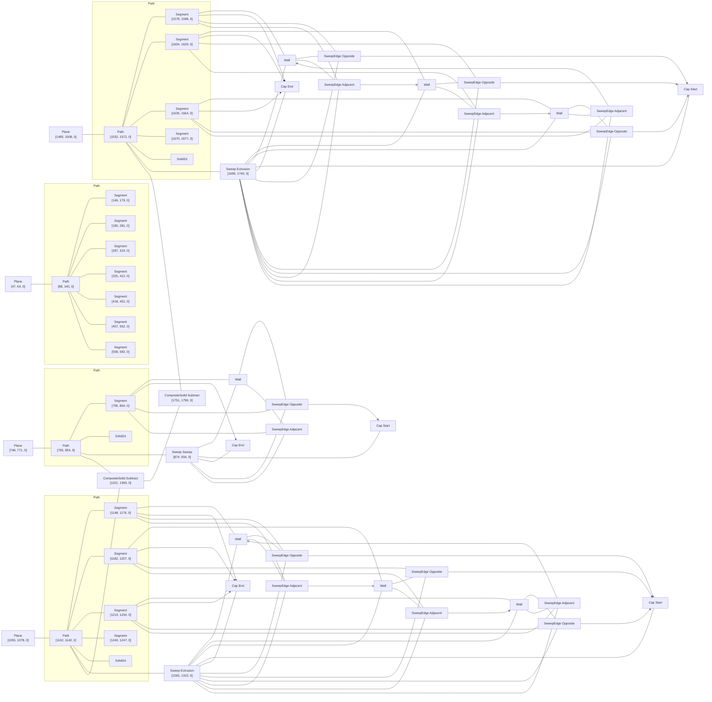

```mermaid
flowchart LR
  subgraph path5 [Path]
    5["Path<br>[88, 140, 0]"]
      %% [ProgramBodyItem { index: 1 }, VariableDeclarationDeclaration, VariableDeclarationInit, PipeBodyItem { index: 0 }]
    9["Segment<br>[146, 179, 0]"]
      %% [ProgramBodyItem { index: 1 }, VariableDeclarationDeclaration, VariableDeclarationInit, PipeBodyItem { index: 1 }]
    10["Segment<br>[185, 281, 0]"]
      %% [ProgramBodyItem { index: 1 }, VariableDeclarationDeclaration, VariableDeclarationInit, PipeBodyItem { index: 2 }]
    11["Segment<br>[287, 319, 0]"]
      %% [ProgramBodyItem { index: 1 }, VariableDeclarationDeclaration, VariableDeclarationInit, PipeBodyItem { index: 3 }]
    12["Segment<br>[325, 412, 0]"]
      %% [ProgramBodyItem { index: 1 }, VariableDeclarationDeclaration, VariableDeclarationInit, PipeBodyItem { index: 4 }]
    13["Segment<br>[418, 451, 0]"]
      %% [ProgramBodyItem { index: 1 }, VariableDeclarationDeclaration, VariableDeclarationInit, PipeBodyItem { index: 5 }]
    14["Segment<br>[457, 552, 0]"]
      %% [ProgramBodyItem { index: 1 }, VariableDeclarationDeclaration, VariableDeclarationInit, PipeBodyItem { index: 6 }]
    15["Segment<br>[558, 592, 0]"]
      %% [ProgramBodyItem { index: 1 }, VariableDeclarationDeclaration, VariableDeclarationInit, PipeBodyItem { index: 7 }]
  end
  subgraph path6 [Path]
    6["Path<br>[795, 854, 0]"]
      %% [ProgramBodyItem { index: 4 }, VariableDeclarationDeclaration, VariableDeclarationInit]
    16["Segment<br>[795, 854, 0]"]
      %% [ProgramBodyItem { index: 4 }, VariableDeclarationDeclaration, VariableDeclarationInit]
    27[Solid2d]
  end
  subgraph path7 [Path]
    7["Path<br>[1102, 1142, 0]"]
      %% [ProgramBodyItem { index: 8 }, VariableDeclarationDeclaration, VariableDeclarationInit, PipeBodyItem { index: 0 }]
    17["Segment<br>[1148, 1176, 0]"]
      %% [ProgramBodyItem { index: 8 }, VariableDeclarationDeclaration, VariableDeclarationInit, PipeBodyItem { index: 1 }]
    18["Segment<br>[1182, 1207, 0]"]
      %% [ProgramBodyItem { index: 8 }, VariableDeclarationDeclaration, VariableDeclarationInit, PipeBodyItem { index: 2 }]
    19["Segment<br>[1213, 1234, 0]"]
      %% [ProgramBodyItem { index: 8 }, VariableDeclarationDeclaration, VariableDeclarationInit, PipeBodyItem { index: 3 }]
    20["Segment<br>[1240, 1247, 0]"]
      %% [ProgramBodyItem { index: 8 }, VariableDeclarationDeclaration, VariableDeclarationInit, PipeBodyItem { index: 4 }]
    25[Solid2d]
  end
  subgraph path8 [Path]
    8["Path<br>[1532, 1572, 0]"]
      %% [ProgramBodyItem { index: 13 }, VariableDeclarationDeclaration, VariableDeclarationInit, PipeBodyItem { index: 0 }]
    21["Segment<br>[1578, 1598, 0]"]
      %% [ProgramBodyItem { index: 13 }, VariableDeclarationDeclaration, VariableDeclarationInit, PipeBodyItem { index: 1 }]
    22["Segment<br>[1604, 1629, 0]"]
      %% [ProgramBodyItem { index: 13 }, VariableDeclarationDeclaration, VariableDeclarationInit, PipeBodyItem { index: 2 }]
    23["Segment<br>[1635, 1664, 0]"]
      %% [ProgramBodyItem { index: 13 }, VariableDeclarationDeclaration, VariableDeclarationInit, PipeBodyItem { index: 3 }]
    24["Segment<br>[1670, 1677, 0]"]
      %% [ProgramBodyItem { index: 13 }, VariableDeclarationDeclaration, VariableDeclarationInit, PipeBodyItem { index: 4 }]
    26[Solid2d]
  end
  1["Plane<br>[47, 64, 0]"]
    %% [ProgramBodyItem { index: 0 }, VariableDeclarationDeclaration, VariableDeclarationInit]
  2["Plane<br>[748, 771, 0]"]
    %% [ProgramBodyItem { index: 3 }, VariableDeclarationDeclaration, VariableDeclarationInit]
  3["Plane<br>[1055, 1078, 0]"]
    %% [ProgramBodyItem { index: 7 }, VariableDeclarationDeclaration, VariableDeclarationInit]
  4["Plane<br>[1485, 1508, 0]"]
    %% [ProgramBodyItem { index: 12 }, VariableDeclarationDeclaration, VariableDeclarationInit]
  28["Sweep Sweep<br>[874, 934, 0]"]
    %% [ProgramBodyItem { index: 5 }, VariableDeclarationDeclaration, VariableDeclarationInit]
  29["Sweep Extrusion<br>[1265, 1310, 0]"]
    %% [ProgramBodyItem { index: 9 }, VariableDeclarationDeclaration, VariableDeclarationInit]
  30["Sweep Extrusion<br>[1695, 1740, 0]"]
    %% [ProgramBodyItem { index: 14 }, VariableDeclarationDeclaration, VariableDeclarationInit]
  31["CompositeSolid Subtract<br>[1751, 1790, 0]"]
    %% [ProgramBodyItem { index: 15 }, VariableDeclarationDeclaration, VariableDeclarationInit]
  32["CompositeSolid Subtract<br>[1321, 1369, 0]"]
    %% [ProgramBodyItem { index: 10 }, VariableDeclarationDeclaration, VariableDeclarationInit]
  33[Wall]
  34[Wall]
  35[Wall]
  36[Wall]
  37[Wall]
  38[Wall]
  39[Wall]
  40["Cap Start"]
  41["Cap Start"]
  42["Cap Start"]
  43["Cap End"]
  44["Cap End"]
  45["Cap End"]
  46["SweepEdge Opposite"]
  47["SweepEdge Opposite"]
  48["SweepEdge Opposite"]
  49["SweepEdge Opposite"]
  50["SweepEdge Opposite"]
  51["SweepEdge Opposite"]
  52["SweepEdge Opposite"]
  53["SweepEdge Adjacent"]
  54["SweepEdge Adjacent"]
  55["SweepEdge Adjacent"]
  56["SweepEdge Adjacent"]
  57["SweepEdge Adjacent"]
  58["SweepEdge Adjacent"]
  59["SweepEdge Adjacent"]
  1 --- 5
  2 --- 6
  3 --- 7
  4 --- 8
  5 --- 9
  5 --- 10
  5 --- 11
  5 --- 12
  5 --- 13
  5 --- 14
  5 --- 15
  6 --- 16
  6 --- 27
  6 ---- 28
  6 --- 32
  7 --- 17
  7 --- 18
  7 --- 19
  7 --- 20
  7 --- 25
  7 ---- 29
  7 --- 32
  8 --- 21
  8 --- 22
  8 --- 23
  8 --- 24
  8 --- 26
  8 ---- 30
  8 --- 31
  16 --- 36
  16 x--> 43
  16 --- 49
  16 --- 56
  17 --- 37
  17 x--> 45
  17 --- 50
  17 --- 57
  18 --- 39
  18 x--> 45
  18 --- 51
  18 --- 58
  19 --- 38
  19 x--> 45
  19 --- 52
  19 --- 59
  21 --- 35
  21 x--> 44
  21 --- 46
  21 --- 53
  22 --- 33
  22 x--> 44
  22 --- 47
  22 --- 54
  23 --- 34
  23 x--> 44
  23 --- 48
  23 --- 55
  28 --- 36
  28 --- 40
  28 --- 43
  28 --- 49
  28 --- 56
  29 --- 37
  29 --- 38
  29 --- 39
  29 --- 42
  29 --- 45
  29 --- 50
  29 --- 51
  29 --- 52
  29 --- 57
  29 --- 58
  29 --- 59
  30 --- 33
  30 --- 34
  30 --- 35
  30 --- 41
  30 --- 44
  30 --- 46
  30 --- 47
  30 --- 48
  30 --- 53
  30 --- 54
  30 --- 55
  32 --- 31
  33 --- 47
  53 <--x 33
  33 --- 54
  34 --- 48
  54 <--x 34
  34 --- 55
  35 --- 46
  35 --- 53
  55 <--x 35
  36 --- 49
  36 --- 56
  37 --- 50
  37 --- 57
  59 <--x 37
  38 --- 52
  58 <--x 38
  38 --- 59
  39 --- 51
  57 <--x 39
  39 --- 58
  49 <--x 40
  46 <--x 41
  47 <--x 41
  48 <--x 41
  50 <--x 42
  51 <--x 42
  52 <--x 42
```
