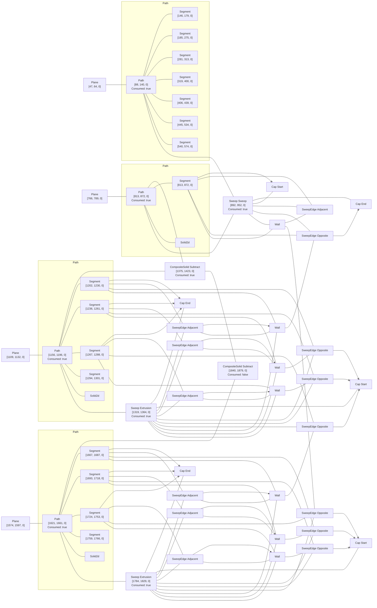

```mermaid
flowchart LR
  subgraph path12 [Path]
    12["Path<br>[88, 140, 0]<br>Consumed: true"]
      %% [ProgramBodyItem { index: 1 }, VariableDeclarationDeclaration, VariableDeclarationInit, PipeBodyItem { index: 0 }]
    21["Segment<br>[146, 179, 0]"]
      %% [ProgramBodyItem { index: 1 }, VariableDeclarationDeclaration, VariableDeclarationInit, PipeBodyItem { index: 1 }]
    26["Segment<br>[185, 275, 0]"]
      %% [ProgramBodyItem { index: 1 }, VariableDeclarationDeclaration, VariableDeclarationInit, PipeBodyItem { index: 2 }]
    27["Segment<br>[281, 313, 0]"]
      %% [ProgramBodyItem { index: 1 }, VariableDeclarationDeclaration, VariableDeclarationInit, PipeBodyItem { index: 3 }]
    28["Segment<br>[319, 400, 0]"]
      %% [ProgramBodyItem { index: 1 }, VariableDeclarationDeclaration, VariableDeclarationInit, PipeBodyItem { index: 4 }]
    29["Segment<br>[406, 439, 0]"]
      %% [ProgramBodyItem { index: 1 }, VariableDeclarationDeclaration, VariableDeclarationInit, PipeBodyItem { index: 5 }]
    30["Segment<br>[445, 534, 0]"]
      %% [ProgramBodyItem { index: 1 }, VariableDeclarationDeclaration, VariableDeclarationInit, PipeBodyItem { index: 6 }]
    31["Segment<br>[540, 574, 0]"]
      %% [ProgramBodyItem { index: 1 }, VariableDeclarationDeclaration, VariableDeclarationInit, PipeBodyItem { index: 7 }]
  end
  subgraph path11 [Path]
    11["Path<br>[813, 872, 0]<br>Consumed: true"]
      %% [ProgramBodyItem { index: 4 }, VariableDeclarationDeclaration, VariableDeclarationInit]
    32["Segment<br>[813, 872, 0]"]
      %% [ProgramBodyItem { index: 4 }, VariableDeclarationDeclaration, VariableDeclarationInit]
    35[Solid2d]
  end
  subgraph path9 [Path]
    9["Path<br>[1156, 1196, 0]<br>Consumed: true"]
      %% [ProgramBodyItem { index: 8 }, VariableDeclarationDeclaration, VariableDeclarationInit, PipeBodyItem { index: 0 }]
    17["Segment<br>[1202, 1230, 0]"]
      %% [ProgramBodyItem { index: 8 }, VariableDeclarationDeclaration, VariableDeclarationInit, PipeBodyItem { index: 1 }]
    18["Segment<br>[1236, 1261, 0]"]
      %% [ProgramBodyItem { index: 8 }, VariableDeclarationDeclaration, VariableDeclarationInit, PipeBodyItem { index: 2 }]
    19["Segment<br>[1267, 1288, 0]"]
      %% [ProgramBodyItem { index: 8 }, VariableDeclarationDeclaration, VariableDeclarationInit, PipeBodyItem { index: 3 }]
    20["Segment<br>[1294, 1301, 0]"]
      %% [ProgramBodyItem { index: 8 }, VariableDeclarationDeclaration, VariableDeclarationInit, PipeBodyItem { index: 4 }]
    33[Solid2d]
  end
  subgraph path10 [Path]
    10["Path<br>[1621, 1661, 0]<br>Consumed: true"]
      %% [ProgramBodyItem { index: 13 }, VariableDeclarationDeclaration, VariableDeclarationInit, PipeBodyItem { index: 0 }]
    22["Segment<br>[1667, 1687, 0]"]
      %% [ProgramBodyItem { index: 13 }, VariableDeclarationDeclaration, VariableDeclarationInit, PipeBodyItem { index: 1 }]
    23["Segment<br>[1693, 1718, 0]"]
      %% [ProgramBodyItem { index: 13 }, VariableDeclarationDeclaration, VariableDeclarationInit, PipeBodyItem { index: 2 }]
    24["Segment<br>[1724, 1753, 0]"]
      %% [ProgramBodyItem { index: 13 }, VariableDeclarationDeclaration, VariableDeclarationInit, PipeBodyItem { index: 3 }]
    25["Segment<br>[1759, 1766, 0]"]
      %% [ProgramBodyItem { index: 13 }, VariableDeclarationDeclaration, VariableDeclarationInit, PipeBodyItem { index: 4 }]
    34[Solid2d]
  end
  15["Plane<br>[47, 64, 0]"]
    %% [ProgramBodyItem { index: 0 }, VariableDeclarationDeclaration, VariableDeclarationInit]
  16["Plane<br>[766, 789, 0]"]
    %% [ProgramBodyItem { index: 3 }, VariableDeclarationDeclaration, VariableDeclarationInit]
  38["Sweep Sweep<br>[892, 952, 0]<br>Consumed: true"]
    %% [ProgramBodyItem { index: 5 }, VariableDeclarationDeclaration, VariableDeclarationInit]
  59[Wall]
    %% face_code_ref=Missing NodePath
  6["Cap Start"]
    %% face_code_ref=Missing NodePath
  3["Cap End"]
    %% face_code_ref=Missing NodePath
  46["SweepEdge Opposite"]
  45["SweepEdge Adjacent"]
  13["Plane<br>[1109, 1132, 0]"]
    %% [ProgramBodyItem { index: 7 }, VariableDeclarationDeclaration, VariableDeclarationInit]
  36["Sweep Extrusion<br>[1319, 1364, 0]<br>Consumed: true"]
    %% [ProgramBodyItem { index: 9 }, VariableDeclarationDeclaration, VariableDeclarationInit]
  53[Wall]
    %% face_code_ref=Missing NodePath
  54[Wall]
    %% face_code_ref=Missing NodePath
  55[Wall]
    %% face_code_ref=Missing NodePath
  4["Cap Start"]
    %% face_code_ref=Missing NodePath
  1["Cap End"]
    %% face_code_ref=Missing NodePath
  47["SweepEdge Opposite"]
  39["SweepEdge Adjacent"]
  48["SweepEdge Opposite"]
  40["SweepEdge Adjacent"]
  49["SweepEdge Opposite"]
  41["SweepEdge Adjacent"]
  7["CompositeSolid Subtract<br>[1375, 1423, 0]<br>Consumed: true"]
    %% [ProgramBodyItem { index: 10 }, VariableDeclarationDeclaration, VariableDeclarationInit]
  14["Plane<br>[1574, 1597, 0]"]
    %% [ProgramBodyItem { index: 12 }, VariableDeclarationDeclaration, VariableDeclarationInit]
  37["Sweep Extrusion<br>[1784, 1829, 0]<br>Consumed: true"]
    %% [ProgramBodyItem { index: 14 }, VariableDeclarationDeclaration, VariableDeclarationInit]
  56[Wall]
    %% face_code_ref=Missing NodePath
  57[Wall]
    %% face_code_ref=Missing NodePath
  58[Wall]
    %% face_code_ref=Missing NodePath
  5["Cap Start"]
    %% face_code_ref=Missing NodePath
  2["Cap End"]
    %% face_code_ref=Missing NodePath
  50["SweepEdge Opposite"]
  42["SweepEdge Adjacent"]
  51["SweepEdge Opposite"]
  43["SweepEdge Adjacent"]
  52["SweepEdge Opposite"]
  44["SweepEdge Adjacent"]
  8["CompositeSolid Subtract<br>[1840, 1879, 0]<br>Consumed: false"]
    %% [ProgramBodyItem { index: 15 }, VariableDeclarationDeclaration, VariableDeclarationInit]
  17 <--x 1
  18 <--x 1
  19 <--x 1
  36 --- 1
  22 <--x 2
  23 <--x 2
  24 <--x 2
  37 --- 2
  38 --- 3
  46 <--x 3
  36 --- 4
  47 <--x 4
  48 <--x 4
  49 <--x 4
  37 --- 5
  50 <--x 5
  51 <--x 5
  52 <--x 5
  32 <--x 6
  38 --- 6
  7 --- 8
  9 --- 7
  11 --- 7
  10 --- 8
  13 --- 9
  9 --- 17
  9 --- 18
  9 --- 19
  9 --- 20
  9 --- 33
  9 ---- 36
  14 --- 10
  10 --- 22
  10 --- 23
  10 --- 24
  10 --- 25
  10 --- 34
  10 ---- 37
  16 --- 11
  11 --- 32
  11 --- 35
  11 ---- 38
  15 --- 12
  12 --- 21
  12 --- 26
  12 --- 27
  12 --- 28
  12 --- 29
  12 --- 30
  12 --- 31
  12 ---- 38
  17 --- 39
  17 --- 47
  17 --- 53
  18 --- 40
  18 --- 48
  18 --- 54
  19 --- 41
  19 --- 49
  19 --- 55
  22 --- 42
  22 --- 50
  22 --- 56
  23 --- 43
  23 --- 51
  23 --- 57
  24 --- 44
  24 --- 52
  24 --- 58
  32 --- 45
  32 --- 46
  32 --- 59
  36 --- 39
  36 --- 40
  36 --- 41
  36 --- 47
  36 --- 48
  36 --- 49
  36 --- 53
  36 --- 54
  36 --- 55
  37 --- 42
  37 --- 43
  37 --- 44
  37 --- 50
  37 --- 51
  37 --- 52
  37 --- 56
  37 --- 57
  37 --- 58
  38 --- 45
  38 --- 46
  38 --- 59
  53 --- 39
  39 x--> 53
  54 --- 40
  40 x--> 54
  55 --- 41
  41 x--> 55
  56 --- 42
  42 x--> 56
  57 --- 43
  43 x--> 57
  58 --- 44
  44 x--> 58
  59 --- 45
  53 --- 46
  54 --- 47
  55 --- 48
  56 --- 49
  57 --- 50
  58 --- 51
  59 --- 52
```
