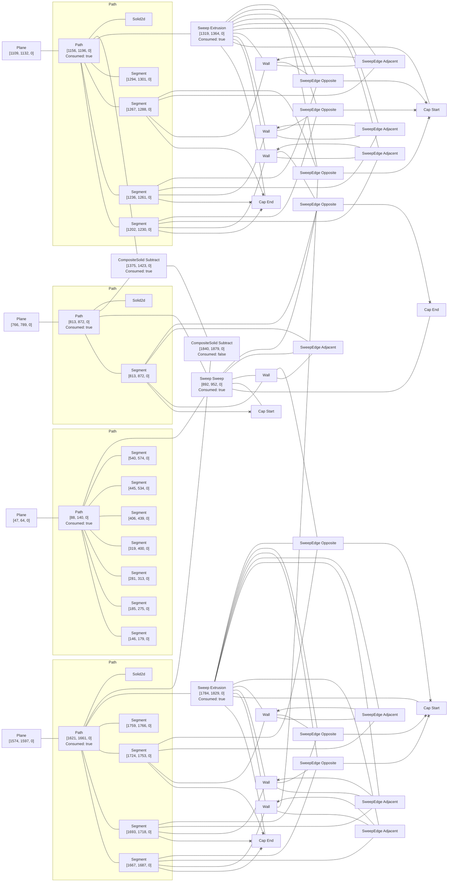

```mermaid
flowchart LR
  subgraph path15 [Path]
    15["Path<br>[88, 140, 0]<br>Consumed: true"]
      %% [ProgramBodyItem { index: 1 }, VariableDeclarationDeclaration, VariableDeclarationInit, PipeBodyItem { index: 0 }]
    16["Segment<br>[146, 179, 0]"]
      %% [ProgramBodyItem { index: 1 }, VariableDeclarationDeclaration, VariableDeclarationInit, PipeBodyItem { index: 1 }]
    17["Segment<br>[185, 275, 0]"]
      %% [ProgramBodyItem { index: 1 }, VariableDeclarationDeclaration, VariableDeclarationInit, PipeBodyItem { index: 2 }]
    18["Segment<br>[281, 313, 0]"]
      %% [ProgramBodyItem { index: 1 }, VariableDeclarationDeclaration, VariableDeclarationInit, PipeBodyItem { index: 3 }]
    19["Segment<br>[319, 400, 0]"]
      %% [ProgramBodyItem { index: 1 }, VariableDeclarationDeclaration, VariableDeclarationInit, PipeBodyItem { index: 4 }]
    20["Segment<br>[406, 439, 0]"]
      %% [ProgramBodyItem { index: 1 }, VariableDeclarationDeclaration, VariableDeclarationInit, PipeBodyItem { index: 5 }]
    21["Segment<br>[445, 534, 0]"]
      %% [ProgramBodyItem { index: 1 }, VariableDeclarationDeclaration, VariableDeclarationInit, PipeBodyItem { index: 6 }]
    22["Segment<br>[540, 574, 0]"]
      %% [ProgramBodyItem { index: 1 }, VariableDeclarationDeclaration, VariableDeclarationInit, PipeBodyItem { index: 7 }]
  end
  subgraph path24 [Path]
    24["Path<br>[813, 872, 0]<br>Consumed: true"]
      %% [ProgramBodyItem { index: 4 }, VariableDeclarationDeclaration, VariableDeclarationInit]
    25["Segment<br>[813, 872, 0]"]
      %% [ProgramBodyItem { index: 4 }, VariableDeclarationDeclaration, VariableDeclarationInit]
    45[Solid2d]
  end
  subgraph path28 [Path]
    28["Path<br>[1156, 1196, 0]<br>Consumed: true"]
      %% [ProgramBodyItem { index: 8 }, VariableDeclarationDeclaration, VariableDeclarationInit, PipeBodyItem { index: 0 }]
    29["Segment<br>[1202, 1230, 0]"]
      %% [ProgramBodyItem { index: 8 }, VariableDeclarationDeclaration, VariableDeclarationInit, PipeBodyItem { index: 1 }]
    30["Segment<br>[1236, 1261, 0]"]
      %% [ProgramBodyItem { index: 8 }, VariableDeclarationDeclaration, VariableDeclarationInit, PipeBodyItem { index: 2 }]
    31["Segment<br>[1267, 1288, 0]"]
      %% [ProgramBodyItem { index: 8 }, VariableDeclarationDeclaration, VariableDeclarationInit, PipeBodyItem { index: 3 }]
    32["Segment<br>[1294, 1301, 0]"]
      %% [ProgramBodyItem { index: 8 }, VariableDeclarationDeclaration, VariableDeclarationInit, PipeBodyItem { index: 4 }]
    43[Solid2d]
  end
  subgraph path36 [Path]
    36["Path<br>[1621, 1661, 0]<br>Consumed: true"]
      %% [ProgramBodyItem { index: 13 }, VariableDeclarationDeclaration, VariableDeclarationInit, PipeBodyItem { index: 0 }]
    37["Segment<br>[1667, 1687, 0]"]
      %% [ProgramBodyItem { index: 13 }, VariableDeclarationDeclaration, VariableDeclarationInit, PipeBodyItem { index: 1 }]
    38["Segment<br>[1693, 1718, 0]"]
      %% [ProgramBodyItem { index: 13 }, VariableDeclarationDeclaration, VariableDeclarationInit, PipeBodyItem { index: 2 }]
    39["Segment<br>[1724, 1753, 0]"]
      %% [ProgramBodyItem { index: 13 }, VariableDeclarationDeclaration, VariableDeclarationInit, PipeBodyItem { index: 3 }]
    40["Segment<br>[1759, 1766, 0]"]
      %% [ProgramBodyItem { index: 13 }, VariableDeclarationDeclaration, VariableDeclarationInit, PipeBodyItem { index: 4 }]
    44[Solid2d]
  end
  1["Cap End"]
    %% face_code_ref=Missing NodePath
  2["Cap End"]
    %% face_code_ref=Missing NodePath
  3["Cap End"]
    %% face_code_ref=Missing NodePath
  4["Cap Start"]
    %% face_code_ref=Missing NodePath
  5["Cap Start"]
    %% face_code_ref=Missing NodePath
  6["Cap Start"]
    %% face_code_ref=Missing NodePath
  7[Wall]
    %% face_code_ref=Missing NodePath
  8[Wall]
    %% face_code_ref=Missing NodePath
  9[Wall]
    %% face_code_ref=Missing NodePath
  10[Wall]
    %% face_code_ref=Missing NodePath
  11[Wall]
    %% face_code_ref=Missing NodePath
  12[Wall]
    %% face_code_ref=Missing NodePath
  13[Wall]
    %% face_code_ref=Missing NodePath
  14["Plane<br>[47, 64, 0]"]
    %% [ProgramBodyItem { index: 0 }, VariableDeclarationDeclaration, VariableDeclarationInit]
  23["Plane<br>[766, 789, 0]"]
    %% [ProgramBodyItem { index: 3 }, VariableDeclarationDeclaration, VariableDeclarationInit]
  26["Sweep Sweep<br>[892, 952, 0]<br>Consumed: true"]
    %% [ProgramBodyItem { index: 5 }, VariableDeclarationDeclaration, VariableDeclarationInit]
  27["Plane<br>[1109, 1132, 0]"]
    %% [ProgramBodyItem { index: 7 }, VariableDeclarationDeclaration, VariableDeclarationInit]
  33["Sweep Extrusion<br>[1319, 1364, 0]<br>Consumed: true"]
    %% [ProgramBodyItem { index: 9 }, VariableDeclarationDeclaration, VariableDeclarationInit]
  34["CompositeSolid Subtract<br>[1375, 1423, 0]<br>Consumed: true"]
    %% [ProgramBodyItem { index: 10 }, VariableDeclarationDeclaration, VariableDeclarationInit]
  35["Plane<br>[1574, 1597, 0]"]
    %% [ProgramBodyItem { index: 12 }, VariableDeclarationDeclaration, VariableDeclarationInit]
  41["Sweep Extrusion<br>[1784, 1829, 0]<br>Consumed: true"]
    %% [ProgramBodyItem { index: 14 }, VariableDeclarationDeclaration, VariableDeclarationInit]
  42["CompositeSolid Subtract<br>[1840, 1879, 0]<br>Consumed: false"]
    %% [ProgramBodyItem { index: 15 }, VariableDeclarationDeclaration, VariableDeclarationInit]
  46["SweepEdge Adjacent"]
  47["SweepEdge Adjacent"]
  48["SweepEdge Adjacent"]
  49["SweepEdge Adjacent"]
  50["SweepEdge Adjacent"]
  51["SweepEdge Adjacent"]
  52["SweepEdge Adjacent"]
  53["SweepEdge Opposite"]
  54["SweepEdge Opposite"]
  55["SweepEdge Opposite"]
  56["SweepEdge Opposite"]
  57["SweepEdge Opposite"]
  58["SweepEdge Opposite"]
  59["SweepEdge Opposite"]
  29 <--x 1
  30 <--x 1
  31 <--x 1
  33 --- 1
  37 <--x 2
  38 <--x 2
  39 <--x 2
  41 --- 2
  26 --- 3
  53 <--x 3
  33 --- 4
  54 <--x 4
  55 <--x 4
  56 <--x 4
  41 --- 5
  57 <--x 5
  58 <--x 5
  59 <--x 5
  25 <--x 6
  26 --- 6
  29 --- 7
  33 --- 7
  7 --- 46
  46 <--x 7
  7 --- 53
  30 --- 8
  33 --- 8
  8 --- 47
  47 <--x 8
  8 --- 54
  31 --- 9
  33 --- 9
  9 --- 48
  48 <--x 9
  9 --- 55
  37 --- 10
  41 --- 10
  10 --- 49
  49 <--x 10
  10 --- 56
  38 --- 11
  41 --- 11
  11 --- 50
  50 <--x 11
  11 --- 57
  39 --- 12
  41 --- 12
  12 --- 51
  51 <--x 12
  12 --- 58
  25 --- 13
  26 --- 13
  13 --- 52
  13 --- 59
  14 --- 15
  15 --- 16
  15 --- 17
  15 --- 18
  15 --- 19
  15 --- 20
  15 --- 21
  15 --- 22
  15 ---- 26
  23 --- 24
  24 --- 25
  24 ---- 26
  24 --- 34
  24 --- 45
  25 --- 52
  25 --- 53
  26 --- 52
  26 --- 53
  27 --- 28
  28 --- 29
  28 --- 30
  28 --- 31
  28 --- 32
  28 ---- 33
  28 --- 34
  28 --- 43
  29 --- 46
  29 --- 54
  30 --- 47
  30 --- 55
  31 --- 48
  31 --- 56
  33 --- 46
  33 --- 47
  33 --- 48
  33 --- 54
  33 --- 55
  33 --- 56
  34 --- 42
  35 --- 36
  36 --- 37
  36 --- 38
  36 --- 39
  36 --- 40
  36 ---- 41
  36 --- 42
  36 --- 44
  37 --- 49
  37 --- 57
  38 --- 50
  38 --- 58
  39 --- 51
  39 --- 59
  41 --- 49
  41 --- 50
  41 --- 51
  41 --- 57
  41 --- 58
  41 --- 59
```
