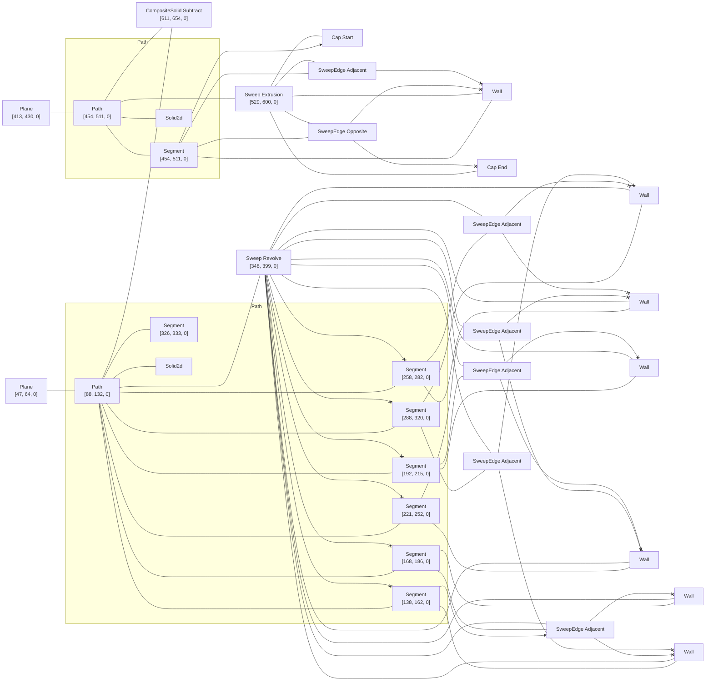

```mermaid
flowchart LR
  subgraph path3 [Path]
    3["Path<br>[88, 132, 0]"]
    5["Segment<br>[138, 162, 0]"]
    6["Segment<br>[168, 186, 0]"]
    7["Segment<br>[192, 215, 0]"]
    8["Segment<br>[221, 252, 0]"]
    9["Segment<br>[258, 282, 0]"]
    10["Segment<br>[288, 320, 0]"]
    11["Segment<br>[326, 333, 0]"]
    13[Solid2d]
  end
  subgraph path4 [Path]
    4["Path<br>[454, 511, 0]"]
    12["Segment<br>[454, 511, 0]"]
    14[Solid2d]
  end
  1["Plane<br>[47, 64, 0]"]
  2["Plane<br>[413, 430, 0]"]
  15["Sweep Revolve<br>[348, 399, 0]"]
  16["Sweep Extrusion<br>[529, 600, 0]"]
  17["CompositeSolid Subtract<br>[611, 654, 0]"]
  18[Wall]
  19[Wall]
  20[Wall]
  21[Wall]
  22[Wall]
  23[Wall]
  24[Wall]
  25["Cap Start"]
  26["Cap End"]
  27["SweepEdge Opposite"]
  28["SweepEdge Adjacent"]
  29["SweepEdge Adjacent"]
  30["SweepEdge Adjacent"]
  31["SweepEdge Adjacent"]
  32["SweepEdge Adjacent"]
  33["SweepEdge Adjacent"]
  1 --- 3
  2 --- 4
  3 --- 5
  3 --- 6
  3 --- 7
  3 --- 8
  3 --- 9
  3 --- 10
  3 --- 11
  3 --- 13
  3 ---- 15
  3 --- 17
  4 --- 12
  4 --- 14
  4 ---- 16
  4 --- 17
  15 <--x 5
  5 --- 24
  5 x--> 30
  15 <--x 6
  6 --- 22
  6 --- 30
  15 <--x 7
  7 --- 21
  7 --- 32
  15 <--x 8
  8 --- 23
  8 --- 29
  15 <--x 9
  9 --- 20
  9 --- 31
  15 <--x 10
  10 --- 19
  10 --- 33
  12 --- 18
  12 x--> 25
  12 --- 27
  12 --- 28
  15 --- 19
  15 --- 20
  15 --- 21
  15 --- 22
  15 --- 23
  15 --- 24
  15 --- 29
  15 --- 30
  15 --- 31
  15 --- 32
  15 --- 33
  16 --- 18
  16 --- 25
  16 --- 26
  16 --- 27
  16 --- 28
  27 <--x 18
  28 <--x 18
  31 <--x 19
  33 <--x 19
  29 <--x 20
  31 <--x 20
  32 <--x 21
  30 <--x 22
  29 <--x 23
  32 <--x 23
  30 <--x 24
  33 <--x 24
  27 <--x 26
```
