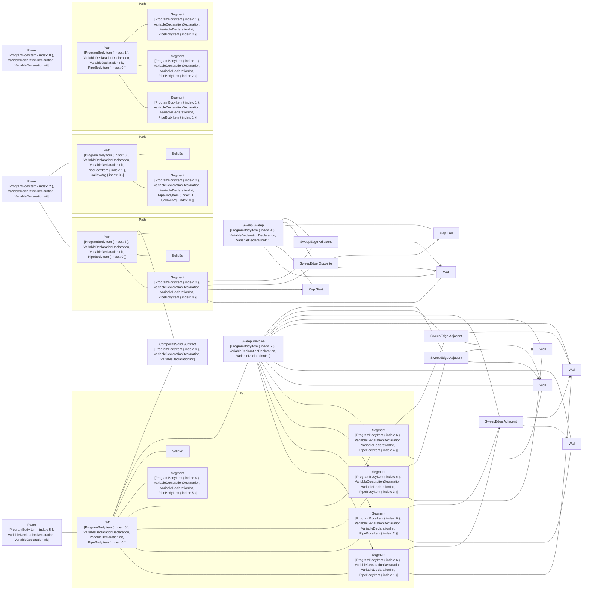

```mermaid
flowchart LR
  subgraph path4 [Path]
    4["Path<br>[ProgramBodyItem { index: 1 }, VariableDeclarationDeclaration, VariableDeclarationInit, PipeBodyItem { index: 0 }]"]
    8["Segment<br>[ProgramBodyItem { index: 1 }, VariableDeclarationDeclaration, VariableDeclarationInit, PipeBodyItem { index: 1 }]"]
    9["Segment<br>[ProgramBodyItem { index: 1 }, VariableDeclarationDeclaration, VariableDeclarationInit, PipeBodyItem { index: 2 }]"]
    10["Segment<br>[ProgramBodyItem { index: 1 }, VariableDeclarationDeclaration, VariableDeclarationInit, PipeBodyItem { index: 3 }]"]
  end
  subgraph path5 [Path]
    5["Path<br>[ProgramBodyItem { index: 3 }, VariableDeclarationDeclaration, VariableDeclarationInit, PipeBodyItem { index: 0 }]"]
    11["Segment<br>[ProgramBodyItem { index: 3 }, VariableDeclarationDeclaration, VariableDeclarationInit, PipeBodyItem { index: 0 }]"]
    19[Solid2d]
  end
  subgraph path6 [Path]
    6["Path<br>[ProgramBodyItem { index: 3 }, VariableDeclarationDeclaration, VariableDeclarationInit, PipeBodyItem { index: 1 }, CallKwArg { index: 0 }]"]
    12["Segment<br>[ProgramBodyItem { index: 3 }, VariableDeclarationDeclaration, VariableDeclarationInit, PipeBodyItem { index: 1 }, CallKwArg { index: 0 }]"]
    18[Solid2d]
  end
  subgraph path7 [Path]
    7["Path<br>[ProgramBodyItem { index: 6 }, VariableDeclarationDeclaration, VariableDeclarationInit, PipeBodyItem { index: 0 }]"]
    13["Segment<br>[ProgramBodyItem { index: 6 }, VariableDeclarationDeclaration, VariableDeclarationInit, PipeBodyItem { index: 1 }]"]
    14["Segment<br>[ProgramBodyItem { index: 6 }, VariableDeclarationDeclaration, VariableDeclarationInit, PipeBodyItem { index: 2 }]"]
    15["Segment<br>[ProgramBodyItem { index: 6 }, VariableDeclarationDeclaration, VariableDeclarationInit, PipeBodyItem { index: 3 }]"]
    16["Segment<br>[ProgramBodyItem { index: 6 }, VariableDeclarationDeclaration, VariableDeclarationInit, PipeBodyItem { index: 4 }]"]
    17["Segment<br>[ProgramBodyItem { index: 6 }, VariableDeclarationDeclaration, VariableDeclarationInit, PipeBodyItem { index: 5 }]"]
    20[Solid2d]
  end
  1["Plane<br>[ProgramBodyItem { index: 0 }, VariableDeclarationDeclaration, VariableDeclarationInit]"]
  2["Plane<br>[ProgramBodyItem { index: 2 }, VariableDeclarationDeclaration, VariableDeclarationInit]"]
  3["Plane<br>[ProgramBodyItem { index: 5 }, VariableDeclarationDeclaration, VariableDeclarationInit]"]
  21["Sweep Sweep<br>[ProgramBodyItem { index: 4 }, VariableDeclarationDeclaration, VariableDeclarationInit]"]
  22["Sweep Revolve<br>[ProgramBodyItem { index: 7 }, VariableDeclarationDeclaration, VariableDeclarationInit]"]
  23["CompositeSolid Subtract<br>[ProgramBodyItem { index: 8 }, VariableDeclarationDeclaration, VariableDeclarationInit]"]
  24[Wall]
  25[Wall]
  26[Wall]
  27[Wall]
  28[Wall]
  29["Cap Start"]
  30["Cap End"]
  31["SweepEdge Opposite"]
  32["SweepEdge Adjacent"]
  33["SweepEdge Adjacent"]
  34["SweepEdge Adjacent"]
  35["SweepEdge Adjacent"]
  1 --- 4
  2 --- 5
  2 --- 6
  3 --- 7
  4 --- 8
  4 --- 9
  4 --- 10
  5 --- 11
  5 --- 19
  5 ---- 21
  5 --- 23
  6 --- 12
  6 --- 18
  7 --- 13
  7 --- 14
  7 --- 15
  7 --- 16
  7 --- 17
  7 --- 20
  7 ---- 22
  7 --- 23
  11 --- 24
  11 x--> 29
  11 --- 31
  11 --- 32
  22 <--x 13
  13 --- 27
  13 x--> 33
  22 <--x 14
  14 --- 26
  14 --- 33
  22 <--x 15
  15 --- 28
  15 --- 35
  22 <--x 16
  16 --- 25
  16 --- 34
  21 --- 24
  21 --- 29
  21 --- 30
  21 --- 31
  21 --- 32
  22 --- 25
  22 --- 26
  22 --- 27
  22 --- 28
  22 --- 33
  22 --- 34
  22 --- 35
  31 <--x 24
  32 <--x 24
  34 <--x 25
  35 <--x 25
  33 <--x 26
  33 <--x 27
  34 <--x 27
  35 <--x 28
  31 <--x 30
```
