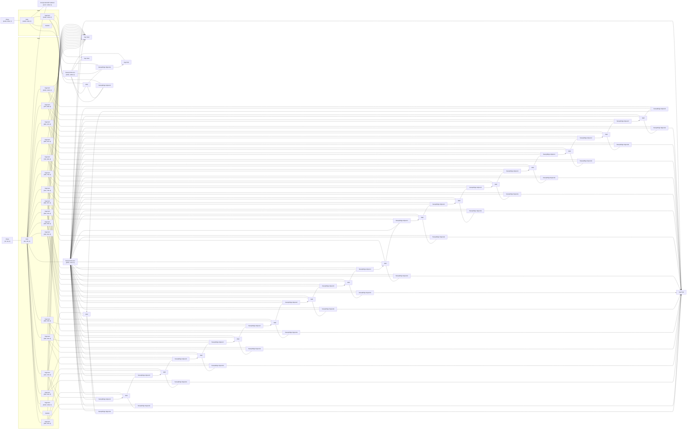

```mermaid
flowchart LR
  subgraph path2 [Path]
    2["Path<br>[88, 135, 0]"]
      %% [ProgramBodyItem { index: 1 }, VariableDeclarationDeclaration, VariableDeclarationInit, PipeBodyItem { index: 0 }]
    3["Segment<br>[141, 163, 0]"]
      %% [ProgramBodyItem { index: 1 }, VariableDeclarationDeclaration, VariableDeclarationInit, PipeBodyItem { index: 1 }]
    4["Segment<br>[169, 253, 0]"]
      %% [ProgramBodyItem { index: 1 }, VariableDeclarationDeclaration, VariableDeclarationInit, PipeBodyItem { index: 2 }]
    5["Segment<br>[259, 292, 0]"]
      %% [ProgramBodyItem { index: 1 }, VariableDeclarationDeclaration, VariableDeclarationInit, PipeBodyItem { index: 3 }]
    6["Segment<br>[298, 393, 0]"]
      %% [ProgramBodyItem { index: 1 }, VariableDeclarationDeclaration, VariableDeclarationInit, PipeBodyItem { index: 4 }]
    7["Segment<br>[399, 430, 0]"]
      %% [ProgramBodyItem { index: 1 }, VariableDeclarationDeclaration, VariableDeclarationInit, PipeBodyItem { index: 5 }]
    8["Segment<br>[436, 522, 0]"]
      %% [ProgramBodyItem { index: 1 }, VariableDeclarationDeclaration, VariableDeclarationInit, PipeBodyItem { index: 6 }]
    9["Segment<br>[528, 550, 0]"]
      %% [ProgramBodyItem { index: 1 }, VariableDeclarationDeclaration, VariableDeclarationInit, PipeBodyItem { index: 7 }]
    10["Segment<br>[556, 578, 0]"]
      %% [ProgramBodyItem { index: 1 }, VariableDeclarationDeclaration, VariableDeclarationInit, PipeBodyItem { index: 8 }]
    11["Segment<br>[584, 607, 0]"]
      %% [ProgramBodyItem { index: 1 }, VariableDeclarationDeclaration, VariableDeclarationInit, PipeBodyItem { index: 9 }]
    12["Segment<br>[613, 700, 0]"]
      %% [ProgramBodyItem { index: 1 }, VariableDeclarationDeclaration, VariableDeclarationInit, PipeBodyItem { index: 10 }]
    13["Segment<br>[706, 739, 0]"]
      %% [ProgramBodyItem { index: 1 }, VariableDeclarationDeclaration, VariableDeclarationInit, PipeBodyItem { index: 11 }]
    14["Segment<br>[745, 840, 0]"]
      %% [ProgramBodyItem { index: 1 }, VariableDeclarationDeclaration, VariableDeclarationInit, PipeBodyItem { index: 12 }]
    15["Segment<br>[846, 879, 0]"]
      %% [ProgramBodyItem { index: 1 }, VariableDeclarationDeclaration, VariableDeclarationInit, PipeBodyItem { index: 13 }]
    16["Segment<br>[885, 970, 0]"]
      %% [ProgramBodyItem { index: 1 }, VariableDeclarationDeclaration, VariableDeclarationInit, PipeBodyItem { index: 14 }]
    17["Segment<br>[976, 999, 0]"]
      %% [ProgramBodyItem { index: 1 }, VariableDeclarationDeclaration, VariableDeclarationInit, PipeBodyItem { index: 15 }]
    18["Segment<br>[1005, 1026, 0]"]
      %% [ProgramBodyItem { index: 1 }, VariableDeclarationDeclaration, VariableDeclarationInit, PipeBodyItem { index: 16 }]
    19["Segment<br>[1032, 1039, 0]"]
      %% [ProgramBodyItem { index: 1 }, VariableDeclarationDeclaration, VariableDeclarationInit, PipeBodyItem { index: 17 }]
    20[Solid2d]
  end
  subgraph path73 [Path]
    73["Path<br>[1286, 1346, 0]"]
      %% [ProgramBodyItem { index: 5 }, VariableDeclarationDeclaration, VariableDeclarationInit]
    74["Segment<br>[1286, 1346, 0]"]
      %% [ProgramBodyItem { index: 5 }, VariableDeclarationDeclaration, VariableDeclarationInit]
    75[Solid2d]
  end
  1["Plane<br>[47, 64, 0]"]
    %% [ProgramBodyItem { index: 0 }, VariableDeclarationDeclaration, VariableDeclarationInit]
  21["Sweep Extrusion<br>[1054, 1123, 0]"]
    %% [ProgramBodyItem { index: 2 }, VariableDeclarationDeclaration, VariableDeclarationInit]
  22[Wall]
    %% face_code_ref=Missing NodePath
  23[Wall]
    %% face_code_ref=Missing NodePath
  24[Wall]
    %% face_code_ref=Missing NodePath
  25[Wall]
    %% face_code_ref=Missing NodePath
  26[Wall]
    %% face_code_ref=Missing NodePath
  27[Wall]
    %% face_code_ref=Missing NodePath
  28[Wall]
    %% face_code_ref=Missing NodePath
  29[Wall]
    %% face_code_ref=Missing NodePath
  30[Wall]
    %% face_code_ref=Missing NodePath
  31[Wall]
    %% face_code_ref=Missing NodePath
  32[Wall]
    %% face_code_ref=Missing NodePath
  33[Wall]
    %% face_code_ref=Missing NodePath
  34[Wall]
    %% face_code_ref=Missing NodePath
  35[Wall]
    %% face_code_ref=Missing NodePath
  36[Wall]
    %% face_code_ref=Missing NodePath
  37[Wall]
    %% face_code_ref=Missing NodePath
  38["Cap Start"]
    %% face_code_ref=Missing NodePath
  39["Cap End"]
    %% face_code_ref=Missing NodePath
  40["SweepEdge Opposite"]
  41["SweepEdge Adjacent"]
  42["SweepEdge Opposite"]
  43["SweepEdge Adjacent"]
  44["SweepEdge Opposite"]
  45["SweepEdge Adjacent"]
  46["SweepEdge Opposite"]
  47["SweepEdge Adjacent"]
  48["SweepEdge Opposite"]
  49["SweepEdge Adjacent"]
  50["SweepEdge Opposite"]
  51["SweepEdge Adjacent"]
  52["SweepEdge Opposite"]
  53["SweepEdge Adjacent"]
  54["SweepEdge Opposite"]
  55["SweepEdge Adjacent"]
  56["SweepEdge Opposite"]
  57["SweepEdge Adjacent"]
  58["SweepEdge Opposite"]
  59["SweepEdge Adjacent"]
  60["SweepEdge Opposite"]
  61["SweepEdge Adjacent"]
  62["SweepEdge Opposite"]
  63["SweepEdge Adjacent"]
  64["SweepEdge Opposite"]
  65["SweepEdge Adjacent"]
  66["SweepEdge Opposite"]
  67["SweepEdge Adjacent"]
  68["SweepEdge Opposite"]
  69["SweepEdge Adjacent"]
  70["SweepEdge Opposite"]
  71["SweepEdge Adjacent"]
  72["Plane<br>[1239, 1262, 0]"]
    %% [ProgramBodyItem { index: 4 }, VariableDeclarationDeclaration, VariableDeclarationInit]
  76["Sweep Extrusion<br>[1364, 1406, 0]"]
    %% [ProgramBodyItem { index: 6 }, VariableDeclarationDeclaration, VariableDeclarationInit]
  77[Wall]
    %% face_code_ref=Missing NodePath
  78["Cap Start"]
    %% face_code_ref=Missing NodePath
  79["Cap End"]
    %% face_code_ref=Missing NodePath
  80["SweepEdge Opposite"]
  81["SweepEdge Adjacent"]
  82["CompositeSolid Subtract<br>[1417, 1460, 0]"]
    %% [ProgramBodyItem { index: 7 }, VariableDeclarationDeclaration, VariableDeclarationInit]
  1 --- 2
  2 --- 3
  2 --- 4
  2 --- 5
  2 --- 6
  2 --- 7
  2 --- 8
  2 --- 9
  2 --- 10
  2 --- 11
  2 --- 12
  2 --- 13
  2 --- 14
  2 --- 15
  2 --- 16
  2 --- 17
  2 --- 18
  2 --- 19
  2 --- 20
  2 ---- 21
  2 --- 82
  3 --- 37
  3 x--> 38
  3 --- 70
  3 --- 71
  4 --- 36
  4 x--> 38
  4 --- 68
  4 --- 69
  5 --- 35
  5 x--> 38
  5 --- 66
  5 --- 67
  6 --- 34
  6 x--> 38
  6 --- 64
  6 --- 65
  7 --- 33
  7 x--> 38
  7 --- 62
  7 --- 63
  8 --- 32
  8 x--> 38
  8 --- 60
  8 --- 61
  9 --- 31
  9 x--> 38
  9 --- 58
  9 --- 59
  10 --- 30
  10 x--> 38
  10 --- 56
  10 --- 57
  11 --- 29
  11 x--> 38
  11 --- 54
  11 --- 55
  12 --- 28
  12 x--> 38
  12 --- 52
  12 --- 53
  13 --- 27
  13 x--> 38
  13 --- 50
  13 --- 51
  14 --- 26
  14 x--> 38
  14 --- 48
  14 --- 49
  15 --- 25
  15 x--> 38
  15 --- 46
  15 --- 47
  16 --- 24
  16 x--> 38
  16 --- 44
  16 --- 45
  17 --- 23
  17 x--> 38
  17 --- 42
  17 --- 43
  18 --- 22
  18 x--> 38
  18 --- 40
  18 --- 41
  21 --- 22
  21 --- 23
  21 --- 24
  21 --- 25
  21 --- 26
  21 --- 27
  21 --- 28
  21 --- 29
  21 --- 30
  21 --- 31
  21 --- 32
  21 --- 33
  21 --- 34
  21 --- 35
  21 --- 36
  21 --- 37
  21 --- 38
  21 --- 39
  21 --- 40
  21 --- 41
  21 --- 42
  21 --- 43
  21 --- 44
  21 --- 45
  21 --- 46
  21 --- 47
  21 --- 48
  21 --- 49
  21 --- 50
  21 --- 51
  21 --- 52
  21 --- 53
  21 --- 54
  21 --- 55
  21 --- 56
  21 --- 57
  21 --- 58
  21 --- 59
  21 --- 60
  21 --- 61
  21 --- 62
  21 --- 63
  21 --- 64
  21 --- 65
  21 --- 66
  21 --- 67
  21 --- 68
  21 --- 69
  21 --- 70
  21 --- 71
  22 --- 40
  22 --- 41
  43 <--x 22
  23 --- 42
  23 --- 43
  45 <--x 23
  24 --- 44
  24 --- 45
  47 <--x 24
  25 --- 46
  25 --- 47
  49 <--x 25
  26 --- 48
  26 --- 49
  51 <--x 26
  27 --- 50
  27 --- 51
  53 <--x 27
  28 --- 52
  28 --- 53
  55 <--x 28
  29 --- 54
  29 --- 55
  57 <--x 29
  30 --- 56
  30 --- 57
  59 <--x 30
  31 --- 58
  31 --- 59
  61 <--x 31
  32 --- 60
  32 --- 61
  63 <--x 32
  33 --- 62
  33 --- 63
  65 <--x 33
  34 --- 64
  34 --- 65
  67 <--x 34
  35 --- 66
  35 --- 67
  69 <--x 35
  36 --- 68
  36 --- 69
  71 <--x 36
  41 <--x 37
  37 --- 70
  37 --- 71
  40 <--x 39
  42 <--x 39
  44 <--x 39
  46 <--x 39
  48 <--x 39
  50 <--x 39
  52 <--x 39
  54 <--x 39
  56 <--x 39
  58 <--x 39
  60 <--x 39
  62 <--x 39
  64 <--x 39
  66 <--x 39
  68 <--x 39
  70 <--x 39
  72 --- 73
  73 --- 74
  73 --- 75
  73 ---- 76
  73 --- 82
  74 --- 77
  74 x--> 78
  74 --- 80
  74 --- 81
  76 --- 77
  76 --- 78
  76 --- 79
  76 --- 80
  76 --- 81
  77 --- 80
  77 --- 81
  80 <--x 79
```
