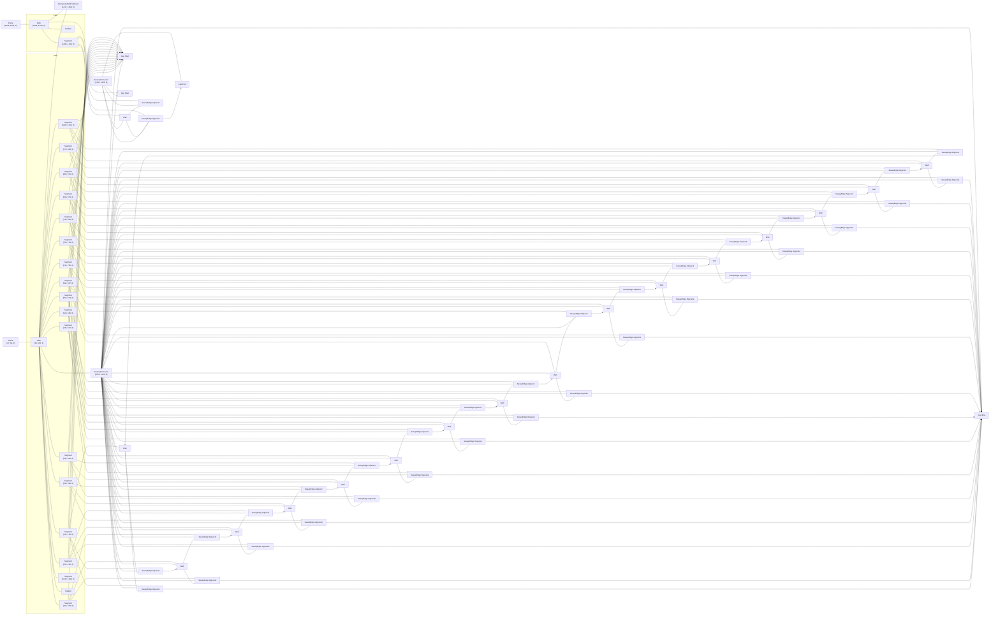

```mermaid
flowchart LR
  subgraph path3 [Path]
    3["Path<br>[88, 135, 0]"]
    5["Segment<br>[141, 163, 0]"]
    6["Segment<br>[169, 253, 0]"]
    7["Segment<br>[259, 292, 0]"]
    8["Segment<br>[298, 393, 0]"]
    9["Segment<br>[399, 430, 0]"]
    10["Segment<br>[436, 522, 0]"]
    11["Segment<br>[528, 550, 0]"]
    12["Segment<br>[556, 578, 0]"]
    13["Segment<br>[584, 607, 0]"]
    14["Segment<br>[613, 700, 0]"]
    15["Segment<br>[706, 739, 0]"]
    16["Segment<br>[745, 840, 0]"]
    17["Segment<br>[846, 879, 0]"]
    18["Segment<br>[885, 970, 0]"]
    19["Segment<br>[976, 999, 0]"]
    20["Segment<br>[1005, 1026, 0]"]
    21["Segment<br>[1032, 1039, 0]"]
    23[Solid2d]
  end
  subgraph path4 [Path]
    4["Path<br>[1286, 1346, 0]"]
    22["Segment<br>[1286, 1346, 0]"]
    24[Solid2d]
  end
  1["Plane<br>[47, 64, 0]"]
  2["Plane<br>[1239, 1262, 0]"]
  25["Sweep Extrusion<br>[1054, 1123, 0]"]
  26["Sweep Extrusion<br>[1364, 1406, 0]"]
  27["CompositeSolid Subtract<br>[1417, 1460, 0]"]
  28[Wall]
  29[Wall]
  30[Wall]
  31[Wall]
  32[Wall]
  33[Wall]
  34[Wall]
  35[Wall]
  36[Wall]
  37[Wall]
  38[Wall]
  39[Wall]
  40[Wall]
  41[Wall]
  42[Wall]
  43[Wall]
  44[Wall]
  45["Cap Start"]
  46["Cap Start"]
  47["Cap End"]
  48["Cap End"]
  49["SweepEdge Opposite"]
  50["SweepEdge Opposite"]
  51["SweepEdge Opposite"]
  52["SweepEdge Opposite"]
  53["SweepEdge Opposite"]
  54["SweepEdge Opposite"]
  55["SweepEdge Opposite"]
  56["SweepEdge Opposite"]
  57["SweepEdge Opposite"]
  58["SweepEdge Opposite"]
  59["SweepEdge Opposite"]
  60["SweepEdge Opposite"]
  61["SweepEdge Opposite"]
  62["SweepEdge Opposite"]
  63["SweepEdge Opposite"]
  64["SweepEdge Opposite"]
  65["SweepEdge Opposite"]
  66["SweepEdge Adjacent"]
  67["SweepEdge Adjacent"]
  68["SweepEdge Adjacent"]
  69["SweepEdge Adjacent"]
  70["SweepEdge Adjacent"]
  71["SweepEdge Adjacent"]
  72["SweepEdge Adjacent"]
  73["SweepEdge Adjacent"]
  74["SweepEdge Adjacent"]
  75["SweepEdge Adjacent"]
  76["SweepEdge Adjacent"]
  77["SweepEdge Adjacent"]
  78["SweepEdge Adjacent"]
  79["SweepEdge Adjacent"]
  80["SweepEdge Adjacent"]
  81["SweepEdge Adjacent"]
  82["SweepEdge Adjacent"]
  1 --- 3
  2 --- 4
  3 --- 5
  3 --- 6
  3 --- 7
  3 --- 8
  3 --- 9
  3 --- 10
  3 --- 11
  3 --- 12
  3 --- 13
  3 --- 14
  3 --- 15
  3 --- 16
  3 --- 17
  3 --- 18
  3 --- 19
  3 --- 20
  3 --- 21
  3 --- 23
  3 ---- 25
  3 --- 27
  4 --- 22
  4 --- 24
  4 ---- 26
  4 --- 27
  5 --- 41
  5 x--> 45
  5 --- 65
  5 --- 82
  6 --- 36
  6 x--> 45
  6 --- 64
  6 --- 81
  7 --- 35
  7 x--> 45
  7 --- 63
  7 --- 80
  8 --- 37
  8 x--> 45
  8 --- 62
  8 --- 79
  9 --- 33
  9 x--> 45
  9 --- 61
  9 --- 78
  10 --- 32
  10 x--> 45
  10 --- 60
  10 --- 77
  11 --- 40
  11 x--> 45
  11 --- 59
  11 --- 76
  12 --- 43
  12 x--> 45
  12 --- 58
  12 --- 75
  13 --- 42
  13 x--> 45
  13 --- 57
  13 --- 74
  14 --- 30
  14 x--> 45
  14 --- 56
  14 --- 73
  15 --- 31
  15 x--> 45
  15 --- 55
  15 --- 72
  16 --- 44
  16 x--> 45
  16 --- 54
  16 --- 71
  17 --- 38
  17 x--> 45
  17 --- 53
  17 --- 70
  18 --- 34
  18 x--> 45
  18 --- 52
  18 --- 69
  19 --- 29
  19 x--> 45
  19 --- 51
  19 --- 68
  20 --- 39
  20 x--> 45
  20 --- 50
  20 --- 67
  22 --- 28
  22 x--> 46
  22 --- 49
  22 --- 66
  25 --- 29
  25 --- 30
  25 --- 31
  25 --- 32
  25 --- 33
  25 --- 34
  25 --- 35
  25 --- 36
  25 --- 37
  25 --- 38
  25 --- 39
  25 --- 40
  25 --- 41
  25 --- 42
  25 --- 43
  25 --- 44
  25 --- 45
  25 --- 47
  25 --- 50
  25 --- 51
  25 --- 52
  25 --- 53
  25 --- 54
  25 --- 55
  25 --- 56
  25 --- 57
  25 --- 58
  25 --- 59
  25 --- 60
  25 --- 61
  25 --- 62
  25 --- 63
  25 --- 64
  25 --- 65
  25 --- 67
  25 --- 68
  25 --- 69
  25 --- 70
  25 --- 71
  25 --- 72
  25 --- 73
  25 --- 74
  25 --- 75
  25 --- 76
  25 --- 77
  25 --- 78
  25 --- 79
  25 --- 80
  25 --- 81
  25 --- 82
  26 --- 28
  26 --- 46
  26 --- 48
  26 --- 49
  26 --- 66
  28 --- 49
  28 --- 66
  29 --- 51
  29 --- 68
  69 <--x 29
  30 --- 56
  30 --- 73
  74 <--x 30
  31 --- 55
  31 --- 72
  73 <--x 31
  32 --- 60
  32 --- 77
  78 <--x 32
  33 --- 61
  33 --- 78
  79 <--x 33
  34 --- 52
  34 --- 69
  70 <--x 34
  35 --- 63
  35 --- 80
  81 <--x 35
  36 --- 64
  36 --- 81
  82 <--x 36
  37 --- 62
  37 --- 79
  80 <--x 37
  38 --- 53
  38 --- 70
  71 <--x 38
  39 --- 50
  39 --- 67
  68 <--x 39
  40 --- 59
  40 --- 76
  77 <--x 40
  41 --- 65
  67 <--x 41
  41 --- 82
  42 --- 57
  42 --- 74
  75 <--x 42
  43 --- 58
  43 --- 75
  76 <--x 43
  44 --- 54
  44 --- 71
  72 <--x 44
  50 <--x 47
  51 <--x 47
  52 <--x 47
  53 <--x 47
  54 <--x 47
  55 <--x 47
  56 <--x 47
  57 <--x 47
  58 <--x 47
  59 <--x 47
  60 <--x 47
  61 <--x 47
  62 <--x 47
  63 <--x 47
  64 <--x 47
  65 <--x 47
  49 <--x 48
```
