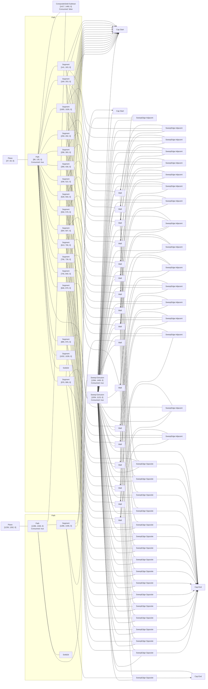

```mermaid
flowchart LR
  subgraph path23 [Path]
    23["Path<br>[88, 135, 0]<br>Consumed: true"]
      %% [ProgramBodyItem { index: 1 }, VariableDeclarationDeclaration, VariableDeclarationInit, PipeBodyItem { index: 0 }]
    24["Segment<br>[141, 163, 0]"]
      %% [ProgramBodyItem { index: 1 }, VariableDeclarationDeclaration, VariableDeclarationInit, PipeBodyItem { index: 1 }]
    25["Segment<br>[169, 253, 0]"]
      %% [ProgramBodyItem { index: 1 }, VariableDeclarationDeclaration, VariableDeclarationInit, PipeBodyItem { index: 2 }]
    26["Segment<br>[259, 292, 0]"]
      %% [ProgramBodyItem { index: 1 }, VariableDeclarationDeclaration, VariableDeclarationInit, PipeBodyItem { index: 3 }]
    27["Segment<br>[298, 393, 0]"]
      %% [ProgramBodyItem { index: 1 }, VariableDeclarationDeclaration, VariableDeclarationInit, PipeBodyItem { index: 4 }]
    28["Segment<br>[399, 430, 0]"]
      %% [ProgramBodyItem { index: 1 }, VariableDeclarationDeclaration, VariableDeclarationInit, PipeBodyItem { index: 5 }]
    29["Segment<br>[436, 522, 0]"]
      %% [ProgramBodyItem { index: 1 }, VariableDeclarationDeclaration, VariableDeclarationInit, PipeBodyItem { index: 6 }]
    30["Segment<br>[528, 550, 0]"]
      %% [ProgramBodyItem { index: 1 }, VariableDeclarationDeclaration, VariableDeclarationInit, PipeBodyItem { index: 7 }]
    31["Segment<br>[556, 578, 0]"]
      %% [ProgramBodyItem { index: 1 }, VariableDeclarationDeclaration, VariableDeclarationInit, PipeBodyItem { index: 8 }]
    32["Segment<br>[584, 607, 0]"]
      %% [ProgramBodyItem { index: 1 }, VariableDeclarationDeclaration, VariableDeclarationInit, PipeBodyItem { index: 9 }]
    33["Segment<br>[613, 700, 0]"]
      %% [ProgramBodyItem { index: 1 }, VariableDeclarationDeclaration, VariableDeclarationInit, PipeBodyItem { index: 10 }]
    34["Segment<br>[706, 739, 0]"]
      %% [ProgramBodyItem { index: 1 }, VariableDeclarationDeclaration, VariableDeclarationInit, PipeBodyItem { index: 11 }]
    35["Segment<br>[745, 840, 0]"]
      %% [ProgramBodyItem { index: 1 }, VariableDeclarationDeclaration, VariableDeclarationInit, PipeBodyItem { index: 12 }]
    36["Segment<br>[846, 879, 0]"]
      %% [ProgramBodyItem { index: 1 }, VariableDeclarationDeclaration, VariableDeclarationInit, PipeBodyItem { index: 13 }]
    37["Segment<br>[885, 970, 0]"]
      %% [ProgramBodyItem { index: 1 }, VariableDeclarationDeclaration, VariableDeclarationInit, PipeBodyItem { index: 14 }]
    38["Segment<br>[976, 999, 0]"]
      %% [ProgramBodyItem { index: 1 }, VariableDeclarationDeclaration, VariableDeclarationInit, PipeBodyItem { index: 15 }]
    39["Segment<br>[1005, 1026, 0]"]
      %% [ProgramBodyItem { index: 1 }, VariableDeclarationDeclaration, VariableDeclarationInit, PipeBodyItem { index: 16 }]
    40["Segment<br>[1032, 1039, 0]"]
      %% [ProgramBodyItem { index: 1 }, VariableDeclarationDeclaration, VariableDeclarationInit, PipeBodyItem { index: 17 }]
    48[Solid2d]
  end
  subgraph path43 [Path]
    43["Path<br>[1286, 1346, 0]<br>Consumed: true"]
      %% [ProgramBodyItem { index: 5 }, VariableDeclarationDeclaration, VariableDeclarationInit]
    44["Segment<br>[1286, 1346, 0]"]
      %% [ProgramBodyItem { index: 5 }, VariableDeclarationDeclaration, VariableDeclarationInit]
    47[Solid2d]
  end
  1["Cap End"]
    %% face_code_ref=Missing NodePath
  2["Cap End"]
    %% face_code_ref=Missing NodePath
  3["Cap Start"]
    %% face_code_ref=Missing NodePath
  4["Cap Start"]
    %% face_code_ref=Missing NodePath
  5[Wall]
    %% face_code_ref=Missing NodePath
  6[Wall]
    %% face_code_ref=Missing NodePath
  7[Wall]
    %% face_code_ref=Missing NodePath
  8[Wall]
    %% face_code_ref=Missing NodePath
  9[Wall]
    %% face_code_ref=Missing NodePath
  10[Wall]
    %% face_code_ref=Missing NodePath
  11[Wall]
    %% face_code_ref=Missing NodePath
  12[Wall]
    %% face_code_ref=Missing NodePath
  13[Wall]
    %% face_code_ref=Missing NodePath
  14[Wall]
    %% face_code_ref=Missing NodePath
  15[Wall]
    %% face_code_ref=Missing NodePath
  16[Wall]
    %% face_code_ref=Missing NodePath
  17[Wall]
    %% face_code_ref=Missing NodePath
  18[Wall]
    %% face_code_ref=Missing NodePath
  19[Wall]
    %% face_code_ref=Missing NodePath
  20[Wall]
    %% face_code_ref=Missing NodePath
  21[Wall]
    %% face_code_ref=Missing NodePath
  22["Plane<br>[47, 64, 0]"]
    %% [ProgramBodyItem { index: 0 }, VariableDeclarationDeclaration, VariableDeclarationInit]
  41["Sweep Extrusion<br>[1054, 1123, 0]<br>Consumed: true"]
    %% [ProgramBodyItem { index: 2 }, VariableDeclarationDeclaration, VariableDeclarationInit]
  42["Plane<br>[1239, 1262, 0]"]
    %% [ProgramBodyItem { index: 4 }, VariableDeclarationDeclaration, VariableDeclarationInit]
  45["Sweep Extrusion<br>[1364, 1406, 0]<br>Consumed: true"]
    %% [ProgramBodyItem { index: 6 }, VariableDeclarationDeclaration, VariableDeclarationInit]
  46["CompositeSolid Subtract<br>[1417, 1460, 0]<br>Consumed: false"]
    %% [ProgramBodyItem { index: 7 }, VariableDeclarationDeclaration, VariableDeclarationInit]
  49["SweepEdge Adjacent"]
  50["SweepEdge Adjacent"]
  51["SweepEdge Adjacent"]
  52["SweepEdge Adjacent"]
  53["SweepEdge Adjacent"]
  54["SweepEdge Adjacent"]
  55["SweepEdge Adjacent"]
  56["SweepEdge Adjacent"]
  57["SweepEdge Adjacent"]
  58["SweepEdge Adjacent"]
  59["SweepEdge Adjacent"]
  60["SweepEdge Adjacent"]
  61["SweepEdge Adjacent"]
  62["SweepEdge Adjacent"]
  63["SweepEdge Adjacent"]
  64["SweepEdge Adjacent"]
  65["SweepEdge Adjacent"]
  66["SweepEdge Opposite"]
  67["SweepEdge Opposite"]
  68["SweepEdge Opposite"]
  69["SweepEdge Opposite"]
  70["SweepEdge Opposite"]
  71["SweepEdge Opposite"]
  72["SweepEdge Opposite"]
  73["SweepEdge Opposite"]
  74["SweepEdge Opposite"]
  75["SweepEdge Opposite"]
  76["SweepEdge Opposite"]
  77["SweepEdge Opposite"]
  78["SweepEdge Opposite"]
  79["SweepEdge Opposite"]
  80["SweepEdge Opposite"]
  81["SweepEdge Opposite"]
  82["SweepEdge Opposite"]
  41 --- 1
  66 <--x 1
  68 <--x 1
  69 <--x 1
  70 <--x 1
  71 <--x 1
  72 <--x 1
  73 <--x 1
  74 <--x 1
  75 <--x 1
  76 <--x 1
  77 <--x 1
  78 <--x 1
  79 <--x 1
  80 <--x 1
  81 <--x 1
  82 <--x 1
  45 --- 2
  67 <--x 2
  24 <--x 3
  25 <--x 3
  26 <--x 3
  27 <--x 3
  28 <--x 3
  29 <--x 3
  30 <--x 3
  31 <--x 3
  32 <--x 3
  33 <--x 3
  34 <--x 3
  35 <--x 3
  36 <--x 3
  37 <--x 3
  38 <--x 3
  39 <--x 3
  41 --- 3
  44 <--x 4
  45 --- 4
  39 --- 5
  41 --- 5
  5 --- 49
  49 <--x 5
  5 --- 66
  44 --- 6
  45 --- 6
  6 --- 50
  6 --- 67
  24 --- 7
  41 --- 7
  7 --- 51
  51 <--x 7
  7 --- 68
  25 --- 8
  41 --- 8
  8 --- 52
  52 <--x 8
  8 --- 69
  26 --- 9
  41 --- 9
  9 --- 53
  53 <--x 9
  9 --- 70
  27 --- 10
  41 --- 10
  10 --- 54
  54 <--x 10
  10 --- 71
  28 --- 11
  41 --- 11
  11 --- 55
  55 <--x 11
  11 --- 72
  29 --- 12
  41 --- 12
  12 --- 56
  56 <--x 12
  12 --- 73
  30 --- 13
  41 --- 13
  13 --- 57
  57 <--x 13
  13 --- 74
  31 --- 14
  41 --- 14
  14 --- 58
  58 <--x 14
  14 --- 75
  32 --- 15
  41 --- 15
  15 --- 59
  59 <--x 15
  15 --- 76
  33 --- 16
  41 --- 16
  16 --- 60
  60 <--x 16
  16 --- 77
  34 --- 17
  41 --- 17
  17 --- 61
  61 <--x 17
  17 --- 78
  35 --- 18
  41 --- 18
  18 --- 62
  62 <--x 18
  18 --- 79
  36 --- 19
  41 --- 19
  19 --- 63
  63 <--x 19
  19 --- 80
  37 --- 20
  41 --- 20
  20 --- 64
  64 <--x 20
  20 --- 81
  38 --- 21
  41 --- 21
  21 --- 65
  65 <--x 21
  21 --- 82
  22 --- 23
  23 --- 24
  23 --- 25
  23 --- 26
  23 --- 27
  23 --- 28
  23 --- 29
  23 --- 30
  23 --- 31
  23 --- 32
  23 --- 33
  23 --- 34
  23 --- 35
  23 --- 36
  23 --- 37
  23 --- 38
  23 --- 39
  23 --- 40
  23 ---- 41
  23 --- 46
  23 --- 48
  24 --- 51
  24 --- 68
  25 --- 52
  25 --- 69
  26 --- 53
  26 --- 70
  27 --- 54
  27 --- 71
  28 --- 55
  28 --- 72
  29 --- 56
  29 --- 73
  30 --- 57
  30 --- 74
  31 --- 58
  31 --- 75
  32 --- 59
  32 --- 76
  33 --- 60
  33 --- 77
  34 --- 61
  34 --- 78
  35 --- 62
  35 --- 79
  36 --- 63
  36 --- 80
  37 --- 64
  37 --- 81
  38 --- 65
  38 --- 82
  39 --- 49
  39 --- 66
  41 --- 49
  41 --- 51
  41 --- 52
  41 --- 53
  41 --- 54
  41 --- 55
  41 --- 56
  41 --- 57
  41 --- 58
  41 --- 59
  41 --- 60
  41 --- 61
  41 --- 62
  41 --- 63
  41 --- 64
  41 --- 65
  41 --- 66
  41 --- 68
  41 --- 69
  41 --- 70
  41 --- 71
  41 --- 72
  41 --- 73
  41 --- 74
  41 --- 75
  41 --- 76
  41 --- 77
  41 --- 78
  41 --- 79
  41 --- 80
  41 --- 81
  41 --- 82
  42 --- 43
  43 --- 44
  43 ---- 45
  43 --- 46
  43 --- 47
  44 --- 50
  44 --- 67
  45 --- 50
  45 --- 67
```
