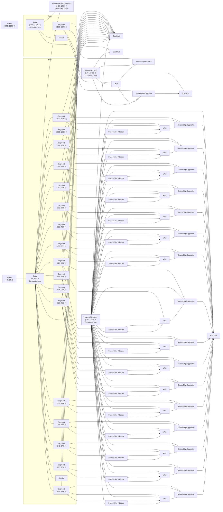

```mermaid
flowchart LR
  subgraph path6 [Path]
    6["Path<br>[1286, 1346, 0]<br>Consumed: true"]
      %% [ProgramBodyItem { index: 5 }, VariableDeclarationDeclaration, VariableDeclarationInit]
    12["Segment<br>[1286, 1346, 0]"]
      %% [ProgramBodyItem { index: 5 }, VariableDeclarationDeclaration, VariableDeclarationInit]
    28[Solid2d]
  end
  subgraph path7 [Path]
    7["Path<br>[88, 135, 0]<br>Consumed: true"]
      %% [ProgramBodyItem { index: 1 }, VariableDeclarationDeclaration, VariableDeclarationInit, PipeBodyItem { index: 0 }]
    10["Segment<br>[1005, 1026, 0]"]
      %% [ProgramBodyItem { index: 1 }, VariableDeclarationDeclaration, VariableDeclarationInit, PipeBodyItem { index: 16 }]
    11["Segment<br>[1032, 1039, 0]"]
      %% [ProgramBodyItem { index: 1 }, VariableDeclarationDeclaration, VariableDeclarationInit, PipeBodyItem { index: 17 }]
    13["Segment<br>[141, 163, 0]"]
      %% [ProgramBodyItem { index: 1 }, VariableDeclarationDeclaration, VariableDeclarationInit, PipeBodyItem { index: 1 }]
    14["Segment<br>[169, 253, 0]"]
      %% [ProgramBodyItem { index: 1 }, VariableDeclarationDeclaration, VariableDeclarationInit, PipeBodyItem { index: 2 }]
    15["Segment<br>[259, 292, 0]"]
      %% [ProgramBodyItem { index: 1 }, VariableDeclarationDeclaration, VariableDeclarationInit, PipeBodyItem { index: 3 }]
    16["Segment<br>[298, 393, 0]"]
      %% [ProgramBodyItem { index: 1 }, VariableDeclarationDeclaration, VariableDeclarationInit, PipeBodyItem { index: 4 }]
    17["Segment<br>[399, 430, 0]"]
      %% [ProgramBodyItem { index: 1 }, VariableDeclarationDeclaration, VariableDeclarationInit, PipeBodyItem { index: 5 }]
    18["Segment<br>[436, 522, 0]"]
      %% [ProgramBodyItem { index: 1 }, VariableDeclarationDeclaration, VariableDeclarationInit, PipeBodyItem { index: 6 }]
    19["Segment<br>[528, 550, 0]"]
      %% [ProgramBodyItem { index: 1 }, VariableDeclarationDeclaration, VariableDeclarationInit, PipeBodyItem { index: 7 }]
    20["Segment<br>[556, 578, 0]"]
      %% [ProgramBodyItem { index: 1 }, VariableDeclarationDeclaration, VariableDeclarationInit, PipeBodyItem { index: 8 }]
    21["Segment<br>[584, 607, 0]"]
      %% [ProgramBodyItem { index: 1 }, VariableDeclarationDeclaration, VariableDeclarationInit, PipeBodyItem { index: 9 }]
    22["Segment<br>[613, 700, 0]"]
      %% [ProgramBodyItem { index: 1 }, VariableDeclarationDeclaration, VariableDeclarationInit, PipeBodyItem { index: 10 }]
    23["Segment<br>[706, 739, 0]"]
      %% [ProgramBodyItem { index: 1 }, VariableDeclarationDeclaration, VariableDeclarationInit, PipeBodyItem { index: 11 }]
    24["Segment<br>[745, 840, 0]"]
      %% [ProgramBodyItem { index: 1 }, VariableDeclarationDeclaration, VariableDeclarationInit, PipeBodyItem { index: 12 }]
    25["Segment<br>[846, 879, 0]"]
      %% [ProgramBodyItem { index: 1 }, VariableDeclarationDeclaration, VariableDeclarationInit, PipeBodyItem { index: 13 }]
    26["Segment<br>[885, 970, 0]"]
      %% [ProgramBodyItem { index: 1 }, VariableDeclarationDeclaration, VariableDeclarationInit, PipeBodyItem { index: 14 }]
    27["Segment<br>[976, 999, 0]"]
      %% [ProgramBodyItem { index: 1 }, VariableDeclarationDeclaration, VariableDeclarationInit, PipeBodyItem { index: 15 }]
    29[Solid2d]
  end
  1["Cap End"]
    %% face_code_ref=Missing NodePath
  2["Cap End"]
    %% face_code_ref=Missing NodePath
  3["Cap Start"]
    %% face_code_ref=Missing NodePath
  4["Cap Start"]
    %% face_code_ref=Missing NodePath
  5["CompositeSolid Subtract<br>[1417, 1460, 0]<br>Consumed: false"]
    %% [ProgramBodyItem { index: 7 }, VariableDeclarationDeclaration, VariableDeclarationInit]
  8["Plane<br>[1239, 1262, 0]"]
    %% [ProgramBodyItem { index: 4 }, VariableDeclarationDeclaration, VariableDeclarationInit]
  9["Plane<br>[47, 64, 0]"]
    %% [ProgramBodyItem { index: 0 }, VariableDeclarationDeclaration, VariableDeclarationInit]
  30["Sweep Extrusion<br>[1054, 1123, 0]<br>Consumed: true"]
    %% [ProgramBodyItem { index: 2 }, VariableDeclarationDeclaration, VariableDeclarationInit]
  31["Sweep Extrusion<br>[1364, 1406, 0]<br>Consumed: true"]
    %% [ProgramBodyItem { index: 6 }, VariableDeclarationDeclaration, VariableDeclarationInit]
  32["SweepEdge Adjacent"]
  33["SweepEdge Adjacent"]
  34["SweepEdge Adjacent"]
  35["SweepEdge Adjacent"]
  36["SweepEdge Adjacent"]
  37["SweepEdge Adjacent"]
  38["SweepEdge Adjacent"]
  39["SweepEdge Adjacent"]
  40["SweepEdge Adjacent"]
  41["SweepEdge Adjacent"]
  42["SweepEdge Adjacent"]
  43["SweepEdge Adjacent"]
  44["SweepEdge Adjacent"]
  45["SweepEdge Adjacent"]
  46["SweepEdge Adjacent"]
  47["SweepEdge Adjacent"]
  48["SweepEdge Adjacent"]
  49["SweepEdge Opposite"]
  50["SweepEdge Opposite"]
  51["SweepEdge Opposite"]
  52["SweepEdge Opposite"]
  53["SweepEdge Opposite"]
  54["SweepEdge Opposite"]
  55["SweepEdge Opposite"]
  56["SweepEdge Opposite"]
  57["SweepEdge Opposite"]
  58["SweepEdge Opposite"]
  59["SweepEdge Opposite"]
  60["SweepEdge Opposite"]
  61["SweepEdge Opposite"]
  62["SweepEdge Opposite"]
  63["SweepEdge Opposite"]
  64["SweepEdge Opposite"]
  65["SweepEdge Opposite"]
  66[Wall]
    %% face_code_ref=Missing NodePath
  67[Wall]
    %% face_code_ref=Missing NodePath
  68[Wall]
    %% face_code_ref=Missing NodePath
  69[Wall]
    %% face_code_ref=Missing NodePath
  70[Wall]
    %% face_code_ref=Missing NodePath
  71[Wall]
    %% face_code_ref=Missing NodePath
  72[Wall]
    %% face_code_ref=Missing NodePath
  73[Wall]
    %% face_code_ref=Missing NodePath
  74[Wall]
    %% face_code_ref=Missing NodePath
  75[Wall]
    %% face_code_ref=Missing NodePath
  76[Wall]
    %% face_code_ref=Missing NodePath
  77[Wall]
    %% face_code_ref=Missing NodePath
  78[Wall]
    %% face_code_ref=Missing NodePath
  79[Wall]
    %% face_code_ref=Missing NodePath
  80[Wall]
    %% face_code_ref=Missing NodePath
  81[Wall]
    %% face_code_ref=Missing NodePath
  82[Wall]
    %% face_code_ref=Missing NodePath
  30 --- 1
  49 <--x 1
  51 <--x 1
  52 <--x 1
  53 <--x 1
  54 <--x 1
  55 <--x 1
  56 <--x 1
  57 <--x 1
  58 <--x 1
  59 <--x 1
  60 <--x 1
  61 <--x 1
  62 <--x 1
  63 <--x 1
  64 <--x 1
  65 <--x 1
  31 --- 2
  50 <--x 2
  10 <--x 3
  13 <--x 3
  14 <--x 3
  15 <--x 3
  16 <--x 3
  17 <--x 3
  18 <--x 3
  19 <--x 3
  20 <--x 3
  21 <--x 3
  22 <--x 3
  23 <--x 3
  24 <--x 3
  25 <--x 3
  26 <--x 3
  27 <--x 3
  30 --- 3
  12 <--x 4
  31 --- 4
  6 --- 5
  7 --- 5
  8 --- 6
  6 --- 12
  6 --- 28
  6 ---- 31
  9 --- 7
  7 --- 10
  7 --- 11
  7 --- 13
  7 --- 14
  7 --- 15
  7 --- 16
  7 --- 17
  7 --- 18
  7 --- 19
  7 --- 20
  7 --- 21
  7 --- 22
  7 --- 23
  7 --- 24
  7 --- 25
  7 --- 26
  7 --- 27
  7 --- 29
  7 ---- 30
  10 --- 32
  10 --- 49
  10 --- 66
  12 --- 33
  12 --- 50
  12 --- 67
  13 --- 34
  13 --- 51
  13 --- 68
  14 --- 35
  14 --- 52
  14 --- 69
  15 --- 36
  15 --- 53
  15 --- 70
  16 --- 37
  16 --- 54
  16 --- 71
  17 --- 38
  17 --- 55
  17 --- 72
  18 --- 39
  18 --- 56
  18 --- 73
  19 --- 40
  19 --- 57
  19 --- 74
  20 --- 41
  20 --- 58
  20 --- 75
  21 --- 42
  21 --- 59
  21 --- 76
  22 --- 43
  22 --- 60
  22 --- 77
  23 --- 44
  23 --- 61
  23 --- 78
  24 --- 45
  24 --- 62
  24 --- 79
  25 --- 46
  25 --- 63
  25 --- 80
  26 --- 47
  26 --- 64
  26 --- 81
  27 --- 48
  27 --- 65
  27 --- 82
  30 --- 32
  30 --- 34
  30 --- 35
  30 --- 36
  30 --- 37
  30 --- 38
  30 --- 39
  30 --- 40
  30 --- 41
  30 --- 42
  30 --- 43
  30 --- 44
  30 --- 45
  30 --- 46
  30 --- 47
  30 --- 48
  30 --- 49
  30 --- 51
  30 --- 52
  30 --- 53
  30 --- 54
  30 --- 55
  30 --- 56
  30 --- 57
  30 --- 58
  30 --- 59
  30 --- 60
  30 --- 61
  30 --- 62
  30 --- 63
  30 --- 64
  30 --- 65
  30 --- 66
  30 --- 68
  30 --- 69
  30 --- 70
  30 --- 71
  30 --- 72
  30 --- 73
  30 --- 74
  30 --- 75
  30 --- 76
  30 --- 77
  30 --- 78
  30 --- 79
  30 --- 80
  30 --- 81
  30 --- 82
  31 --- 33
  31 --- 50
  31 --- 67
  66 --- 32
  32 x--> 66
  67 --- 33
  68 --- 34
  34 x--> 68
  69 --- 35
  35 x--> 69
  70 --- 36
  36 x--> 70
  71 --- 37
  37 x--> 71
  72 --- 38
  38 x--> 72
  73 --- 39
  39 x--> 73
  74 --- 40
  40 x--> 74
  75 --- 41
  41 x--> 75
  76 --- 42
  42 x--> 76
  77 --- 43
  43 x--> 77
  78 --- 44
  44 x--> 78
  79 --- 45
  45 x--> 79
  80 --- 46
  46 x--> 80
  81 --- 47
  47 x--> 81
  48 x--> 82
  82 --- 48
  66 --- 49
  67 --- 50
  68 --- 51
  69 --- 52
  70 --- 53
  71 --- 54
  72 --- 55
  73 --- 56
  74 --- 57
  75 --- 58
  76 --- 59
  77 --- 60
  78 --- 61
  79 --- 62
  80 --- 63
  81 --- 64
  82 --- 65
```
