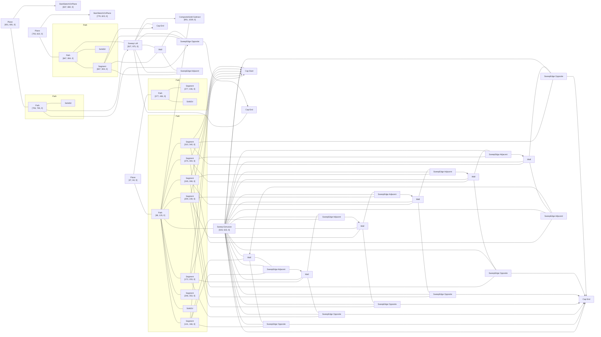

```mermaid
flowchart LR
  subgraph path6 [Path]
    6["Path<br>[88, 135, 0]"]
      %% [ProgramBodyItem { index: 1 }, VariableDeclarationDeclaration, VariableDeclarationInit, PipeBodyItem { index: 0 }]
    10["Segment<br>[141, 166, 0]"]
      %% [ProgramBodyItem { index: 1 }, VariableDeclarationDeclaration, VariableDeclarationInit, PipeBodyItem { index: 1 }]
    11["Segment<br>[172, 203, 0]"]
      %% [ProgramBodyItem { index: 1 }, VariableDeclarationDeclaration, VariableDeclarationInit, PipeBodyItem { index: 2 }]
    12["Segment<br>[209, 239, 0]"]
      %% [ProgramBodyItem { index: 1 }, VariableDeclarationDeclaration, VariableDeclarationInit, PipeBodyItem { index: 3 }]
    13["Segment<br>[245, 269, 0]"]
      %% [ProgramBodyItem { index: 1 }, VariableDeclarationDeclaration, VariableDeclarationInit, PipeBodyItem { index: 4 }]
    14["Segment<br>[275, 304, 0]"]
      %% [ProgramBodyItem { index: 1 }, VariableDeclarationDeclaration, VariableDeclarationInit, PipeBodyItem { index: 5 }]
    15["Segment<br>[310, 340, 0]"]
      %% [ProgramBodyItem { index: 1 }, VariableDeclarationDeclaration, VariableDeclarationInit, PipeBodyItem { index: 6 }]
    16["Segment<br>[346, 353, 0]"]
      %% [ProgramBodyItem { index: 1 }, VariableDeclarationDeclaration, VariableDeclarationInit, PipeBodyItem { index: 7 }]
    20[Solid2d]
  end
  subgraph path7 [Path]
    7["Path<br>[377, 436, 0]"]
      %% [ProgramBodyItem { index: 2 }, VariableDeclarationDeclaration, VariableDeclarationInit]
    17["Segment<br>[377, 436, 0]"]
      %% [ProgramBodyItem { index: 2 }, VariableDeclarationDeclaration, VariableDeclarationInit]
    22[Solid2d]
  end
  subgraph path8 [Path]
    8["Path<br>[706, 765, 0]"]
      %% [ProgramBodyItem { index: 6 }, VariableDeclarationDeclaration, VariableDeclarationInit]
    19[Solid2d]
  end
  subgraph path9 [Path]
    9["Path<br>[847, 904, 0]"]
      %% [ProgramBodyItem { index: 8 }, VariableDeclarationDeclaration, VariableDeclarationInit]
    18["Segment<br>[847, 904, 0]"]
      %% [ProgramBodyItem { index: 8 }, VariableDeclarationDeclaration, VariableDeclarationInit]
    21[Solid2d]
  end
  1["Plane<br>[47, 64, 0]"]
    %% [ProgramBodyItem { index: 0 }, VariableDeclarationDeclaration, VariableDeclarationInit]
  2["Plane<br>[651, 681, 0]"]
    %% [ProgramBodyItem { index: 5 }, VariableDeclarationDeclaration, VariableDeclarationInit, CallKwUnlabeledArg]
  3["Plane<br>[793, 822, 0]"]
    %% [ProgramBodyItem { index: 7 }, VariableDeclarationDeclaration, VariableDeclarationInit, CallKwUnlabeledArg]
  4["StartSketchOnPlane<br>[779, 823, 0]"]
    %% [ProgramBodyItem { index: 7 }, VariableDeclarationDeclaration, VariableDeclarationInit]
  5["StartSketchOnPlane<br>[637, 682, 0]"]
    %% [ProgramBodyItem { index: 5 }, VariableDeclarationDeclaration, VariableDeclarationInit]
  23["Sweep Extrusion<br>[543, 623, 0]"]
    %% [ProgramBodyItem { index: 4 }, VariableDeclarationDeclaration, VariableDeclarationInit]
  24["Sweep Loft<br>[927, 975, 0]"]
    %% [ProgramBodyItem { index: 9 }, VariableDeclarationDeclaration, VariableDeclarationInit]
  25["CompositeSolid Subtract<br>[991, 1039, 0]"]
    %% [ProgramBodyItem { index: 10 }, VariableDeclarationDeclaration, VariableDeclarationInit]
  26[Wall]
    %% face_code_ref=Missing NodePath
  27[Wall]
    %% face_code_ref=Missing NodePath
  28[Wall]
    %% face_code_ref=Missing NodePath
  29[Wall]
    %% face_code_ref=Missing NodePath
  30[Wall]
    %% face_code_ref=Missing NodePath
  31[Wall]
    %% face_code_ref=Missing NodePath
  32[Wall]
    %% face_code_ref=Missing NodePath
  33["Cap Start"]
    %% face_code_ref=Missing NodePath
  34["Cap End"]
    %% face_code_ref=Missing NodePath
  35["Cap End"]
    %% face_code_ref=Missing NodePath
  36["Cap End"]
    %% face_code_ref=Missing NodePath
  37["SweepEdge Opposite"]
  38["SweepEdge Opposite"]
  39["SweepEdge Opposite"]
  40["SweepEdge Opposite"]
  41["SweepEdge Opposite"]
  42["SweepEdge Opposite"]
  43["SweepEdge Opposite"]
  44["SweepEdge Adjacent"]
  45["SweepEdge Adjacent"]
  46["SweepEdge Adjacent"]
  47["SweepEdge Adjacent"]
  48["SweepEdge Adjacent"]
  49["SweepEdge Adjacent"]
  50["SweepEdge Adjacent"]
  1 --- 6
  1 --- 7
  2 <--x 5
  2 --- 8
  3 <--x 4
  3 --- 9
  6 --- 10
  6 --- 11
  6 --- 12
  6 --- 13
  6 --- 14
  6 --- 15
  6 --- 16
  6 --- 20
  6 ---- 23
  6 --- 25
  7 --- 17
  7 --- 22
  8 --- 19
  8 x---> 24
  8 x--> 43
  9 --- 18
  9 --- 21
  9 ---- 24
  10 --- 31
  10 x--> 33
  10 --- 37
  10 --- 44
  11 --- 29
  11 x--> 33
  11 --- 38
  11 --- 45
  12 --- 28
  12 x--> 33
  12 --- 39
  12 --- 46
  13 --- 30
  13 x--> 33
  13 --- 40
  13 --- 47
  14 --- 27
  14 x--> 33
  14 --- 41
  14 --- 48
  15 --- 26
  15 x--> 33
  15 --- 42
  15 --- 49
  18 --- 32
  18 x--> 36
  18 --- 43
  18 --- 50
  23 --- 26
  23 --- 27
  23 --- 28
  23 --- 29
  23 --- 30
  23 --- 31
  23 --- 33
  23 --- 34
  23 --- 37
  23 --- 38
  23 --- 39
  23 --- 40
  23 --- 41
  23 --- 42
  23 --- 44
  23 --- 45
  23 --- 46
  23 --- 47
  23 --- 48
  23 --- 49
  24 <--x 25
  24 --- 32
  24 --- 35
  24 --- 36
  24 --- 43
  24 --- 50
  26 --- 42
  48 <--x 26
  26 --- 49
  27 --- 41
  47 <--x 27
  27 --- 48
  28 --- 39
  45 <--x 28
  28 --- 46
  29 --- 38
  44 <--x 29
  29 --- 45
  30 --- 40
  46 <--x 30
  30 --- 47
  31 --- 37
  31 --- 44
  49 <--x 31
  32 --- 43
  32 --- 50
  37 <--x 34
  38 <--x 34
  39 <--x 34
  40 <--x 34
  41 <--x 34
  42 <--x 34
  43 <--x 35
```
