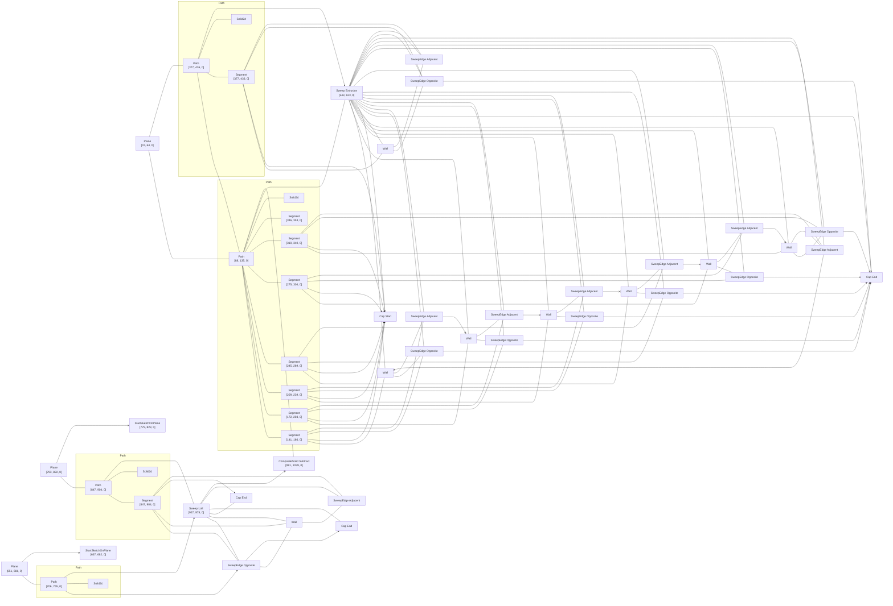

```mermaid
flowchart LR
  subgraph path2 [Path]
    2["Path<br>[88, 135, 0]"]
      %% [ProgramBodyItem { index: 1 }, VariableDeclarationDeclaration, VariableDeclarationInit, PipeBodyItem { index: 0 }]
    3["Segment<br>[141, 166, 0]"]
      %% [ProgramBodyItem { index: 1 }, VariableDeclarationDeclaration, VariableDeclarationInit, PipeBodyItem { index: 1 }]
    4["Segment<br>[172, 203, 0]"]
      %% [ProgramBodyItem { index: 1 }, VariableDeclarationDeclaration, VariableDeclarationInit, PipeBodyItem { index: 2 }]
    5["Segment<br>[209, 239, 0]"]
      %% [ProgramBodyItem { index: 1 }, VariableDeclarationDeclaration, VariableDeclarationInit, PipeBodyItem { index: 3 }]
    6["Segment<br>[245, 269, 0]"]
      %% [ProgramBodyItem { index: 1 }, VariableDeclarationDeclaration, VariableDeclarationInit, PipeBodyItem { index: 4 }]
    7["Segment<br>[275, 304, 0]"]
      %% [ProgramBodyItem { index: 1 }, VariableDeclarationDeclaration, VariableDeclarationInit, PipeBodyItem { index: 5 }]
    8["Segment<br>[310, 340, 0]"]
      %% [ProgramBodyItem { index: 1 }, VariableDeclarationDeclaration, VariableDeclarationInit, PipeBodyItem { index: 6 }]
    9["Segment<br>[346, 353, 0]"]
      %% [ProgramBodyItem { index: 1 }, VariableDeclarationDeclaration, VariableDeclarationInit, PipeBodyItem { index: 7 }]
    10[Solid2d]
  end
  subgraph path11 [Path]
    11["Path<br>[377, 436, 0]"]
      %% [ProgramBodyItem { index: 2 }, VariableDeclarationDeclaration, VariableDeclarationInit]
    12["Segment<br>[377, 436, 0]"]
      %% [ProgramBodyItem { index: 2 }, VariableDeclarationDeclaration, VariableDeclarationInit]
    13[Solid2d]
  end
  subgraph path39 [Path]
    39["Path<br>[706, 765, 0]"]
      %% [ProgramBodyItem { index: 6 }, VariableDeclarationDeclaration, VariableDeclarationInit]
    41[Solid2d]
  end
  subgraph path43 [Path]
    43["Path<br>[847, 904, 0]"]
      %% [ProgramBodyItem { index: 8 }, VariableDeclarationDeclaration, VariableDeclarationInit]
    44["Segment<br>[847, 904, 0]"]
      %% [ProgramBodyItem { index: 8 }, VariableDeclarationDeclaration, VariableDeclarationInit]
    45[Solid2d]
  end
  1["Plane<br>[47, 64, 0]"]
    %% [ProgramBodyItem { index: 0 }, VariableDeclarationDeclaration, VariableDeclarationInit]
  14["Sweep Extrusion<br>[543, 623, 0]"]
    %% [ProgramBodyItem { index: 4 }, VariableDeclarationDeclaration, VariableDeclarationInit]
  15[Wall]
    %% face_code_ref=Missing NodePath
  16[Wall]
    %% face_code_ref=Missing NodePath
  17[Wall]
    %% face_code_ref=Missing NodePath
  18[Wall]
    %% face_code_ref=Missing NodePath
  19[Wall]
    %% face_code_ref=Missing NodePath
  20[Wall]
    %% face_code_ref=Missing NodePath
  21[Wall]
    %% face_code_ref=Missing NodePath
  22["Cap Start"]
    %% face_code_ref=Missing NodePath
  23["Cap End"]
    %% face_code_ref=Missing NodePath
  24["SweepEdge Opposite"]
  25["SweepEdge Adjacent"]
  26["SweepEdge Opposite"]
  27["SweepEdge Adjacent"]
  28["SweepEdge Opposite"]
  29["SweepEdge Adjacent"]
  30["SweepEdge Opposite"]
  31["SweepEdge Adjacent"]
  32["SweepEdge Opposite"]
  33["SweepEdge Adjacent"]
  34["SweepEdge Opposite"]
  35["SweepEdge Adjacent"]
  36["SweepEdge Opposite"]
  37["SweepEdge Adjacent"]
  38["Plane<br>[651, 681, 0]"]
    %% [ProgramBodyItem { index: 5 }, VariableDeclarationDeclaration, VariableDeclarationInit, CallKwUnlabeledArg]
  40["SweepEdge Opposite"]
  42["Plane<br>[793, 822, 0]"]
    %% [ProgramBodyItem { index: 7 }, VariableDeclarationDeclaration, VariableDeclarationInit, CallKwUnlabeledArg]
  46["Sweep Loft<br>[927, 975, 0]"]
    %% [ProgramBodyItem { index: 9 }, VariableDeclarationDeclaration, VariableDeclarationInit]
  47[Wall]
    %% face_code_ref=Missing NodePath
  48["Cap End"]
    %% face_code_ref=Missing NodePath
  49["Cap End"]
    %% face_code_ref=Missing NodePath
  50["SweepEdge Adjacent"]
  51["CompositeSolid Subtract<br>[991, 1039, 0]"]
    %% [ProgramBodyItem { index: 10 }, VariableDeclarationDeclaration, VariableDeclarationInit]
  52["StartSketchOnPlane<br>[637, 682, 0]"]
    %% [ProgramBodyItem { index: 5 }, VariableDeclarationDeclaration, VariableDeclarationInit]
  53["StartSketchOnPlane<br>[779, 823, 0]"]
    %% [ProgramBodyItem { index: 7 }, VariableDeclarationDeclaration, VariableDeclarationInit]
  1 --- 2
  1 --- 11
  2 --- 3
  2 --- 4
  2 --- 5
  2 --- 6
  2 --- 7
  2 --- 8
  2 --- 9
  2 --- 10
  11 --- 2
  2 ---- 14
  2 --- 51
  3 --- 15
  3 x--> 22
  3 --- 24
  3 --- 25
  4 --- 16
  4 x--> 22
  4 --- 26
  4 --- 27
  5 --- 17
  5 x--> 22
  5 --- 28
  5 --- 29
  6 --- 18
  6 x--> 22
  6 --- 30
  6 --- 31
  7 --- 19
  7 x--> 22
  7 --- 32
  7 --- 33
  8 --- 20
  8 x--> 22
  8 --- 34
  8 --- 35
  11 --- 12
  11 --- 13
  11 x---> 14
  12 --- 21
  12 x--> 22
  12 --- 36
  12 --- 37
  14 --- 15
  14 --- 16
  14 --- 17
  14 --- 18
  14 --- 19
  14 --- 20
  14 --- 21
  14 --- 22
  14 --- 23
  14 --- 24
  14 --- 25
  14 --- 26
  14 --- 27
  14 --- 28
  14 --- 29
  14 --- 30
  14 --- 31
  14 --- 32
  14 --- 33
  14 --- 34
  14 --- 35
  14 --- 36
  14 --- 37
  15 --- 24
  15 --- 25
  35 <--x 15
  25 <--x 16
  16 --- 26
  16 --- 27
  27 <--x 17
  17 --- 28
  17 --- 29
  29 <--x 18
  18 --- 30
  18 --- 31
  31 <--x 19
  19 --- 32
  19 --- 33
  33 <--x 20
  20 --- 34
  20 --- 35
  21 --- 36
  21 --- 37
  24 <--x 23
  26 <--x 23
  28 <--x 23
  30 <--x 23
  32 <--x 23
  34 <--x 23
  36 <--x 23
  38 --- 39
  38 <--x 52
  39 x--> 40
  39 --- 41
  39 x---> 46
  44 --- 40
  46 --- 40
  40 --- 47
  40 x--> 49
  42 --- 43
  42 <--x 53
  43 --- 44
  43 --- 45
  43 ---- 46
  44 --- 47
  44 x--> 48
  44 --- 50
  46 --- 47
  46 --- 48
  46 --- 49
  46 --- 50
  46 <--x 51
  47 --- 50
```
