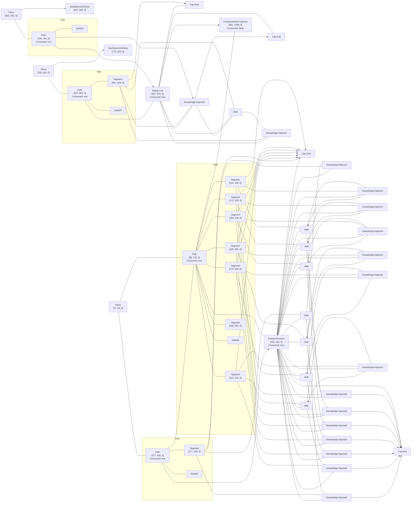

```mermaid
flowchart LR
  subgraph path14 [Path]
    14["Path<br>[88, 135, 0]<br>Consumed: true"]
      %% [ProgramBodyItem { index: 1 }, VariableDeclarationDeclaration, VariableDeclarationInit, PipeBodyItem { index: 0 }]
    15["Segment<br>[141, 166, 0]"]
      %% [ProgramBodyItem { index: 1 }, VariableDeclarationDeclaration, VariableDeclarationInit, PipeBodyItem { index: 1 }]
    16["Segment<br>[172, 203, 0]"]
      %% [ProgramBodyItem { index: 1 }, VariableDeclarationDeclaration, VariableDeclarationInit, PipeBodyItem { index: 2 }]
    17["Segment<br>[209, 239, 0]"]
      %% [ProgramBodyItem { index: 1 }, VariableDeclarationDeclaration, VariableDeclarationInit, PipeBodyItem { index: 3 }]
    18["Segment<br>[245, 269, 0]"]
      %% [ProgramBodyItem { index: 1 }, VariableDeclarationDeclaration, VariableDeclarationInit, PipeBodyItem { index: 4 }]
    19["Segment<br>[275, 304, 0]"]
      %% [ProgramBodyItem { index: 1 }, VariableDeclarationDeclaration, VariableDeclarationInit, PipeBodyItem { index: 5 }]
    20["Segment<br>[310, 340, 0]"]
      %% [ProgramBodyItem { index: 1 }, VariableDeclarationDeclaration, VariableDeclarationInit, PipeBodyItem { index: 6 }]
    21["Segment<br>[346, 353, 0]"]
      %% [ProgramBodyItem { index: 1 }, VariableDeclarationDeclaration, VariableDeclarationInit, PipeBodyItem { index: 7 }]
    37[Solid2d]
  end
  subgraph path22 [Path]
    22["Path<br>[377, 436, 0]<br>Consumed: true"]
      %% [ProgramBodyItem { index: 2 }, VariableDeclarationDeclaration, VariableDeclarationInit]
    23["Segment<br>[377, 436, 0]"]
      %% [ProgramBodyItem { index: 2 }, VariableDeclarationDeclaration, VariableDeclarationInit]
    34[Solid2d]
  end
  subgraph path27 [Path]
    27["Path<br>[706, 765, 0]<br>Consumed: true"]
      %% [ProgramBodyItem { index: 6 }, VariableDeclarationDeclaration, VariableDeclarationInit]
    35[Solid2d]
  end
  subgraph path30 [Path]
    30["Path<br>[847, 904, 0]<br>Consumed: true"]
      %% [ProgramBodyItem { index: 8 }, VariableDeclarationDeclaration, VariableDeclarationInit]
    31["Segment<br>[847, 904, 0]"]
      %% [ProgramBodyItem { index: 8 }, VariableDeclarationDeclaration, VariableDeclarationInit]
    36[Solid2d]
  end
  1["Cap End"]
    %% face_code_ref=Missing NodePath
  2["Cap End"]
    %% face_code_ref=Missing NodePath
  3["Cap Start"]
    %% face_code_ref=Missing NodePath
  4["Cap Start"]
    %% face_code_ref=Missing NodePath
  5[Wall]
    %% face_code_ref=Missing NodePath
  6[Wall]
    %% face_code_ref=Missing NodePath
  7[Wall]
    %% face_code_ref=Missing NodePath
  8[Wall]
    %% face_code_ref=Missing NodePath
  9[Wall]
    %% face_code_ref=Missing NodePath
  10[Wall]
    %% face_code_ref=Missing NodePath
  11[Wall]
    %% face_code_ref=Missing NodePath
  12[Wall]
    %% face_code_ref=Missing NodePath
  13["Plane<br>[47, 64, 0]"]
    %% [ProgramBodyItem { index: 0 }, VariableDeclarationDeclaration, VariableDeclarationInit]
  24["Sweep Extrusion<br>[543, 623, 0]<br>Consumed: true"]
    %% [ProgramBodyItem { index: 4 }, VariableDeclarationDeclaration, VariableDeclarationInit]
  25["StartSketchOnPlane<br>[637, 682, 0]"]
    %% [ProgramBodyItem { index: 5 }, VariableDeclarationDeclaration, VariableDeclarationInit]
  26["Plane<br>[651, 681, 0]"]
    %% [ProgramBodyItem { index: 5 }, VariableDeclarationDeclaration, VariableDeclarationInit, CallKwUnlabeledArg]
  28["StartSketchOnPlane<br>[779, 823, 0]"]
    %% [ProgramBodyItem { index: 7 }, VariableDeclarationDeclaration, VariableDeclarationInit]
  29["Plane<br>[793, 822, 0]"]
    %% [ProgramBodyItem { index: 7 }, VariableDeclarationDeclaration, VariableDeclarationInit, CallKwUnlabeledArg]
  32["Sweep Loft<br>[927, 975, 0]<br>Consumed: true"]
    %% [ProgramBodyItem { index: 9 }, VariableDeclarationDeclaration, VariableDeclarationInit]
  33["CompositeSolid Subtract<br>[991, 1039, 0]<br>Consumed: false"]
    %% [ProgramBodyItem { index: 10 }, VariableDeclarationDeclaration, VariableDeclarationInit]
  38["SweepEdge Adjacent"]
  39["SweepEdge Adjacent"]
  40["SweepEdge Adjacent"]
  41["SweepEdge Adjacent"]
  42["SweepEdge Adjacent"]
  43["SweepEdge Adjacent"]
  44["SweepEdge Adjacent"]
  45["SweepEdge Adjacent"]
  46["SweepEdge Opposite"]
  47["SweepEdge Opposite"]
  48["SweepEdge Opposite"]
  49["SweepEdge Opposite"]
  50["SweepEdge Opposite"]
  51["SweepEdge Opposite"]
  52["SweepEdge Opposite"]
  53["SweepEdge Opposite"]
  24 --- 1
  46 <--x 1
  47 <--x 1
  48 <--x 1
  49 <--x 1
  50 <--x 1
  51 <--x 1
  52 <--x 1
  32 --- 2
  53 <--x 2
  15 <--x 3
  16 <--x 3
  17 <--x 3
  18 <--x 3
  19 <--x 3
  20 <--x 3
  23 <--x 3
  24 --- 3
  31 <--x 4
  32 --- 4
  15 --- 5
  24 --- 5
  5 --- 38
  38 <--x 5
  5 --- 46
  16 --- 6
  24 --- 6
  6 --- 39
  39 <--x 6
  6 --- 47
  17 --- 7
  24 --- 7
  7 --- 40
  40 <--x 7
  7 --- 48
  18 --- 8
  24 --- 8
  8 --- 41
  41 <--x 8
  8 --- 49
  19 --- 9
  24 --- 9
  9 --- 42
  42 <--x 9
  9 --- 50
  20 --- 10
  24 --- 10
  10 --- 43
  43 <--x 10
  10 --- 51
  23 --- 11
  24 --- 11
  11 --- 44
  11 --- 52
  31 --- 12
  32 --- 12
  12 --- 45
  53 --- 12
  13 --- 14
  13 --- 22
  14 --- 15
  14 --- 16
  14 --- 17
  14 --- 18
  14 --- 19
  14 --- 20
  14 --- 21
  22 --- 14
  14 ---- 24
  14 --- 33
  14 --- 37
  15 --- 38
  15 --- 46
  16 --- 39
  16 --- 47
  17 --- 40
  17 --- 48
  18 --- 41
  18 --- 49
  19 --- 42
  19 --- 50
  20 --- 43
  20 --- 51
  22 --- 23
  22 x---> 24
  22 --- 34
  23 --- 44
  23 --- 52
  24 --- 38
  24 --- 39
  24 --- 40
  24 --- 41
  24 --- 42
  24 --- 43
  24 --- 44
  24 --- 46
  24 --- 47
  24 --- 48
  24 --- 49
  24 --- 50
  24 --- 51
  24 --- 52
  26 x--> 25
  26 --- 27
  27 x---> 32
  27 --- 35
  27 x--> 53
  29 x--> 28
  29 --- 30
  30 --- 31
  30 ---- 32
  30 --- 36
  31 --- 45
  31 --- 53
  32 <--x 33
  32 --- 45
  32 --- 53
```
