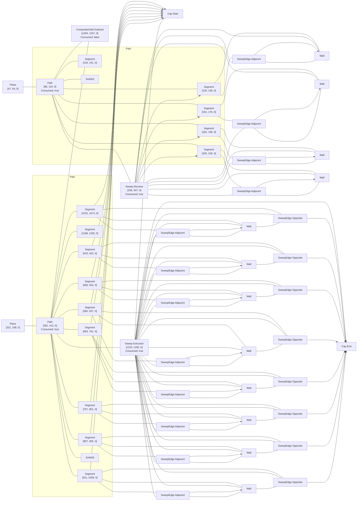

```mermaid
flowchart LR
  subgraph path4 [Path]
    4["Path<br>[362, 413, 0]<br>Consumed: true"]
      %% [ProgramBodyItem { index: 4 }, VariableDeclarationDeclaration, VariableDeclarationInit, PipeBodyItem { index: 0 }]
    8["Segment<br>[1015, 1073, 0]"]
      %% [ProgramBodyItem { index: 4 }, VariableDeclarationDeclaration, VariableDeclarationInit, PipeBodyItem { index: 8 }]
    9["Segment<br>[1198, 1205, 0]"]
      %% [ProgramBodyItem { index: 4 }, VariableDeclarationDeclaration, VariableDeclarationInit, PipeBodyItem { index: 9 }]
    15["Segment<br>[419, 452, 0]"]
      %% [ProgramBodyItem { index: 4 }, VariableDeclarationDeclaration, VariableDeclarationInit, PipeBodyItem { index: 1 }]
    16["Segment<br>[458, 554, 0]"]
      %% [ProgramBodyItem { index: 4 }, VariableDeclarationDeclaration, VariableDeclarationInit, PipeBodyItem { index: 2 }]
    17["Segment<br>[560, 657, 0]"]
      %% [ProgramBodyItem { index: 4 }, VariableDeclarationDeclaration, VariableDeclarationInit, PipeBodyItem { index: 3 }]
    18["Segment<br>[663, 761, 0]"]
      %% [ProgramBodyItem { index: 4 }, VariableDeclarationDeclaration, VariableDeclarationInit, PipeBodyItem { index: 4 }]
    19["Segment<br>[767, 801, 0]"]
      %% [ProgramBodyItem { index: 4 }, VariableDeclarationDeclaration, VariableDeclarationInit, PipeBodyItem { index: 5 }]
    20["Segment<br>[807, 905, 0]"]
      %% [ProgramBodyItem { index: 4 }, VariableDeclarationDeclaration, VariableDeclarationInit, PipeBodyItem { index: 6 }]
    21["Segment<br>[911, 1009, 0]"]
      %% [ProgramBodyItem { index: 4 }, VariableDeclarationDeclaration, VariableDeclarationInit, PipeBodyItem { index: 7 }]
    22[Solid2d]
  end
  subgraph path5 [Path]
    5["Path<br>[88, 124, 0]<br>Consumed: true"]
      %% [ProgramBodyItem { index: 1 }, VariableDeclarationDeclaration, VariableDeclarationInit, PipeBodyItem { index: 0 }]
    10["Segment<br>[130, 148, 0]"]
      %% [ProgramBodyItem { index: 1 }, VariableDeclarationDeclaration, VariableDeclarationInit, PipeBodyItem { index: 1 }]
    11["Segment<br>[154, 176, 0]"]
      %% [ProgramBodyItem { index: 1 }, VariableDeclarationDeclaration, VariableDeclarationInit, PipeBodyItem { index: 2 }]
    12["Segment<br>[182, 199, 0]"]
      %% [ProgramBodyItem { index: 1 }, VariableDeclarationDeclaration, VariableDeclarationInit, PipeBodyItem { index: 3 }]
    13["Segment<br>[205, 228, 0]"]
      %% [ProgramBodyItem { index: 1 }, VariableDeclarationDeclaration, VariableDeclarationInit, PipeBodyItem { index: 4 }]
    14["Segment<br>[234, 241, 0]"]
      %% [ProgramBodyItem { index: 1 }, VariableDeclarationDeclaration, VariableDeclarationInit, PipeBodyItem { index: 5 }]
    23[Solid2d]
  end
  1["Cap End"]
    %% face_code_ref=Missing NodePath
  2["Cap Start"]
    %% face_code_ref=Missing NodePath
  3["CompositeSolid Subtract<br>[1294, 1337, 0]<br>Consumed: false"]
    %% [ProgramBodyItem { index: 6 }, ExpressionStatementExpr]
  6["Plane<br>[321, 338, 0]"]
    %% [ProgramBodyItem { index: 3 }, VariableDeclarationDeclaration, VariableDeclarationInit]
  7["Plane<br>[47, 64, 0]"]
    %% [ProgramBodyItem { index: 0 }, VariableDeclarationDeclaration, VariableDeclarationInit]
  24["Sweep Extrusion<br>[1223, 1292, 0]<br>Consumed: true"]
    %% [ProgramBodyItem { index: 5 }, VariableDeclarationDeclaration, VariableDeclarationInit]
  25["Sweep Revolve<br>[256, 307, 0]<br>Consumed: true"]
    %% [ProgramBodyItem { index: 2 }, VariableDeclarationDeclaration, VariableDeclarationInit]
  26["SweepEdge Adjacent"]
  27["SweepEdge Adjacent"]
  28["SweepEdge Adjacent"]
  29["SweepEdge Adjacent"]
  30["SweepEdge Adjacent"]
  31["SweepEdge Adjacent"]
  32["SweepEdge Adjacent"]
  33["SweepEdge Adjacent"]
  34["SweepEdge Adjacent"]
  35["SweepEdge Adjacent"]
  36["SweepEdge Adjacent"]
  37["SweepEdge Adjacent"]
  38["SweepEdge Opposite"]
  39["SweepEdge Opposite"]
  40["SweepEdge Opposite"]
  41["SweepEdge Opposite"]
  42["SweepEdge Opposite"]
  43["SweepEdge Opposite"]
  44["SweepEdge Opposite"]
  45["SweepEdge Opposite"]
  46[Wall]
    %% face_code_ref=Missing NodePath
  47[Wall]
    %% face_code_ref=Missing NodePath
  48[Wall]
    %% face_code_ref=Missing NodePath
  49[Wall]
    %% face_code_ref=Missing NodePath
  50[Wall]
    %% face_code_ref=Missing NodePath
  51[Wall]
    %% face_code_ref=Missing NodePath
  52[Wall]
    %% face_code_ref=Missing NodePath
  53[Wall]
    %% face_code_ref=Missing NodePath
  54[Wall]
    %% face_code_ref=Missing NodePath
  55[Wall]
    %% face_code_ref=Missing NodePath
  56[Wall]
    %% face_code_ref=Missing NodePath
  57[Wall]
    %% face_code_ref=Missing NodePath
  24 --- 1
  38 <--x 1
  39 <--x 1
  40 <--x 1
  41 <--x 1
  42 <--x 1
  43 <--x 1
  44 <--x 1
  45 <--x 1
  8 <--x 2
  15 <--x 2
  16 <--x 2
  17 <--x 2
  18 <--x 2
  19 <--x 2
  20 <--x 2
  21 <--x 2
  24 --- 2
  4 --- 3
  5 --- 3
  6 --- 4
  4 --- 8
  4 --- 9
  4 --- 15
  4 --- 16
  4 --- 17
  4 --- 18
  4 --- 19
  4 --- 20
  4 --- 21
  4 --- 22
  4 ---- 24
  7 --- 5
  5 --- 10
  5 --- 11
  5 --- 12
  5 --- 13
  5 --- 14
  5 --- 23
  5 ---- 25
  8 --- 26
  8 --- 38
  8 --- 46
  25 <--x 10
  10 --- 27
  10 --- 47
  25 <--x 11
  11 --- 28
  11 --- 48
  25 <--x 12
  12 --- 29
  12 --- 49
  25 <--x 13
  13 --- 30
  13 --- 50
  15 --- 31
  15 --- 39
  15 --- 51
  16 --- 32
  16 --- 40
  16 --- 52
  17 --- 33
  17 --- 41
  17 --- 53
  18 --- 34
  18 --- 42
  18 --- 54
  19 --- 35
  19 --- 43
  19 --- 55
  20 --- 36
  20 --- 44
  20 --- 56
  21 --- 37
  21 --- 45
  21 --- 57
  24 --- 26
  24 --- 31
  24 --- 32
  24 --- 33
  24 --- 34
  24 --- 35
  24 --- 36
  24 --- 37
  24 --- 38
  24 --- 39
  24 --- 40
  24 --- 41
  24 --- 42
  24 --- 43
  24 --- 44
  24 --- 45
  24 --- 46
  24 --- 51
  24 --- 52
  24 --- 53
  24 --- 54
  24 --- 55
  24 --- 56
  24 --- 57
  25 --- 27
  25 --- 28
  25 --- 29
  25 --- 30
  25 --- 47
  25 --- 48
  25 --- 49
  25 --- 50
  46 --- 26
  26 x--> 46
  47 --- 27
  27 x--> 47
  48 --- 28
  28 x--> 48
  49 --- 29
  29 x--> 49
  30 x--> 50
  50 --- 30
  51 --- 31
  31 x--> 51
  52 --- 32
  32 x--> 52
  53 --- 33
  33 x--> 53
  54 --- 34
  34 x--> 54
  55 --- 35
  35 x--> 55
  56 --- 36
  36 x--> 56
  37 x--> 57
  57 --- 37
  46 --- 38
  51 --- 39
  52 --- 40
  53 --- 41
  54 --- 42
  55 --- 43
  56 --- 44
  57 --- 45
```
