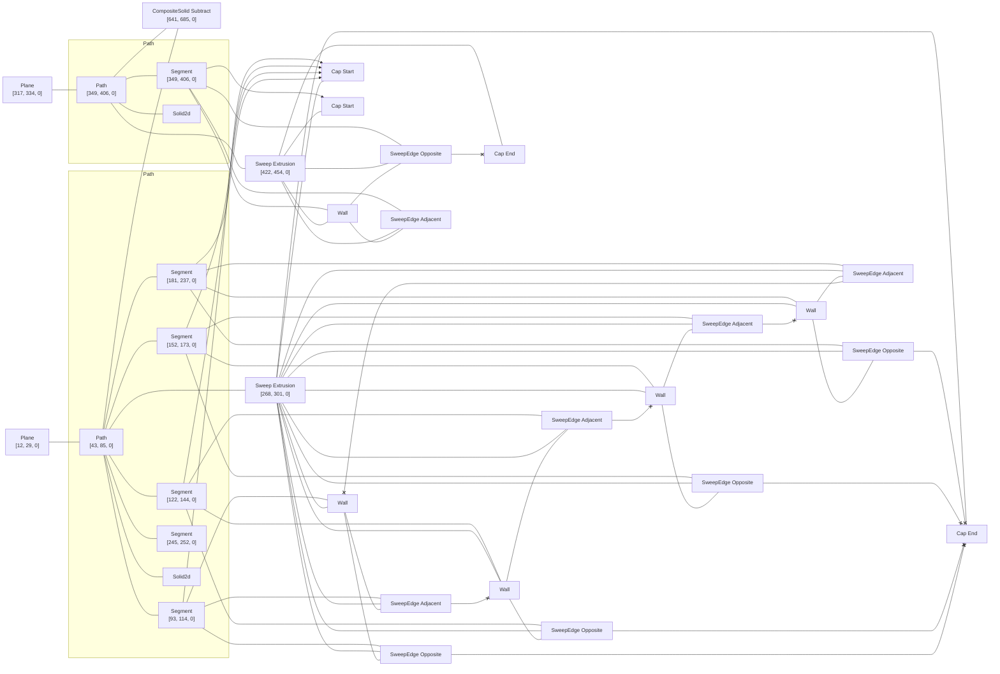

```mermaid
flowchart LR
  subgraph path3 [Path]
    3["Path<br>[43, 85, 0]"]
      %% [ProgramBodyItem { index: 1 }, VariableDeclarationDeclaration, VariableDeclarationInit, PipeBodyItem { index: 0 }]
    5["Segment<br>[93, 114, 0]"]
      %% [ProgramBodyItem { index: 1 }, VariableDeclarationDeclaration, VariableDeclarationInit, PipeBodyItem { index: 1 }]
    6["Segment<br>[122, 144, 0]"]
      %% [ProgramBodyItem { index: 1 }, VariableDeclarationDeclaration, VariableDeclarationInit, PipeBodyItem { index: 2 }]
    7["Segment<br>[152, 173, 0]"]
      %% [ProgramBodyItem { index: 1 }, VariableDeclarationDeclaration, VariableDeclarationInit, PipeBodyItem { index: 3 }]
    8["Segment<br>[181, 237, 0]"]
      %% [ProgramBodyItem { index: 1 }, VariableDeclarationDeclaration, VariableDeclarationInit, PipeBodyItem { index: 4 }]
    9["Segment<br>[245, 252, 0]"]
      %% [ProgramBodyItem { index: 1 }, VariableDeclarationDeclaration, VariableDeclarationInit, PipeBodyItem { index: 5 }]
    12[Solid2d]
  end
  subgraph path4 [Path]
    4["Path<br>[349, 406, 0]"]
      %% [ProgramBodyItem { index: 4 }, VariableDeclarationDeclaration, VariableDeclarationInit]
    10["Segment<br>[349, 406, 0]"]
      %% [ProgramBodyItem { index: 4 }, VariableDeclarationDeclaration, VariableDeclarationInit]
    11[Solid2d]
  end
  1["Plane<br>[12, 29, 0]"]
    %% [ProgramBodyItem { index: 0 }, VariableDeclarationDeclaration, VariableDeclarationInit]
  2["Plane<br>[317, 334, 0]"]
    %% [ProgramBodyItem { index: 3 }, VariableDeclarationDeclaration, VariableDeclarationInit]
  13["Sweep Extrusion<br>[268, 301, 0]"]
    %% [ProgramBodyItem { index: 2 }, VariableDeclarationDeclaration, VariableDeclarationInit]
  14["Sweep Extrusion<br>[422, 454, 0]"]
    %% [ProgramBodyItem { index: 5 }, VariableDeclarationDeclaration, VariableDeclarationInit]
  15["CompositeSolid Subtract<br>[641, 685, 0]"]
    %% [ProgramBodyItem { index: 7 }, ExpressionStatementExpr, PipeBodyItem { index: 0 }]
  16[Wall]
    %% face_code_ref=Missing NodePath
  17[Wall]
    %% face_code_ref=Missing NodePath
  18[Wall]
    %% face_code_ref=Missing NodePath
  19[Wall]
    %% face_code_ref=Missing NodePath
  20[Wall]
    %% face_code_ref=Missing NodePath
  21["Cap Start"]
    %% face_code_ref=Missing NodePath
  22["Cap Start"]
    %% face_code_ref=Missing NodePath
  23["Cap End"]
    %% face_code_ref=Missing NodePath
  24["Cap End"]
    %% face_code_ref=Missing NodePath
  25["SweepEdge Opposite"]
  26["SweepEdge Opposite"]
  27["SweepEdge Opposite"]
  28["SweepEdge Opposite"]
  29["SweepEdge Opposite"]
  30["SweepEdge Adjacent"]
  31["SweepEdge Adjacent"]
  32["SweepEdge Adjacent"]
  33["SweepEdge Adjacent"]
  34["SweepEdge Adjacent"]
  1 --- 3
  2 --- 4
  3 --- 5
  3 --- 6
  3 --- 7
  3 --- 8
  3 --- 9
  3 --- 12
  3 ---- 13
  3 --- 15
  4 --- 10
  4 --- 11
  4 ---- 14
  4 --- 15
  5 --- 19
  5 x--> 21
  5 --- 28
  5 --- 33
  6 --- 17
  6 x--> 21
  6 --- 27
  6 --- 32
  7 --- 16
  7 x--> 21
  7 --- 26
  7 --- 31
  8 --- 18
  8 x--> 21
  8 --- 25
  8 --- 30
  10 --- 20
  10 x--> 22
  10 --- 29
  10 --- 34
  13 --- 16
  13 --- 17
  13 --- 18
  13 --- 19
  13 --- 21
  13 --- 23
  13 --- 25
  13 --- 26
  13 --- 27
  13 --- 28
  13 --- 30
  13 --- 31
  13 --- 32
  13 --- 33
  14 --- 20
  14 --- 22
  14 --- 24
  14 --- 29
  14 --- 34
  16 --- 26
  16 --- 31
  32 <--x 16
  17 --- 27
  17 --- 32
  33 <--x 17
  18 --- 25
  18 --- 30
  31 <--x 18
  19 --- 28
  30 <--x 19
  19 --- 33
  20 --- 29
  20 --- 34
  25 <--x 23
  26 <--x 23
  27 <--x 23
  28 <--x 23
  29 <--x 24
```
