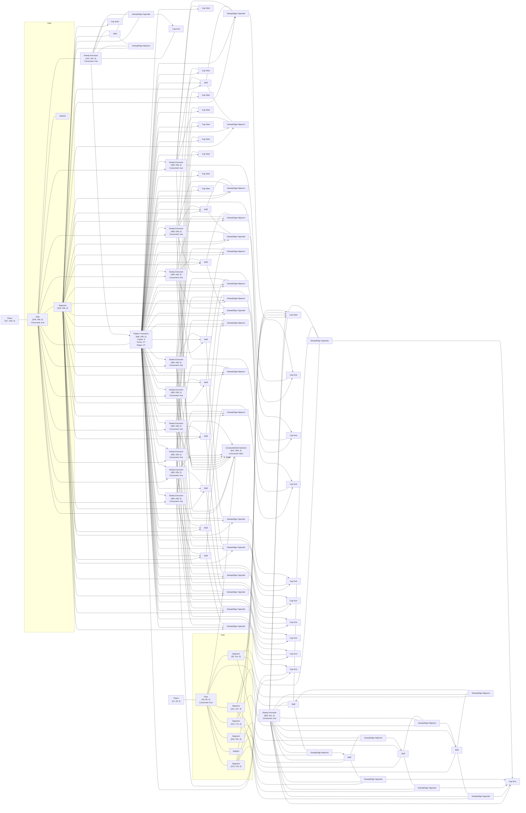

```mermaid
flowchart LR
  subgraph path2 [Path]
    2["Path<br>[43, 85, 0]<br>Consumed: true"]
      %% [ProgramBodyItem { index: 1 }, VariableDeclarationDeclaration, VariableDeclarationInit, PipeBodyItem { index: 0 }]
    3["Segment<br>[93, 114, 0]"]
      %% [ProgramBodyItem { index: 1 }, VariableDeclarationDeclaration, VariableDeclarationInit, PipeBodyItem { index: 1 }]
    4["Segment<br>[122, 144, 0]"]
      %% [ProgramBodyItem { index: 1 }, VariableDeclarationDeclaration, VariableDeclarationInit, PipeBodyItem { index: 2 }]
    5["Segment<br>[152, 173, 0]"]
      %% [ProgramBodyItem { index: 1 }, VariableDeclarationDeclaration, VariableDeclarationInit, PipeBodyItem { index: 3 }]
    6["Segment<br>[181, 237, 0]"]
      %% [ProgramBodyItem { index: 1 }, VariableDeclarationDeclaration, VariableDeclarationInit, PipeBodyItem { index: 4 }]
    7["Segment<br>[245, 252, 0]"]
      %% [ProgramBodyItem { index: 1 }, VariableDeclarationDeclaration, VariableDeclarationInit, PipeBodyItem { index: 5 }]
    8[Solid2d]
  end
  subgraph path25 [Path]
    25["Path<br>[349, 406, 0]<br>Consumed: true"]
      %% [ProgramBodyItem { index: 4 }, VariableDeclarationDeclaration, VariableDeclarationInit]
    26["Segment<br>[349, 406, 0]"]
      %% [ProgramBodyItem { index: 4 }, VariableDeclarationDeclaration, VariableDeclarationInit]
    27[Solid2d]
  end
  1["Plane<br>[12, 29, 0]"]
    %% [ProgramBodyItem { index: 0 }, VariableDeclarationDeclaration, VariableDeclarationInit]
  9["Sweep Extrusion<br>[268, 301, 0]<br>Consumed: true"]
    %% [ProgramBodyItem { index: 2 }, VariableDeclarationDeclaration, VariableDeclarationInit]
  10[Wall]
    %% face_code_ref=Missing NodePath
  11[Wall]
    %% face_code_ref=Missing NodePath
  12[Wall]
    %% face_code_ref=Missing NodePath
  13[Wall]
    %% face_code_ref=Missing NodePath
  14["Cap Start"]
    %% face_code_ref=Missing NodePath
  15["Cap End"]
    %% face_code_ref=Missing NodePath
  16["SweepEdge Opposite"]
  17["SweepEdge Adjacent"]
  18["SweepEdge Opposite"]
  19["SweepEdge Adjacent"]
  20["SweepEdge Opposite"]
  21["SweepEdge Adjacent"]
  22["SweepEdge Opposite"]
  23["SweepEdge Adjacent"]
  24["Plane<br>[317, 334, 0]"]
    %% [ProgramBodyItem { index: 3 }, VariableDeclarationDeclaration, VariableDeclarationInit]
  28["Sweep Extrusion<br>[422, 454, 0]<br>Consumed: true"]
    %% [ProgramBodyItem { index: 5 }, VariableDeclarationDeclaration, VariableDeclarationInit]
  29[Wall]
    %% face_code_ref=Missing NodePath
  30["Cap Start"]
    %% face_code_ref=Missing NodePath
  31["Cap End"]
    %% face_code_ref=Missing NodePath
  32["SweepEdge Opposite"]
  33["SweepEdge Adjacent"]
  34["Pattern Transform<br>[469, 639, 0]<br>Copies: 9<br>Faces: 27<br>Edges: 27"]
    %% [ProgramBodyItem { index: 6 }, VariableDeclarationDeclaration, VariableDeclarationInit]
  35["Sweep Extrusion<br>[469, 639, 0]<br>Consumed: true"]
    %% [ProgramBodyItem { index: 6 }, VariableDeclarationDeclaration, VariableDeclarationInit]
  36[Wall]
    %% face_code_ref=Missing NodePath
  37["Cap Start"]
    %% face_code_ref=Missing NodePath
  38["Cap End"]
    %% face_code_ref=Missing NodePath
  39["SweepEdge Opposite"]
  40["SweepEdge Adjacent"]
  41["Sweep Extrusion<br>[469, 639, 0]<br>Consumed: true"]
    %% [ProgramBodyItem { index: 6 }, VariableDeclarationDeclaration, VariableDeclarationInit]
  42[Wall]
    %% face_code_ref=Missing NodePath
  43["Cap Start"]
    %% face_code_ref=Missing NodePath
  44["Cap End"]
    %% face_code_ref=Missing NodePath
  45["SweepEdge Opposite"]
  46["SweepEdge Adjacent"]
  47["Sweep Extrusion<br>[469, 639, 0]<br>Consumed: true"]
    %% [ProgramBodyItem { index: 6 }, VariableDeclarationDeclaration, VariableDeclarationInit]
  48[Wall]
    %% face_code_ref=Missing NodePath
  49["Cap Start"]
    %% face_code_ref=Missing NodePath
  50["Cap End"]
    %% face_code_ref=Missing NodePath
  51["SweepEdge Opposite"]
  52["SweepEdge Adjacent"]
  53["Sweep Extrusion<br>[469, 639, 0]<br>Consumed: true"]
    %% [ProgramBodyItem { index: 6 }, VariableDeclarationDeclaration, VariableDeclarationInit]
  54[Wall]
    %% face_code_ref=Missing NodePath
  55["Cap Start"]
    %% face_code_ref=Missing NodePath
  56["Cap End"]
    %% face_code_ref=Missing NodePath
  57["SweepEdge Opposite"]
  58["SweepEdge Adjacent"]
  59["Sweep Extrusion<br>[469, 639, 0]<br>Consumed: true"]
    %% [ProgramBodyItem { index: 6 }, VariableDeclarationDeclaration, VariableDeclarationInit]
  60[Wall]
    %% face_code_ref=Missing NodePath
  61["Cap Start"]
    %% face_code_ref=Missing NodePath
  62["Cap End"]
    %% face_code_ref=Missing NodePath
  63["SweepEdge Opposite"]
  64["SweepEdge Adjacent"]
  65["Sweep Extrusion<br>[469, 639, 0]<br>Consumed: true"]
    %% [ProgramBodyItem { index: 6 }, VariableDeclarationDeclaration, VariableDeclarationInit]
  66[Wall]
    %% face_code_ref=Missing NodePath
  67["Cap Start"]
    %% face_code_ref=Missing NodePath
  68["Cap End"]
    %% face_code_ref=Missing NodePath
  69["SweepEdge Opposite"]
  70["SweepEdge Adjacent"]
  71["Sweep Extrusion<br>[469, 639, 0]<br>Consumed: true"]
    %% [ProgramBodyItem { index: 6 }, VariableDeclarationDeclaration, VariableDeclarationInit]
  72[Wall]
    %% face_code_ref=Missing NodePath
  73["Cap Start"]
    %% face_code_ref=Missing NodePath
  74["Cap End"]
    %% face_code_ref=Missing NodePath
  75["SweepEdge Opposite"]
  76["SweepEdge Adjacent"]
  77["Sweep Extrusion<br>[469, 639, 0]<br>Consumed: true"]
    %% [ProgramBodyItem { index: 6 }, VariableDeclarationDeclaration, VariableDeclarationInit]
  78[Wall]
    %% face_code_ref=Missing NodePath
  79["Cap Start"]
    %% face_code_ref=Missing NodePath
  80["Cap End"]
    %% face_code_ref=Missing NodePath
  81["SweepEdge Opposite"]
  82["SweepEdge Adjacent"]
  83["Sweep Extrusion<br>[469, 639, 0]<br>Consumed: true"]
    %% [ProgramBodyItem { index: 6 }, VariableDeclarationDeclaration, VariableDeclarationInit]
  84[Wall]
    %% face_code_ref=Missing NodePath
  85["Cap Start"]
    %% face_code_ref=Missing NodePath
  86["Cap End"]
    %% face_code_ref=Missing NodePath
  87["SweepEdge Opposite"]
  88["SweepEdge Adjacent"]
  89["CompositeSolid Subtract<br>[641, 685, 0]<br>Consumed: false"]
    %% [ProgramBodyItem { index: 7 }, ExpressionStatementExpr, PipeBodyItem { index: 0 }]
  1 --- 2
  2 --- 3
  2 --- 4
  2 --- 5
  2 --- 6
  2 --- 7
  2 --- 8
  2 ---- 9
  2 --- 89
  3 --- 13
  3 x--> 14
  3 --- 22
  3 --- 23
  4 --- 12
  4 x--> 14
  4 --- 20
  4 --- 21
  5 --- 11
  5 x--> 14
  5 --- 18
  5 --- 19
  6 --- 10
  6 x--> 14
  6 --- 16
  6 --- 17
  9 --- 10
  9 --- 11
  9 --- 12
  9 --- 13
  9 --- 14
  9 --- 15
  9 --- 16
  9 --- 17
  9 --- 18
  9 --- 19
  9 --- 20
  9 --- 21
  9 --- 22
  9 --- 23
  10 --- 16
  10 --- 17
  19 <--x 10
  11 --- 18
  11 --- 19
  21 <--x 11
  12 --- 20
  12 --- 21
  23 <--x 12
  17 <--x 13
  13 --- 22
  13 --- 23
  16 <--x 15
  18 <--x 15
  20 <--x 15
  22 <--x 15
  24 --- 25
  25 --- 26
  25 --- 27
  25 ---- 28
  25 --- 34
  25 <---x 35
  25 <---x 41
  25 <---x 47
  25 <---x 53
  25 <---x 59
  25 <---x 65
  25 <---x 71
  25 <---x 77
  25 <---x 83
  25 --- 89
  26 --- 29
  26 x--> 30
  26 --- 32
  26 --- 33
  26 <--x 36
  26 <--x 39
  26 <--x 40
  26 <--x 42
  26 <--x 45
  26 <--x 46
  26 <--x 48
  26 <--x 51
  26 <--x 52
  26 <--x 54
  26 <--x 57
  26 <--x 58
  26 <--x 60
  26 <--x 63
  26 <--x 64
  26 <--x 66
  26 <--x 69
  26 <--x 70
  26 <--x 72
  26 <--x 75
  26 <--x 76
  26 <--x 78
  26 <--x 81
  26 <--x 82
  26 <--x 84
  26 <--x 87
  26 <--x 88
  28 --- 29
  28 --- 30
  28 --- 31
  28 --- 32
  28 --- 33
  28 x--> 34
  29 --- 32
  29 --- 33
  32 <--x 31
  34 x--> 35
  34 x--> 36
  34 x--> 37
  34 x--> 38
  34 x--> 39
  34 x--> 40
  34 x--> 41
  34 x--> 42
  34 x--> 43
  34 x--> 44
  34 x--> 45
  34 x--> 46
  34 x--> 47
  34 x--> 48
  34 x--> 49
  34 x--> 50
  34 x--> 51
  34 x--> 52
  34 x--> 53
  34 x--> 54
  34 x--> 55
  34 x--> 56
  34 x--> 57
  34 x--> 58
  34 x--> 59
  34 x--> 60
  34 x--> 61
  34 x--> 62
  34 x--> 63
  34 x--> 64
  34 x--> 65
  34 x--> 66
  34 x--> 67
  34 x--> 68
  34 x--> 69
  34 x--> 70
  34 x--> 71
  34 x--> 72
  34 x--> 73
  34 x--> 74
  34 x--> 75
  34 x--> 76
  34 x--> 77
  34 x--> 78
  34 x--> 79
  34 x--> 80
  34 x--> 81
  34 x--> 82
  34 x--> 83
  34 x--> 84
  34 x--> 85
  34 x--> 86
  34 x--> 87
  34 x--> 88
  35 --- 36
  35 --- 37
  35 --- 38
  35 --- 39
  35 --- 40
  35 <--x 89
  36 --- 39
  36 --- 40
  39 <--x 38
  41 --- 42
  41 --- 43
  41 --- 44
  41 --- 45
  41 --- 46
  41 <--x 89
  42 --- 45
  42 --- 46
  45 <--x 44
  47 --- 48
  47 --- 49
  47 --- 50
  47 --- 51
  47 --- 52
  47 <--x 89
  48 --- 51
  48 --- 52
  51 <--x 50
  53 --- 54
  53 --- 55
  53 --- 56
  53 --- 57
  53 --- 58
  53 <--x 89
  54 --- 57
  54 --- 58
  57 <--x 56
  59 --- 60
  59 --- 61
  59 --- 62
  59 --- 63
  59 --- 64
  59 <--x 89
  60 --- 63
  60 --- 64
  63 <--x 62
  65 --- 66
  65 --- 67
  65 --- 68
  65 --- 69
  65 --- 70
  65 <--x 89
  66 --- 69
  66 --- 70
  69 <--x 68
  71 --- 72
  71 --- 73
  71 --- 74
  71 --- 75
  71 --- 76
  71 <--x 89
  72 --- 75
  72 --- 76
  75 <--x 74
  77 --- 78
  77 --- 79
  77 --- 80
  77 --- 81
  77 --- 82
  77 <--x 89
  78 --- 81
  78 --- 82
  81 <--x 80
  83 --- 84
  83 --- 85
  83 --- 86
  83 --- 87
  83 --- 88
  83 <--x 89
  84 --- 87
  84 --- 88
  87 <--x 86
```
