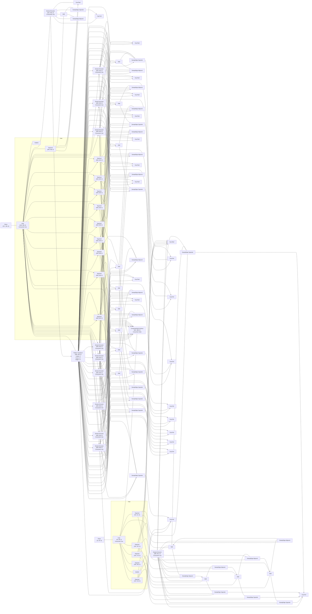

```mermaid
flowchart LR
  subgraph path2 [Path]
    2["Path<br>[43, 85, 0]<br>Consumed: true"]
      %% [ProgramBodyItem { index: 1 }, VariableDeclarationDeclaration, VariableDeclarationInit, PipeBodyItem { index: 0 }]
    3["Segment<br>[93, 114, 0]"]
      %% [ProgramBodyItem { index: 1 }, VariableDeclarationDeclaration, VariableDeclarationInit, PipeBodyItem { index: 1 }]
    4["Segment<br>[122, 144, 0]"]
      %% [ProgramBodyItem { index: 1 }, VariableDeclarationDeclaration, VariableDeclarationInit, PipeBodyItem { index: 2 }]
    5["Segment<br>[152, 173, 0]"]
      %% [ProgramBodyItem { index: 1 }, VariableDeclarationDeclaration, VariableDeclarationInit, PipeBodyItem { index: 3 }]
    6["Segment<br>[181, 237, 0]"]
      %% [ProgramBodyItem { index: 1 }, VariableDeclarationDeclaration, VariableDeclarationInit, PipeBodyItem { index: 4 }]
    7["Segment<br>[245, 252, 0]"]
      %% [ProgramBodyItem { index: 1 }, VariableDeclarationDeclaration, VariableDeclarationInit, PipeBodyItem { index: 5 }]
    8[Solid2d]
  end
  subgraph path25 [Path]
    25["Path<br>[349, 406, 0]<br>Consumed: true"]
      %% [ProgramBodyItem { index: 4 }, VariableDeclarationDeclaration, VariableDeclarationInit]
    26["Segment<br>[349, 406, 0]"]
      %% [ProgramBodyItem { index: 4 }, VariableDeclarationDeclaration, VariableDeclarationInit]
    27[Solid2d]
    36["Segment<br>[469, 639, 0]"]
      %% [ProgramBodyItem { index: 6 }, VariableDeclarationDeclaration, VariableDeclarationInit]
    43["Segment<br>[469, 639, 0]"]
      %% [ProgramBodyItem { index: 6 }, VariableDeclarationDeclaration, VariableDeclarationInit]
    50["Segment<br>[469, 639, 0]"]
      %% [ProgramBodyItem { index: 6 }, VariableDeclarationDeclaration, VariableDeclarationInit]
    57["Segment<br>[469, 639, 0]"]
      %% [ProgramBodyItem { index: 6 }, VariableDeclarationDeclaration, VariableDeclarationInit]
    64["Segment<br>[469, 639, 0]"]
      %% [ProgramBodyItem { index: 6 }, VariableDeclarationDeclaration, VariableDeclarationInit]
    71["Segment<br>[469, 639, 0]"]
      %% [ProgramBodyItem { index: 6 }, VariableDeclarationDeclaration, VariableDeclarationInit]
    78["Segment<br>[469, 639, 0]"]
      %% [ProgramBodyItem { index: 6 }, VariableDeclarationDeclaration, VariableDeclarationInit]
    85["Segment<br>[469, 639, 0]"]
      %% [ProgramBodyItem { index: 6 }, VariableDeclarationDeclaration, VariableDeclarationInit]
    92["Segment<br>[469, 639, 0]"]
      %% [ProgramBodyItem { index: 6 }, VariableDeclarationDeclaration, VariableDeclarationInit]
  end
  1["Plane<br>[12, 29, 0]"]
    %% [ProgramBodyItem { index: 0 }, VariableDeclarationDeclaration, VariableDeclarationInit]
  9["Sweep Extrusion<br>[268, 301, 0]<br>Consumed: true"]
    %% [ProgramBodyItem { index: 2 }, VariableDeclarationDeclaration, VariableDeclarationInit]
  10[Wall]
    %% face_code_ref=Missing NodePath
  11[Wall]
    %% face_code_ref=Missing NodePath
  12[Wall]
    %% face_code_ref=Missing NodePath
  13[Wall]
    %% face_code_ref=Missing NodePath
  14["Cap Start"]
    %% face_code_ref=Missing NodePath
  15["Cap End"]
    %% face_code_ref=Missing NodePath
  16["SweepEdge Opposite"]
  17["SweepEdge Adjacent"]
  18["SweepEdge Opposite"]
  19["SweepEdge Adjacent"]
  20["SweepEdge Opposite"]
  21["SweepEdge Adjacent"]
  22["SweepEdge Opposite"]
  23["SweepEdge Adjacent"]
  24["Plane<br>[317, 334, 0]"]
    %% [ProgramBodyItem { index: 3 }, VariableDeclarationDeclaration, VariableDeclarationInit]
  28["Sweep Extrusion<br>[422, 454, 0]<br>Consumed: true"]
    %% [ProgramBodyItem { index: 5 }, VariableDeclarationDeclaration, VariableDeclarationInit]
  29[Wall]
    %% face_code_ref=Missing NodePath
  30["Cap Start"]
    %% face_code_ref=Missing NodePath
  31["Cap End"]
    %% face_code_ref=Missing NodePath
  32["SweepEdge Opposite"]
  33["SweepEdge Adjacent"]
  34["Pattern Transform<br>[469, 639, 0]<br>Copies: 9<br>Faces: 27<br>Edges: 27"]
    %% [ProgramBodyItem { index: 6 }, VariableDeclarationDeclaration, VariableDeclarationInit]
  35["Sweep Extrusion<br>[469, 639, 0]<br>Consumed: true"]
    %% [ProgramBodyItem { index: 6 }, VariableDeclarationDeclaration, VariableDeclarationInit]
  37[Wall]
    %% face_code_ref=Missing NodePath
  38["Cap Start"]
    %% face_code_ref=Missing NodePath
  39["Cap End"]
    %% face_code_ref=Missing NodePath
  40["SweepEdge Opposite"]
  41["SweepEdge Adjacent"]
  42["Sweep Extrusion<br>[469, 639, 0]<br>Consumed: true"]
    %% [ProgramBodyItem { index: 6 }, VariableDeclarationDeclaration, VariableDeclarationInit]
  44[Wall]
    %% face_code_ref=Missing NodePath
  45["Cap Start"]
    %% face_code_ref=Missing NodePath
  46["Cap End"]
    %% face_code_ref=Missing NodePath
  47["SweepEdge Opposite"]
  48["SweepEdge Adjacent"]
  49["Sweep Extrusion<br>[469, 639, 0]<br>Consumed: true"]
    %% [ProgramBodyItem { index: 6 }, VariableDeclarationDeclaration, VariableDeclarationInit]
  51[Wall]
    %% face_code_ref=Missing NodePath
  52["Cap Start"]
    %% face_code_ref=Missing NodePath
  53["Cap End"]
    %% face_code_ref=Missing NodePath
  54["SweepEdge Opposite"]
  55["SweepEdge Adjacent"]
  56["Sweep Extrusion<br>[469, 639, 0]<br>Consumed: true"]
    %% [ProgramBodyItem { index: 6 }, VariableDeclarationDeclaration, VariableDeclarationInit]
  58[Wall]
    %% face_code_ref=Missing NodePath
  59["Cap Start"]
    %% face_code_ref=Missing NodePath
  60["Cap End"]
    %% face_code_ref=Missing NodePath
  61["SweepEdge Opposite"]
  62["SweepEdge Adjacent"]
  63["Sweep Extrusion<br>[469, 639, 0]<br>Consumed: true"]
    %% [ProgramBodyItem { index: 6 }, VariableDeclarationDeclaration, VariableDeclarationInit]
  65[Wall]
    %% face_code_ref=Missing NodePath
  66["Cap Start"]
    %% face_code_ref=Missing NodePath
  67["Cap End"]
    %% face_code_ref=Missing NodePath
  68["SweepEdge Opposite"]
  69["SweepEdge Adjacent"]
  70["Sweep Extrusion<br>[469, 639, 0]<br>Consumed: true"]
    %% [ProgramBodyItem { index: 6 }, VariableDeclarationDeclaration, VariableDeclarationInit]
  72[Wall]
    %% face_code_ref=Missing NodePath
  73["Cap Start"]
    %% face_code_ref=Missing NodePath
  74["Cap End"]
    %% face_code_ref=Missing NodePath
  75["SweepEdge Opposite"]
  76["SweepEdge Adjacent"]
  77["Sweep Extrusion<br>[469, 639, 0]<br>Consumed: true"]
    %% [ProgramBodyItem { index: 6 }, VariableDeclarationDeclaration, VariableDeclarationInit]
  79[Wall]
    %% face_code_ref=Missing NodePath
  80["Cap Start"]
    %% face_code_ref=Missing NodePath
  81["Cap End"]
    %% face_code_ref=Missing NodePath
  82["SweepEdge Opposite"]
  83["SweepEdge Adjacent"]
  84["Sweep Extrusion<br>[469, 639, 0]<br>Consumed: true"]
    %% [ProgramBodyItem { index: 6 }, VariableDeclarationDeclaration, VariableDeclarationInit]
  86[Wall]
    %% face_code_ref=Missing NodePath
  87["Cap Start"]
    %% face_code_ref=Missing NodePath
  88["Cap End"]
    %% face_code_ref=Missing NodePath
  89["SweepEdge Opposite"]
  90["SweepEdge Adjacent"]
  91["Sweep Extrusion<br>[469, 639, 0]<br>Consumed: true"]
    %% [ProgramBodyItem { index: 6 }, VariableDeclarationDeclaration, VariableDeclarationInit]
  93[Wall]
    %% face_code_ref=Missing NodePath
  94["Cap Start"]
    %% face_code_ref=Missing NodePath
  95["Cap End"]
    %% face_code_ref=Missing NodePath
  96["SweepEdge Opposite"]
  97["SweepEdge Adjacent"]
  98["CompositeSolid Subtract<br>[641, 685, 0]<br>Consumed: false"]
    %% [ProgramBodyItem { index: 7 }, ExpressionStatementExpr, PipeBodyItem { index: 0 }]
  1 --- 2
  2 --- 3
  2 --- 4
  2 --- 5
  2 --- 6
  2 --- 7
  2 --- 8
  2 ---- 9
  2 --- 98
  3 --- 13
  3 x--> 14
  3 --- 22
  3 --- 23
  4 --- 12
  4 x--> 14
  4 --- 20
  4 --- 21
  5 --- 11
  5 x--> 14
  5 --- 18
  5 --- 19
  6 --- 10
  6 x--> 14
  6 --- 16
  6 --- 17
  9 --- 10
  9 --- 11
  9 --- 12
  9 --- 13
  9 --- 14
  9 --- 15
  9 --- 16
  9 --- 17
  9 --- 18
  9 --- 19
  9 --- 20
  9 --- 21
  9 --- 22
  9 --- 23
  10 --- 16
  10 --- 17
  19 <--x 10
  11 --- 18
  11 --- 19
  21 <--x 11
  12 --- 20
  12 --- 21
  23 <--x 12
  17 <--x 13
  13 --- 22
  13 --- 23
  16 <--x 15
  18 <--x 15
  20 <--x 15
  22 <--x 15
  24 --- 25
  25 --- 26
  25 --- 27
  25 ---- 28
  25 --- 34
  25 <---x 35
  25 <--x 36
  25 <---x 42
  25 <--x 43
  25 <---x 49
  25 <--x 50
  25 <---x 56
  25 <--x 57
  25 <---x 63
  25 <--x 64
  25 <---x 70
  25 <--x 71
  25 <---x 77
  25 <--x 78
  25 <---x 84
  25 <--x 85
  25 <---x 91
  25 <--x 92
  25 --- 98
  26 --- 29
  26 x--> 30
  26 --- 32
  26 --- 33
  28 --- 29
  28 --- 30
  28 --- 31
  28 --- 32
  28 --- 33
  28 x--> 34
  29 --- 32
  29 --- 33
  32 <--x 31
  34 x--> 35
  34 x--> 36
  34 x--> 37
  34 x--> 38
  34 x--> 39
  34 x--> 40
  34 x--> 41
  34 x--> 42
  34 x--> 43
  34 x--> 44
  34 x--> 45
  34 x--> 46
  34 x--> 47
  34 x--> 48
  34 x--> 49
  34 x--> 50
  34 x--> 51
  34 x--> 52
  34 x--> 53
  34 x--> 54
  34 x--> 55
  34 x--> 56
  34 x--> 57
  34 x--> 58
  34 x--> 59
  34 x--> 60
  34 x--> 61
  34 x--> 62
  34 x--> 63
  34 x--> 64
  34 x--> 65
  34 x--> 66
  34 x--> 67
  34 x--> 68
  34 x--> 69
  34 x--> 70
  34 x--> 71
  34 x--> 72
  34 x--> 73
  34 x--> 74
  34 x--> 75
  34 x--> 76
  34 x--> 77
  34 x--> 78
  34 x--> 79
  34 x--> 80
  34 x--> 81
  34 x--> 82
  34 x--> 83
  34 x--> 84
  34 x--> 85
  34 x--> 86
  34 x--> 87
  34 x--> 88
  34 x--> 89
  34 x--> 90
  34 x--> 91
  34 x--> 92
  34 x--> 93
  34 x--> 94
  34 x--> 95
  34 x--> 96
  34 x--> 97
  35 --- 37
  35 --- 38
  35 --- 39
  35 --- 40
  35 --- 41
  35 <--x 98
  36 --- 37
  36 x--> 38
  36 --- 40
  36 --- 41
  37 --- 40
  37 --- 41
  40 <--x 39
  42 --- 44
  42 --- 45
  42 --- 46
  42 --- 47
  42 --- 48
  42 <--x 98
  43 --- 44
  43 x--> 45
  43 --- 47
  43 --- 48
  44 --- 47
  44 --- 48
  47 <--x 46
  49 --- 51
  49 --- 52
  49 --- 53
  49 --- 54
  49 --- 55
  49 <--x 98
  50 --- 51
  50 x--> 52
  50 --- 54
  50 --- 55
  51 --- 54
  51 --- 55
  54 <--x 53
  56 --- 58
  56 --- 59
  56 --- 60
  56 --- 61
  56 --- 62
  56 <--x 98
  57 --- 58
  57 x--> 59
  57 --- 61
  57 --- 62
  58 --- 61
  58 --- 62
  61 <--x 60
  63 --- 65
  63 --- 66
  63 --- 67
  63 --- 68
  63 --- 69
  63 <--x 98
  64 --- 65
  64 x--> 66
  64 --- 68
  64 --- 69
  65 --- 68
  65 --- 69
  68 <--x 67
  70 --- 72
  70 --- 73
  70 --- 74
  70 --- 75
  70 --- 76
  70 <--x 98
  71 --- 72
  71 x--> 73
  71 --- 75
  71 --- 76
  72 --- 75
  72 --- 76
  75 <--x 74
  77 --- 79
  77 --- 80
  77 --- 81
  77 --- 82
  77 --- 83
  77 <--x 98
  78 --- 79
  78 x--> 80
  78 --- 82
  78 --- 83
  79 --- 82
  79 --- 83
  82 <--x 81
  84 --- 86
  84 --- 87
  84 --- 88
  84 --- 89
  84 --- 90
  84 <--x 98
  85 --- 86
  85 x--> 87
  85 --- 89
  85 --- 90
  86 --- 89
  86 --- 90
  89 <--x 88
  91 --- 93
  91 --- 94
  91 --- 95
  91 --- 96
  91 --- 97
  91 <--x 98
  92 --- 93
  92 x--> 94
  92 --- 96
  92 --- 97
  93 --- 96
  93 --- 97
  96 <--x 95
```
