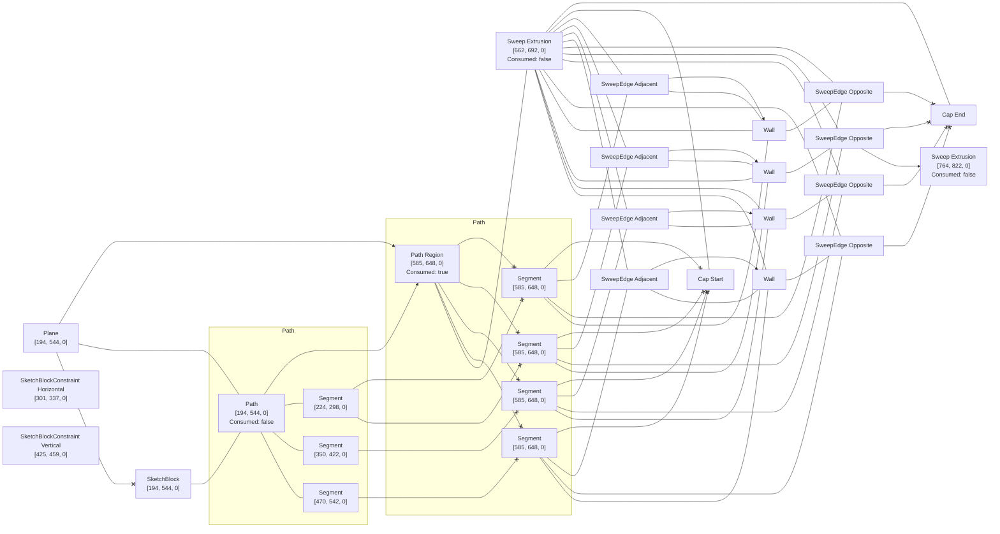

```mermaid
flowchart LR
  subgraph path4 [Path]
    4["Path<br>[194, 544, 0]<br>Consumed: false"]
      %% [ProgramBodyItem { index: 0 }, VariableDeclarationDeclaration, VariableDeclarationInit]
    6["Segment<br>[224, 298, 0]"]
      %% [ProgramBodyItem { index: 0 }, VariableDeclarationDeclaration, VariableDeclarationInit, SketchBlockBody, SketchBlockBodyItem { index: 0 }, VariableDeclarationDeclaration, VariableDeclarationInit]
    7["Segment<br>[350, 422, 0]"]
      %% [ProgramBodyItem { index: 0 }, VariableDeclarationDeclaration, VariableDeclarationInit, SketchBlockBody, SketchBlockBodyItem { index: 2 }, VariableDeclarationDeclaration, VariableDeclarationInit]
    8["Segment<br>[470, 542, 0]"]
      %% [ProgramBodyItem { index: 0 }, VariableDeclarationDeclaration, VariableDeclarationInit, SketchBlockBody, SketchBlockBodyItem { index: 4 }, VariableDeclarationDeclaration, VariableDeclarationInit]
  end
  subgraph path3 [Path]
    3["Path Region<br>[585, 648, 0]<br>Consumed: true"]
      %% [ProgramBodyItem { index: 2 }, VariableDeclarationDeclaration, VariableDeclarationInit]
    9["Segment<br>[585, 648, 0]"]
      %% [ProgramBodyItem { index: 2 }, VariableDeclarationDeclaration, VariableDeclarationInit]
    10["Segment<br>[585, 648, 0]"]
      %% [ProgramBodyItem { index: 2 }, VariableDeclarationDeclaration, VariableDeclarationInit]
    11["Segment<br>[585, 648, 0]"]
      %% [ProgramBodyItem { index: 2 }, VariableDeclarationDeclaration, VariableDeclarationInit]
    12["Segment<br>[585, 648, 0]"]
      %% [ProgramBodyItem { index: 2 }, VariableDeclarationDeclaration, VariableDeclarationInit]
  end
  5["Plane<br>[194, 544, 0]"]
    %% [ProgramBodyItem { index: 0 }, VariableDeclarationDeclaration, VariableDeclarationInit]
  16["Sweep Extrusion<br>[662, 692, 0]<br>Consumed: false"]
    %% [ProgramBodyItem { index: 3 }, VariableDeclarationDeclaration, VariableDeclarationInit]
  26[Wall]
    %% face_code_ref=Missing NodePath
  27[Wall]
    %% face_code_ref=Missing NodePath
  28[Wall]
    %% face_code_ref=Missing NodePath
  29[Wall]
    %% face_code_ref=Missing NodePath
  2["Cap Start"]
    %% face_code_ref=Missing NodePath
  1["Cap End"]
    %% face_code_ref=Missing NodePath
  22["SweepEdge Opposite"]
  18["SweepEdge Adjacent"]
  23["SweepEdge Opposite"]
  19["SweepEdge Adjacent"]
  24["SweepEdge Opposite"]
  20["SweepEdge Adjacent"]
  25["SweepEdge Opposite"]
  21["SweepEdge Adjacent"]
  17["Sweep Extrusion<br>[764, 822, 0]<br>Consumed: false"]
    %% [ProgramBodyItem { index: 6 }, VariableDeclarationDeclaration, VariableDeclarationInit]
  13["SketchBlock<br>[194, 544, 0]"]
    %% [ProgramBodyItem { index: 0 }, VariableDeclarationDeclaration, VariableDeclarationInit]
  14["SketchBlockConstraint Horizontal<br>[301, 337, 0]"]
    %% [ProgramBodyItem { index: 0 }, VariableDeclarationDeclaration, VariableDeclarationInit, SketchBlockBody, SketchBlockBodyItem { index: 1 }, ExpressionStatementExpr]
  15["SketchBlockConstraint Vertical<br>[425, 459, 0]"]
    %% [ProgramBodyItem { index: 0 }, VariableDeclarationDeclaration, VariableDeclarationInit, SketchBlockBody, SketchBlockBodyItem { index: 3 }, ExpressionStatementExpr]
  16 --- 1
  22 <--x 1
  23 <--x 1
  24 <--x 1
  25 <--x 1
  9 <--x 2
  10 <--x 2
  11 <--x 2
  12 <--x 2
  16 --- 2
  4 x--> 3
  5 x--> 3
  3 <--x 9
  3 <--x 10
  3 <--x 11
  3 <--x 12
  3 ---- 16
  5 --- 4
  4 --- 6
  4 --- 7
  4 --- 8
  13 --- 4
  5 <--x 13
  6 <--x 9
  6 <--x 10
  7 <--x 11
  8 <--x 12
  9 --- 18
  9 --- 22
  9 --- 26
  10 --- 19
  10 --- 23
  10 --- 27
  11 --- 20
  11 --- 24
  11 --- 28
  12 --- 21
  12 --- 25
  12 --- 29
  16 --- 18
  16 --- 19
  16 --- 20
  16 --- 21
  16 --- 22
  16 --- 23
  16 --- 24
  16 --- 25
  16 --- 26
  16 --- 27
  16 --- 28
  16 --- 29
  23 x--> 17
  26 --- 18
  18 x--> 26
  27 --- 19
  19 x--> 27
  28 --- 20
  20 x--> 28
  29 --- 21
  21 x--> 29
  26 --- 22
  27 --- 23
  28 --- 24
  29 --- 25
```
