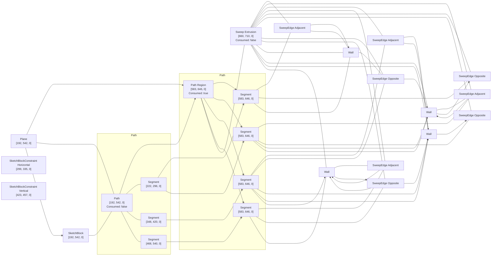

```mermaid
flowchart LR
  subgraph path2 [Path]
    2["Path<br>[192, 542, 0]<br>Consumed: false"]
      %% [ProgramBodyItem { index: 0 }, VariableDeclarationDeclaration, VariableDeclarationInit]
    4["Segment<br>[222, 296, 0]"]
      %% [ProgramBodyItem { index: 0 }, VariableDeclarationDeclaration, VariableDeclarationInit, SketchBlockBody, SketchBlockBodyItem { index: 0 }, VariableDeclarationDeclaration, VariableDeclarationInit]
    5["Segment<br>[348, 420, 0]"]
      %% [ProgramBodyItem { index: 0 }, VariableDeclarationDeclaration, VariableDeclarationInit, SketchBlockBody, SketchBlockBodyItem { index: 2 }, VariableDeclarationDeclaration, VariableDeclarationInit]
    6["Segment<br>[468, 540, 0]"]
      %% [ProgramBodyItem { index: 0 }, VariableDeclarationDeclaration, VariableDeclarationInit, SketchBlockBody, SketchBlockBodyItem { index: 4 }, VariableDeclarationDeclaration, VariableDeclarationInit]
  end
  subgraph path1 [Path]
    1["Path Region<br>[583, 646, 0]<br>Consumed: true"]
      %% [ProgramBodyItem { index: 2 }, VariableDeclarationDeclaration, VariableDeclarationInit]
    7["Segment<br>[583, 646, 0]"]
      %% [ProgramBodyItem { index: 2 }, VariableDeclarationDeclaration, VariableDeclarationInit]
    8["Segment<br>[583, 646, 0]"]
      %% [ProgramBodyItem { index: 2 }, VariableDeclarationDeclaration, VariableDeclarationInit]
    9["Segment<br>[583, 646, 0]"]
      %% [ProgramBodyItem { index: 2 }, VariableDeclarationDeclaration, VariableDeclarationInit]
    10["Segment<br>[583, 646, 0]"]
      %% [ProgramBodyItem { index: 2 }, VariableDeclarationDeclaration, VariableDeclarationInit]
  end
  3["Plane<br>[192, 542, 0]"]
    %% [ProgramBodyItem { index: 0 }, VariableDeclarationDeclaration, VariableDeclarationInit]
  14["Sweep Extrusion<br>[660, 710, 0]<br>Consumed: false"]
    %% [ProgramBodyItem { index: 3 }, VariableDeclarationDeclaration, VariableDeclarationInit]
  23[Wall]
    %% face_code_ref=Missing NodePath
  24[Wall]
    %% face_code_ref=Missing NodePath
  25[Wall]
    %% face_code_ref=Missing NodePath
  26[Wall]
    %% face_code_ref=Missing NodePath
  21["SweepEdge Opposite"]
  15["SweepEdge Adjacent"]
  22["SweepEdge Opposite"]
  16["SweepEdge Adjacent"]
  19["SweepEdge Opposite"]
  17["SweepEdge Adjacent"]
  20["SweepEdge Opposite"]
  18["SweepEdge Adjacent"]
  11["SketchBlock<br>[192, 542, 0]"]
    %% [ProgramBodyItem { index: 0 }, VariableDeclarationDeclaration, VariableDeclarationInit]
  12["SketchBlockConstraint Horizontal<br>[299, 335, 0]"]
    %% [ProgramBodyItem { index: 0 }, VariableDeclarationDeclaration, VariableDeclarationInit, SketchBlockBody, SketchBlockBodyItem { index: 1 }, ExpressionStatementExpr]
  13["SketchBlockConstraint Vertical<br>[423, 457, 0]"]
    %% [ProgramBodyItem { index: 0 }, VariableDeclarationDeclaration, VariableDeclarationInit, SketchBlockBody, SketchBlockBodyItem { index: 3 }, ExpressionStatementExpr]
  2 x--> 1
  3 x--> 1
  1 <--x 7
  1 <--x 8
  1 <--x 9
  1 <--x 10
  1 ---- 14
  3 --- 2
  2 --- 4
  2 --- 5
  2 --- 6
  11 --- 2
  3 <--x 11
  4 <--x 7
  4 <--x 8
  5 <--x 9
  6 <--x 10
  7 --- 15
  7 --- 19
  7 --- 23
  8 --- 16
  8 --- 20
  8 --- 24
  8 x--> 24
  9 --- 17
  9 --- 21
  9 --- 25
  9 x--> 25
  9 x--> 26
  10 --- 18
  10 --- 22
  10 --- 26
  14 --- 15
  14 --- 16
  14 --- 17
  14 --- 18
  14 --- 19
  14 --- 20
  14 --- 21
  14 --- 22
  14 --- 23
  14 --- 24
  14 --- 25
  14 --- 26
  23 --- 15
  15 x--> 23
  24 --- 16
  16 x--> 24
  25 --- 17
  17 x--> 25
  26 --- 18
  18 x--> 26
  24 <--x 19
  25 <--x 20
  23 --- 21
  21 x--> 24
  22 x--> 25
  26 <--x 22
  22 x--> 26
```
