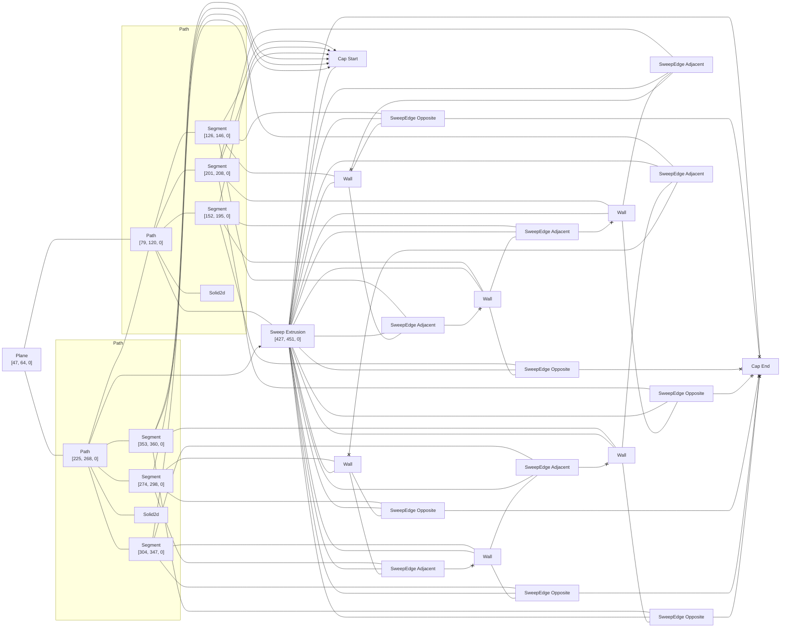

```mermaid
flowchart LR
  subgraph path2 [Path]
    2["Path<br>[79, 120, 0]"]
      %% [ProgramBodyItem { index: 1 }, VariableDeclarationDeclaration, VariableDeclarationInit, PipeBodyItem { index: 0 }]
    3["Segment<br>[126, 146, 0]"]
      %% [ProgramBodyItem { index: 1 }, VariableDeclarationDeclaration, VariableDeclarationInit, PipeBodyItem { index: 1 }]
    4["Segment<br>[152, 195, 0]"]
      %% [ProgramBodyItem { index: 1 }, VariableDeclarationDeclaration, VariableDeclarationInit, PipeBodyItem { index: 2 }]
    5["Segment<br>[201, 208, 0]"]
      %% [ProgramBodyItem { index: 1 }, VariableDeclarationDeclaration, VariableDeclarationInit, PipeBodyItem { index: 3 }]
    6[Solid2d]
  end
  subgraph path7 [Path]
    7["Path<br>[225, 268, 0]"]
      %% [ProgramBodyItem { index: 2 }, VariableDeclarationDeclaration, VariableDeclarationInit, PipeBodyItem { index: 0 }]
    8["Segment<br>[274, 298, 0]"]
      %% [ProgramBodyItem { index: 2 }, VariableDeclarationDeclaration, VariableDeclarationInit, PipeBodyItem { index: 1 }]
    9["Segment<br>[304, 347, 0]"]
      %% [ProgramBodyItem { index: 2 }, VariableDeclarationDeclaration, VariableDeclarationInit, PipeBodyItem { index: 2 }]
    10["Segment<br>[353, 360, 0]"]
      %% [ProgramBodyItem { index: 2 }, VariableDeclarationDeclaration, VariableDeclarationInit, PipeBodyItem { index: 3 }]
    11[Solid2d]
  end
  1["Plane<br>[47, 64, 0]"]
    %% [ProgramBodyItem { index: 0 }, VariableDeclarationDeclaration, VariableDeclarationInit]
  12["Sweep Extrusion<br>[427, 451, 0]"]
    %% [ProgramBodyItem { index: 4 }, VariableDeclarationDeclaration, VariableDeclarationInit]
  13[Wall]
    %% face_code_ref=Missing NodePath
  14[Wall]
    %% face_code_ref=Missing NodePath
  15[Wall]
    %% face_code_ref=Missing NodePath
  16[Wall]
    %% face_code_ref=Missing NodePath
  17[Wall]
    %% face_code_ref=Missing NodePath
  18[Wall]
    %% face_code_ref=Missing NodePath
  19["Cap Start"]
    %% face_code_ref=Missing NodePath
  20["Cap End"]
    %% face_code_ref=Missing NodePath
  21["SweepEdge Opposite"]
  22["SweepEdge Adjacent"]
  23["SweepEdge Opposite"]
  24["SweepEdge Adjacent"]
  25["SweepEdge Opposite"]
  26["SweepEdge Adjacent"]
  27["SweepEdge Opposite"]
  28["SweepEdge Adjacent"]
  29["SweepEdge Opposite"]
  30["SweepEdge Adjacent"]
  31["SweepEdge Opposite"]
  32["SweepEdge Adjacent"]
  1 --- 2
  1 --- 7
  2 --- 3
  2 --- 4
  2 --- 5
  2 --- 6
  7 --- 2
  2 ---- 12
  3 --- 13
  3 x--> 19
  3 --- 21
  3 --- 22
  4 --- 14
  4 x--> 19
  4 --- 23
  4 --- 24
  5 --- 15
  5 x--> 19
  5 --- 25
  5 --- 26
  7 --- 8
  7 --- 9
  7 --- 10
  7 --- 11
  7 x---> 12
  8 --- 16
  8 x--> 19
  8 --- 27
  8 --- 28
  9 --- 17
  9 x--> 19
  9 --- 29
  9 --- 30
  10 --- 18
  10 x--> 19
  10 --- 31
  10 --- 32
  12 --- 13
  12 --- 14
  12 --- 15
  12 --- 16
  12 --- 17
  12 --- 18
  12 --- 19
  12 --- 20
  12 --- 21
  12 --- 22
  12 --- 23
  12 --- 24
  12 --- 25
  12 --- 26
  12 --- 27
  12 --- 28
  12 --- 29
  12 --- 30
  12 --- 31
  12 --- 32
  13 --- 21
  13 --- 22
  26 <--x 13
  22 <--x 14
  14 --- 23
  14 --- 24
  24 <--x 15
  15 --- 25
  15 --- 26
  16 --- 27
  16 --- 28
  32 <--x 16
  28 <--x 17
  17 --- 29
  17 --- 30
  30 <--x 18
  18 --- 31
  18 --- 32
  21 <--x 20
  23 <--x 20
  25 <--x 20
  27 <--x 20
  29 <--x 20
  31 <--x 20
```
