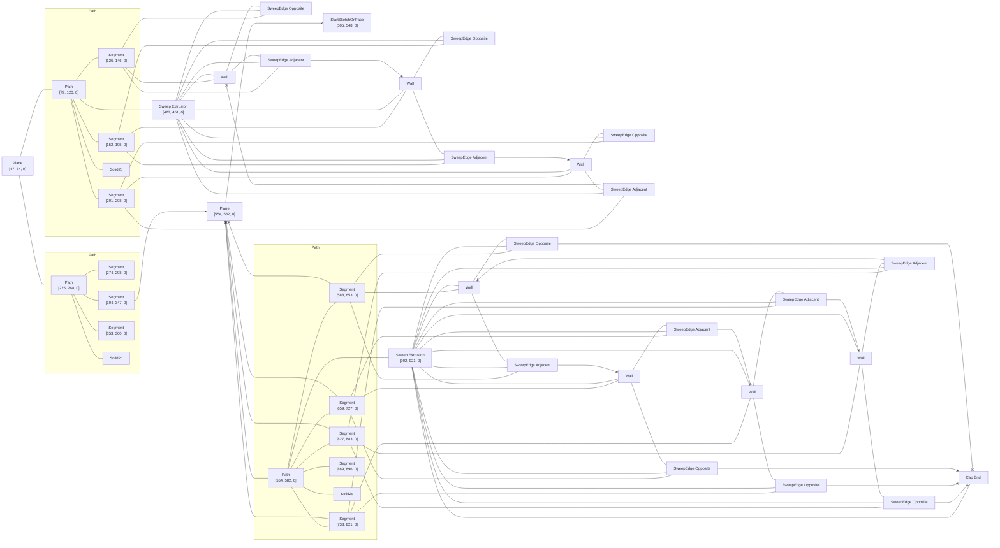

```mermaid
flowchart LR
  subgraph path2 [Path]
    2["Path<br>[79, 120, 0]"]
      %% [ProgramBodyItem { index: 1 }, VariableDeclarationDeclaration, VariableDeclarationInit, PipeBodyItem { index: 0 }]
    3["Segment<br>[126, 146, 0]"]
      %% [ProgramBodyItem { index: 1 }, VariableDeclarationDeclaration, VariableDeclarationInit, PipeBodyItem { index: 1 }]
    4["Segment<br>[152, 195, 0]"]
      %% [ProgramBodyItem { index: 1 }, VariableDeclarationDeclaration, VariableDeclarationInit, PipeBodyItem { index: 2 }]
    5["Segment<br>[201, 208, 0]"]
      %% [ProgramBodyItem { index: 1 }, VariableDeclarationDeclaration, VariableDeclarationInit, PipeBodyItem { index: 3 }]
    6[Solid2d]
  end
  subgraph path7 [Path]
    7["Path<br>[225, 268, 0]"]
      %% [ProgramBodyItem { index: 2 }, VariableDeclarationDeclaration, VariableDeclarationInit, PipeBodyItem { index: 0 }]
    8["Segment<br>[274, 298, 0]"]
      %% [ProgramBodyItem { index: 2 }, VariableDeclarationDeclaration, VariableDeclarationInit, PipeBodyItem { index: 1 }]
    9["Segment<br>[304, 347, 0]"]
      %% [ProgramBodyItem { index: 2 }, VariableDeclarationDeclaration, VariableDeclarationInit, PipeBodyItem { index: 2 }]
    10["Segment<br>[353, 360, 0]"]
      %% [ProgramBodyItem { index: 2 }, VariableDeclarationDeclaration, VariableDeclarationInit, PipeBodyItem { index: 3 }]
    11[Solid2d]
  end
  subgraph path23 [Path]
    23["Path<br>[554, 582, 0]"]
      %% [ProgramBodyItem { index: 5 }, ExpressionStatementExpr, PipeBodyItem { index: 1 }]
    24["Segment<br>[588, 653, 0]"]
      %% [ProgramBodyItem { index: 5 }, ExpressionStatementExpr, PipeBodyItem { index: 2 }]
    25["Segment<br>[659, 727, 0]"]
      %% [ProgramBodyItem { index: 5 }, ExpressionStatementExpr, PipeBodyItem { index: 3 }]
    26["Segment<br>[733, 821, 0]"]
      %% [ProgramBodyItem { index: 5 }, ExpressionStatementExpr, PipeBodyItem { index: 4 }]
    27["Segment<br>[827, 883, 0]"]
      %% [ProgramBodyItem { index: 5 }, ExpressionStatementExpr, PipeBodyItem { index: 5 }]
    28["Segment<br>[889, 896, 0]"]
      %% [ProgramBodyItem { index: 5 }, ExpressionStatementExpr, PipeBodyItem { index: 6 }]
    29[Solid2d]
  end
  1["Plane<br>[47, 64, 0]"]
    %% [ProgramBodyItem { index: 0 }, VariableDeclarationDeclaration, VariableDeclarationInit]
  12["Sweep Extrusion<br>[427, 451, 0]"]
    %% [ProgramBodyItem { index: 4 }, VariableDeclarationDeclaration, VariableDeclarationInit]
  13[Wall]
    %% face_code_ref=Missing NodePath
  14[Wall]
    %% face_code_ref=Missing NodePath
  15[Wall]
    %% face_code_ref=Missing NodePath
  16["SweepEdge Opposite"]
  17["SweepEdge Adjacent"]
  18["SweepEdge Opposite"]
  19["SweepEdge Adjacent"]
  20["SweepEdge Opposite"]
  21["SweepEdge Adjacent"]
  22["Plane<br>[554, 582, 0]"]
    %% [ProgramBodyItem { index: 5 }, ExpressionStatementExpr, PipeBodyItem { index: 1 }]
  30["Sweep Extrusion<br>[902, 921, 0]"]
    %% [ProgramBodyItem { index: 5 }, ExpressionStatementExpr, PipeBodyItem { index: 7 }]
  31[Wall]
    %% face_code_ref=Missing NodePath
  32[Wall]
    %% face_code_ref=Missing NodePath
  33[Wall]
    %% face_code_ref=Missing NodePath
  34[Wall]
    %% face_code_ref=Missing NodePath
  35["Cap End"]
    %% face_code_ref=Missing NodePath
  36["SweepEdge Opposite"]
  37["SweepEdge Adjacent"]
  38["SweepEdge Opposite"]
  39["SweepEdge Adjacent"]
  40["SweepEdge Opposite"]
  41["SweepEdge Adjacent"]
  42["SweepEdge Opposite"]
  43["SweepEdge Adjacent"]
  44["StartSketchOnFace<br>[505, 548, 0]"]
    %% [ProgramBodyItem { index: 5 }, ExpressionStatementExpr, PipeBodyItem { index: 0 }]
  1 --- 2
  1 --- 7
  2 --- 3
  2 --- 4
  2 --- 5
  2 --- 6
  2 ---- 12
  3 --- 13
  3 --- 16
  3 --- 17
  4 --- 14
  4 --- 18
  4 --- 19
  5 --- 15
  5 --- 20
  5 --- 21
  7 --- 8
  7 --- 9
  7 --- 10
  7 --- 11
  9 x--> 22
  12 --- 13
  12 --- 14
  12 --- 15
  12 --- 16
  12 --- 17
  12 --- 18
  12 --- 19
  12 --- 20
  12 --- 21
  13 --- 16
  13 --- 17
  21 <--x 13
  17 <--x 14
  14 --- 18
  14 --- 19
  19 <--x 15
  15 --- 20
  15 --- 21
  22 --- 23
  24 <--x 22
  25 <--x 22
  26 <--x 22
  27 <--x 22
  22 <--x 44
  23 --- 24
  23 --- 25
  23 --- 26
  23 --- 27
  23 --- 28
  23 --- 29
  23 ---- 30
  24 --- 34
  24 --- 42
  24 --- 43
  25 --- 33
  25 --- 40
  25 --- 41
  26 --- 32
  26 --- 38
  26 --- 39
  27 --- 31
  27 --- 36
  27 --- 37
  30 --- 31
  30 --- 32
  30 --- 33
  30 --- 34
  30 --- 35
  30 --- 36
  30 --- 37
  30 --- 38
  30 --- 39
  30 --- 40
  30 --- 41
  30 --- 42
  30 --- 43
  31 --- 36
  31 --- 37
  39 <--x 31
  32 --- 38
  32 --- 39
  41 <--x 32
  33 --- 40
  33 --- 41
  43 <--x 33
  37 <--x 34
  34 --- 42
  34 --- 43
  36 <--x 35
  38 <--x 35
  40 <--x 35
  42 <--x 35
```
