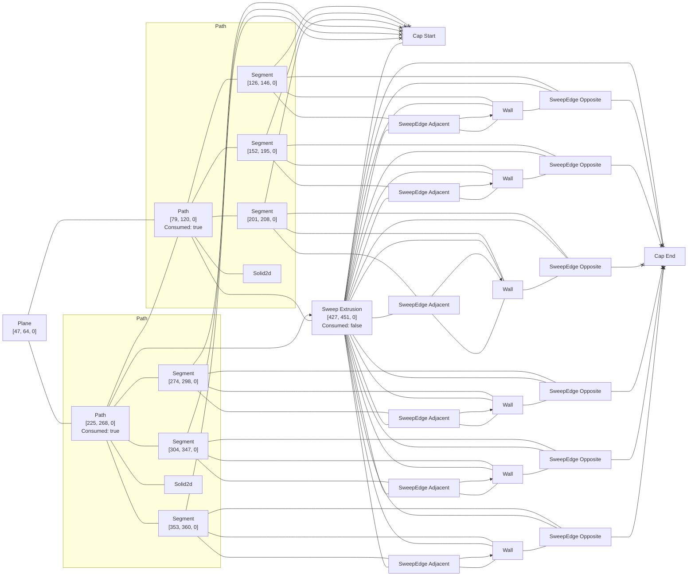

```mermaid
flowchart LR
  subgraph path4 [Path]
    4["Path<br>[79, 120, 0]<br>Consumed: true"]
      %% [ProgramBodyItem { index: 1 }, VariableDeclarationDeclaration, VariableDeclarationInit, PipeBodyItem { index: 0 }]
    6["Segment<br>[126, 146, 0]"]
      %% [ProgramBodyItem { index: 1 }, VariableDeclarationDeclaration, VariableDeclarationInit, PipeBodyItem { index: 1 }]
    7["Segment<br>[152, 195, 0]"]
      %% [ProgramBodyItem { index: 1 }, VariableDeclarationDeclaration, VariableDeclarationInit, PipeBodyItem { index: 2 }]
    8["Segment<br>[201, 208, 0]"]
      %% [ProgramBodyItem { index: 1 }, VariableDeclarationDeclaration, VariableDeclarationInit, PipeBodyItem { index: 3 }]
    13[Solid2d]
  end
  subgraph path3 [Path]
    3["Path<br>[225, 268, 0]<br>Consumed: true"]
      %% [ProgramBodyItem { index: 2 }, VariableDeclarationDeclaration, VariableDeclarationInit, PipeBodyItem { index: 0 }]
    9["Segment<br>[274, 298, 0]"]
      %% [ProgramBodyItem { index: 2 }, VariableDeclarationDeclaration, VariableDeclarationInit, PipeBodyItem { index: 1 }]
    10["Segment<br>[304, 347, 0]"]
      %% [ProgramBodyItem { index: 2 }, VariableDeclarationDeclaration, VariableDeclarationInit, PipeBodyItem { index: 2 }]
    11["Segment<br>[353, 360, 0]"]
      %% [ProgramBodyItem { index: 2 }, VariableDeclarationDeclaration, VariableDeclarationInit, PipeBodyItem { index: 3 }]
    12[Solid2d]
  end
  5["Plane<br>[47, 64, 0]"]
    %% [ProgramBodyItem { index: 0 }, VariableDeclarationDeclaration, VariableDeclarationInit]
  14["Sweep Extrusion<br>[427, 451, 0]<br>Consumed: false"]
    %% [ProgramBodyItem { index: 4 }, VariableDeclarationDeclaration, VariableDeclarationInit]
  27[Wall]
    %% face_code_ref=Missing NodePath
  28[Wall]
    %% face_code_ref=Missing NodePath
  29[Wall]
    %% face_code_ref=Missing NodePath
  30[Wall]
    %% face_code_ref=Missing NodePath
  31[Wall]
    %% face_code_ref=Missing NodePath
  32[Wall]
    %% face_code_ref=Missing NodePath
  2["Cap Start"]
    %% face_code_ref=Missing NodePath
  1["Cap End"]
    %% face_code_ref=Missing NodePath
  21["SweepEdge Opposite"]
  15["SweepEdge Adjacent"]
  22["SweepEdge Opposite"]
  16["SweepEdge Adjacent"]
  23["SweepEdge Opposite"]
  17["SweepEdge Adjacent"]
  24["SweepEdge Opposite"]
  18["SweepEdge Adjacent"]
  25["SweepEdge Opposite"]
  19["SweepEdge Adjacent"]
  26["SweepEdge Opposite"]
  20["SweepEdge Adjacent"]
  14 --- 1
  21 <--x 1
  22 <--x 1
  23 <--x 1
  24 <--x 1
  25 <--x 1
  26 <--x 1
  6 <--x 2
  7 <--x 2
  8 <--x 2
  9 <--x 2
  10 <--x 2
  11 <--x 2
  14 --- 2
  3 --- 4
  5 --- 3
  3 --- 9
  3 --- 10
  3 --- 11
  3 --- 12
  3 x---> 14
  5 --- 4
  4 --- 6
  4 --- 7
  4 --- 8
  4 --- 13
  4 ---- 14
  6 --- 15
  6 --- 21
  6 --- 27
  7 --- 16
  7 --- 22
  7 --- 28
  8 --- 17
  8 --- 23
  8 --- 29
  9 --- 18
  9 --- 24
  9 --- 30
  10 --- 19
  10 --- 25
  10 --- 31
  11 --- 20
  11 --- 26
  11 --- 32
  14 --- 15
  14 --- 16
  14 --- 17
  14 --- 18
  14 --- 19
  14 --- 20
  14 --- 21
  14 --- 22
  14 --- 23
  14 --- 24
  14 --- 25
  14 --- 26
  14 --- 27
  14 --- 28
  14 --- 29
  14 --- 30
  14 --- 31
  14 --- 32
  27 --- 15
  15 x--> 27
  28 --- 16
  16 x--> 28
  29 --- 17
  17 x--> 29
  30 --- 18
  18 x--> 30
  31 --- 19
  19 x--> 31
  32 --- 20
  20 x--> 32
  27 --- 21
  28 --- 22
  29 --- 23
  30 --- 24
  31 --- 25
  32 --- 26
```
