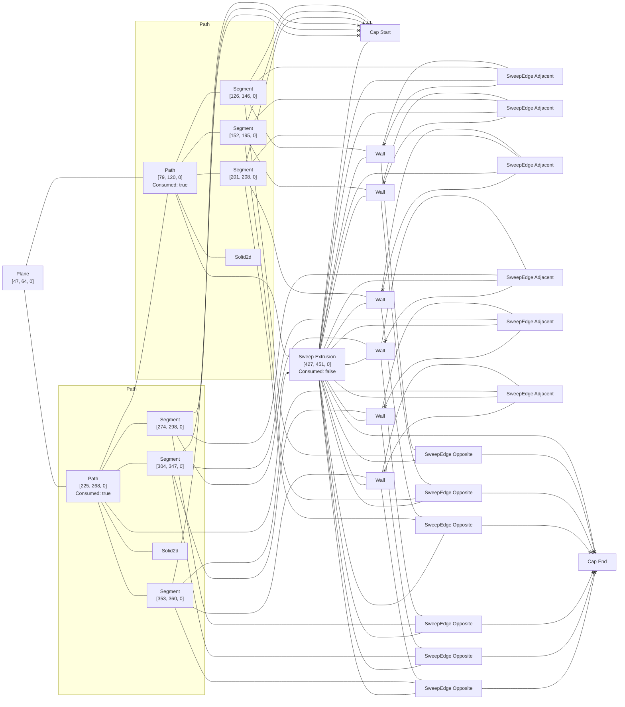

```mermaid
flowchart LR
  subgraph path10 [Path]
    10["Path<br>[79, 120, 0]<br>Consumed: true"]
      %% [ProgramBodyItem { index: 1 }, VariableDeclarationDeclaration, VariableDeclarationInit, PipeBodyItem { index: 0 }]
    11["Segment<br>[126, 146, 0]"]
      %% [ProgramBodyItem { index: 1 }, VariableDeclarationDeclaration, VariableDeclarationInit, PipeBodyItem { index: 1 }]
    12["Segment<br>[152, 195, 0]"]
      %% [ProgramBodyItem { index: 1 }, VariableDeclarationDeclaration, VariableDeclarationInit, PipeBodyItem { index: 2 }]
    13["Segment<br>[201, 208, 0]"]
      %% [ProgramBodyItem { index: 1 }, VariableDeclarationDeclaration, VariableDeclarationInit, PipeBodyItem { index: 3 }]
    20[Solid2d]
  end
  subgraph path14 [Path]
    14["Path<br>[225, 268, 0]<br>Consumed: true"]
      %% [ProgramBodyItem { index: 2 }, VariableDeclarationDeclaration, VariableDeclarationInit, PipeBodyItem { index: 0 }]
    15["Segment<br>[274, 298, 0]"]
      %% [ProgramBodyItem { index: 2 }, VariableDeclarationDeclaration, VariableDeclarationInit, PipeBodyItem { index: 1 }]
    16["Segment<br>[304, 347, 0]"]
      %% [ProgramBodyItem { index: 2 }, VariableDeclarationDeclaration, VariableDeclarationInit, PipeBodyItem { index: 2 }]
    17["Segment<br>[353, 360, 0]"]
      %% [ProgramBodyItem { index: 2 }, VariableDeclarationDeclaration, VariableDeclarationInit, PipeBodyItem { index: 3 }]
    19[Solid2d]
  end
  1["Cap End"]
    %% face_code_ref=Missing NodePath
  2["Cap Start"]
    %% face_code_ref=Missing NodePath
  3[Wall]
    %% face_code_ref=Missing NodePath
  4[Wall]
    %% face_code_ref=Missing NodePath
  5[Wall]
    %% face_code_ref=Missing NodePath
  6[Wall]
    %% face_code_ref=Missing NodePath
  7[Wall]
    %% face_code_ref=Missing NodePath
  8[Wall]
    %% face_code_ref=Missing NodePath
  9["Plane<br>[47, 64, 0]"]
    %% [ProgramBodyItem { index: 0 }, VariableDeclarationDeclaration, VariableDeclarationInit]
  18["Sweep Extrusion<br>[427, 451, 0]<br>Consumed: false"]
    %% [ProgramBodyItem { index: 4 }, VariableDeclarationDeclaration, VariableDeclarationInit]
  21["SweepEdge Adjacent"]
  22["SweepEdge Adjacent"]
  23["SweepEdge Adjacent"]
  24["SweepEdge Adjacent"]
  25["SweepEdge Adjacent"]
  26["SweepEdge Adjacent"]
  27["SweepEdge Opposite"]
  28["SweepEdge Opposite"]
  29["SweepEdge Opposite"]
  30["SweepEdge Opposite"]
  31["SweepEdge Opposite"]
  32["SweepEdge Opposite"]
  18 --- 1
  27 <--x 1
  28 <--x 1
  29 <--x 1
  30 <--x 1
  31 <--x 1
  32 <--x 1
  11 <--x 2
  12 <--x 2
  13 <--x 2
  15 <--x 2
  16 <--x 2
  17 <--x 2
  18 --- 2
  11 --- 3
  18 --- 3
  3 --- 21
  21 <--x 3
  3 --- 27
  12 --- 4
  18 --- 4
  4 --- 22
  22 <--x 4
  4 --- 28
  13 --- 5
  18 --- 5
  5 --- 23
  23 <--x 5
  5 --- 29
  15 --- 6
  18 --- 6
  6 --- 24
  24 <--x 6
  6 --- 30
  16 --- 7
  18 --- 7
  7 --- 25
  25 <--x 7
  7 --- 31
  17 --- 8
  18 --- 8
  8 --- 26
  26 <--x 8
  8 --- 32
  9 --- 10
  9 --- 14
  10 --- 11
  10 --- 12
  10 --- 13
  14 --- 10
  10 ---- 18
  10 --- 20
  11 --- 21
  11 --- 27
  12 --- 22
  12 --- 28
  13 --- 23
  13 --- 29
  14 --- 15
  14 --- 16
  14 --- 17
  14 x---> 18
  14 --- 19
  15 --- 24
  15 --- 30
  16 --- 25
  16 --- 31
  17 --- 26
  17 --- 32
  18 --- 21
  18 --- 22
  18 --- 23
  18 --- 24
  18 --- 25
  18 --- 26
  18 --- 27
  18 --- 28
  18 --- 29
  18 --- 30
  18 --- 31
  18 --- 32
```
