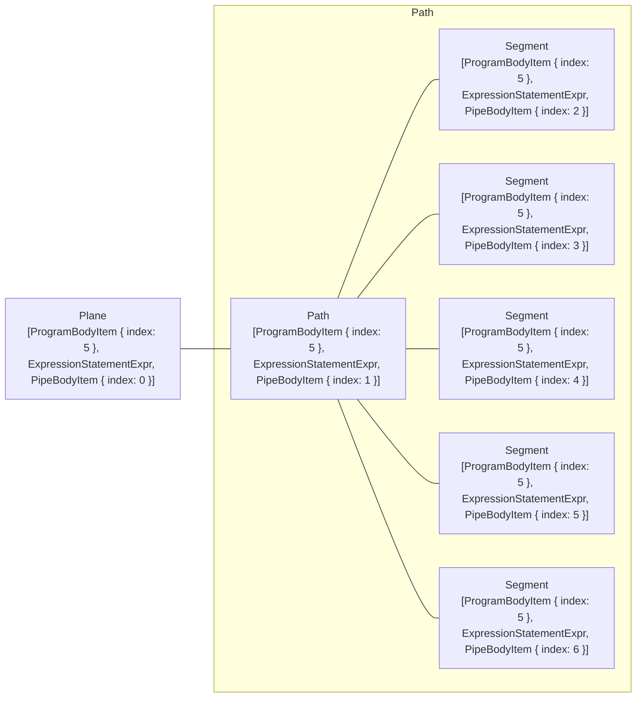

```mermaid
flowchart LR
  subgraph path2 [Path]
    2["Path<br>[ProgramBodyItem { index: 5 }, ExpressionStatementExpr, PipeBodyItem { index: 1 }]"]
    3["Segment<br>[ProgramBodyItem { index: 5 }, ExpressionStatementExpr, PipeBodyItem { index: 2 }]"]
    4["Segment<br>[ProgramBodyItem { index: 5 }, ExpressionStatementExpr, PipeBodyItem { index: 3 }]"]
    5["Segment<br>[ProgramBodyItem { index: 5 }, ExpressionStatementExpr, PipeBodyItem { index: 4 }]"]
    6["Segment<br>[ProgramBodyItem { index: 5 }, ExpressionStatementExpr, PipeBodyItem { index: 5 }]"]
    7["Segment<br>[ProgramBodyItem { index: 5 }, ExpressionStatementExpr, PipeBodyItem { index: 6 }]"]
  end
  1["Plane<br>[ProgramBodyItem { index: 5 }, ExpressionStatementExpr, PipeBodyItem { index: 0 }]"]
  1 --- 2
  2 --- 3
  2 --- 4
  2 --- 5
  2 --- 6
  2 --- 7
```
