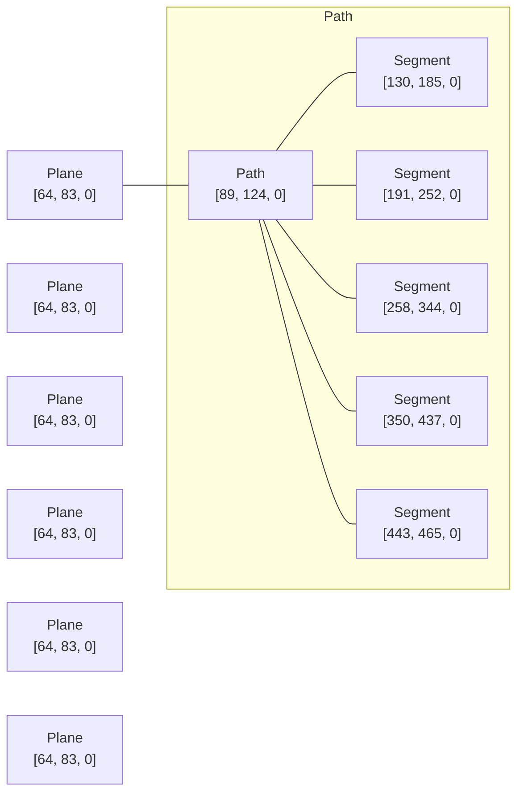

```mermaid
flowchart LR
  subgraph path7 [Path]
    7["Path<br>[89, 124, 0]"]
    8["Segment<br>[130, 185, 0]"]
    9["Segment<br>[191, 252, 0]"]
    10["Segment<br>[258, 344, 0]"]
    11["Segment<br>[350, 437, 0]"]
    12["Segment<br>[443, 465, 0]"]
  end
  1["Plane<br>[64, 83, 0]"]
  2["Plane<br>[64, 83, 0]"]
  3["Plane<br>[64, 83, 0]"]
  4["Plane<br>[64, 83, 0]"]
  5["Plane<br>[64, 83, 0]"]
  6["Plane<br>[64, 83, 0]"]
  1 --- 7
  7 --- 8
  7 --- 9
  7 --- 10
  7 --- 11
  7 --- 12
```
