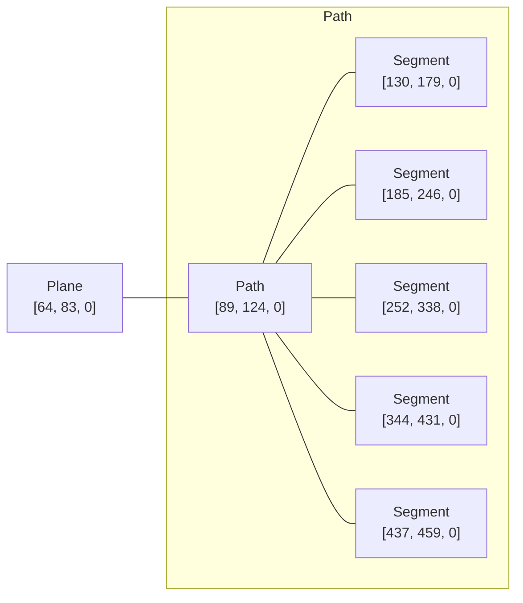

```mermaid
flowchart LR
  subgraph path2 [Path]
    2["Path<br>[89, 124, 0]"]
    3["Segment<br>[130, 179, 0]"]
    4["Segment<br>[185, 246, 0]"]
    5["Segment<br>[252, 338, 0]"]
    6["Segment<br>[344, 431, 0]"]
    7["Segment<br>[437, 459, 0]"]
  end
  1["Plane<br>[64, 83, 0]"]
  1 --- 2
  2 --- 3
  2 --- 4
  2 --- 5
  2 --- 6
  2 --- 7
```
