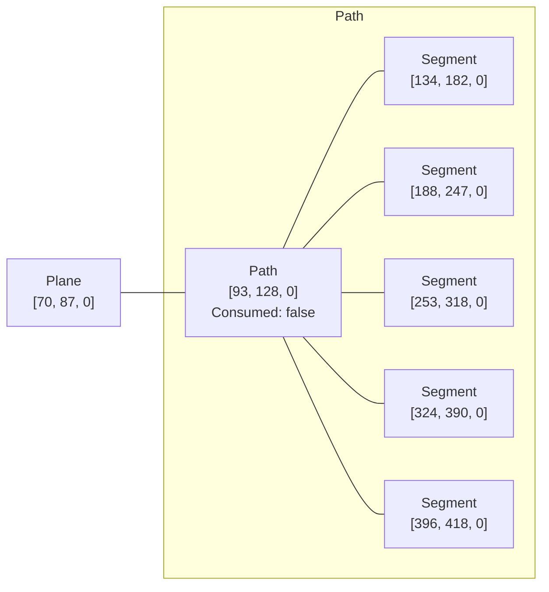

```mermaid
flowchart LR
  subgraph path1 [Path]
    1["Path<br>[93, 128, 0]<br>Consumed: false"]
      %% [ProgramBodyItem { index: 5 }, ExpressionStatementExpr, PipeBodyItem { index: 1 }]
    3["Segment<br>[134, 182, 0]"]
      %% [ProgramBodyItem { index: 5 }, ExpressionStatementExpr, PipeBodyItem { index: 2 }]
    4["Segment<br>[188, 247, 0]"]
      %% [ProgramBodyItem { index: 5 }, ExpressionStatementExpr, PipeBodyItem { index: 3 }]
    5["Segment<br>[253, 318, 0]"]
      %% [ProgramBodyItem { index: 5 }, ExpressionStatementExpr, PipeBodyItem { index: 4 }]
    6["Segment<br>[324, 390, 0]"]
      %% [ProgramBodyItem { index: 5 }, ExpressionStatementExpr, PipeBodyItem { index: 5 }]
    7["Segment<br>[396, 418, 0]"]
      %% [ProgramBodyItem { index: 5 }, ExpressionStatementExpr, PipeBodyItem { index: 6 }]
  end
  2["Plane<br>[70, 87, 0]"]
    %% [ProgramBodyItem { index: 5 }, ExpressionStatementExpr, PipeBodyItem { index: 0 }]
  2 --- 1
  1 --- 3
  1 --- 4
  1 --- 5
  1 --- 6
  1 --- 7
```
