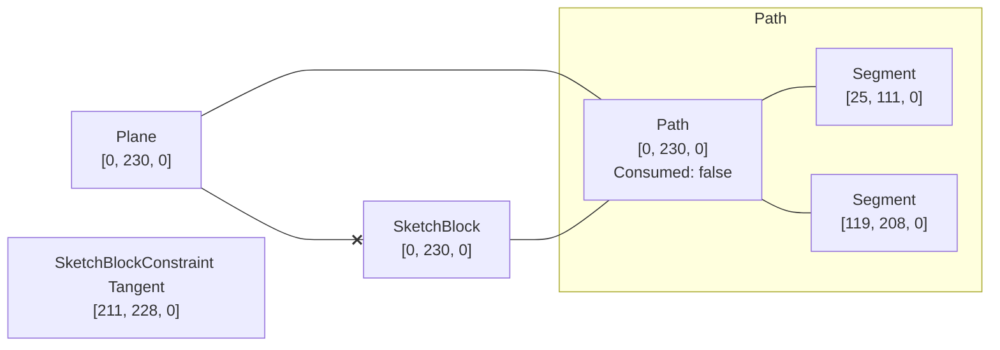

```mermaid
flowchart LR
  subgraph path1 [Path]
    1["Path<br>[0, 230, 0]<br>Consumed: false"]
      %% [ProgramBodyItem { index: 0 }, ExpressionStatementExpr]
    4["Segment<br>[25, 111, 0]"]
      %% [ProgramBodyItem { index: 0 }, ExpressionStatementExpr, SketchBlockBody, SketchBlockBodyItem { index: 0 }, VariableDeclarationDeclaration, VariableDeclarationInit]
    5["Segment<br>[119, 208, 0]"]
      %% [ProgramBodyItem { index: 0 }, ExpressionStatementExpr, SketchBlockBody, SketchBlockBodyItem { index: 1 }, VariableDeclarationDeclaration, VariableDeclarationInit]
  end
  2["Plane<br>[0, 230, 0]"]
    %% [ProgramBodyItem { index: 0 }, ExpressionStatementExpr]
  3["SketchBlock<br>[0, 230, 0]"]
    %% [ProgramBodyItem { index: 0 }, ExpressionStatementExpr]
  6["SketchBlockConstraint Tangent<br>[211, 228, 0]"]
    %% [ProgramBodyItem { index: 0 }, ExpressionStatementExpr, SketchBlockBody, SketchBlockBodyItem { index: 2 }, ExpressionStatementExpr]
  2 --- 1
  3 --- 1
  1 --- 4
  1 --- 5
  2 <--x 3
```
