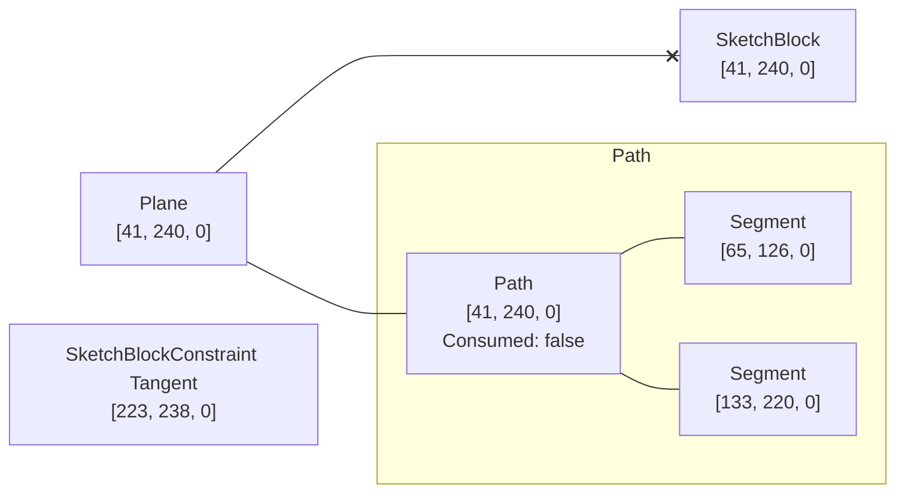

```mermaid
flowchart LR
  subgraph path2 [Path]
    2["Path<br>[41, 240, 0]<br>Consumed: false"]
      %% [ProgramBodyItem { index: 0 }, ExpressionStatementExpr]
    3["Segment<br>[65, 126, 0]"]
      %% [ProgramBodyItem { index: 0 }, ExpressionStatementExpr, SketchBlockBody, SketchBlockBodyItem { index: 0 }, VariableDeclarationDeclaration, VariableDeclarationInit]
    4["Segment<br>[133, 220, 0]"]
      %% [ProgramBodyItem { index: 0 }, ExpressionStatementExpr, SketchBlockBody, SketchBlockBodyItem { index: 1 }, VariableDeclarationDeclaration, VariableDeclarationInit]
  end
  1["Plane<br>[41, 240, 0]"]
    %% [ProgramBodyItem { index: 0 }, ExpressionStatementExpr]
  5["SketchBlock<br>[41, 240, 0]"]
    %% [ProgramBodyItem { index: 0 }, ExpressionStatementExpr]
  6["SketchBlockConstraint Tangent<br>[223, 238, 0]"]
    %% [ProgramBodyItem { index: 0 }, ExpressionStatementExpr, SketchBlockBody, SketchBlockBodyItem { index: 2 }, ExpressionStatementExpr]
  1 --- 2
  1 <--x 5
  2 --- 3
  2 --- 4
```
