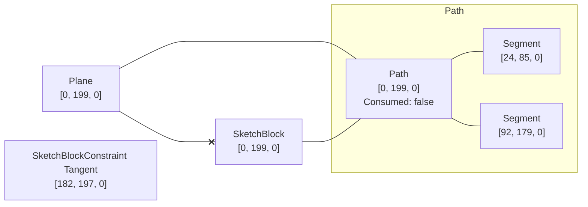

```mermaid
flowchart LR
  subgraph path2 [Path]
    2["Path<br>[0, 199, 0]<br>Consumed: false"]
      %% [ProgramBodyItem { index: 0 }, ExpressionStatementExpr]
    3["Segment<br>[24, 85, 0]"]
      %% [ProgramBodyItem { index: 0 }, ExpressionStatementExpr, CallKwBlock, BlockItem { index: 0 }, VariableDeclarationDeclaration, VariableDeclarationInit]
    4["Segment<br>[92, 179, 0]"]
      %% [ProgramBodyItem { index: 0 }, ExpressionStatementExpr, CallKwBlock, BlockItem { index: 1 }, VariableDeclarationDeclaration, VariableDeclarationInit]
  end
  1["Plane<br>[0, 199, 0]"]
    %% [ProgramBodyItem { index: 0 }, ExpressionStatementExpr]
  5["SketchBlock<br>[0, 199, 0]"]
    %% [ProgramBodyItem { index: 0 }, ExpressionStatementExpr]
  6["SketchBlockConstraint Tangent<br>[182, 197, 0]"]
    %% [ProgramBodyItem { index: 0 }, ExpressionStatementExpr, CallKwBlock, BlockItem { index: 2 }, ExpressionStatementExpr]
  1 --- 2
  1 <--x 5
  2 --- 3
  2 --- 4
  5 --- 2
```
