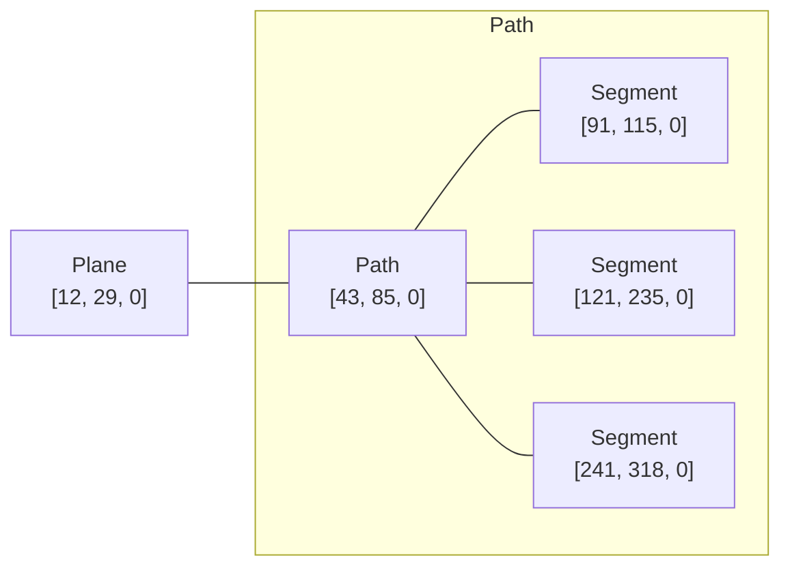

```mermaid
flowchart LR
  subgraph path2 [Path]
    2["Path<br>[43, 85, 0]"]
    3["Segment<br>[91, 115, 0]"]
    4["Segment<br>[121, 235, 0]"]
    5["Segment<br>[241, 318, 0]"]
  end
  1["Plane<br>[12, 29, 0]"]
  1 --- 2
  2 --- 3
  2 --- 4
  2 --- 5
```
