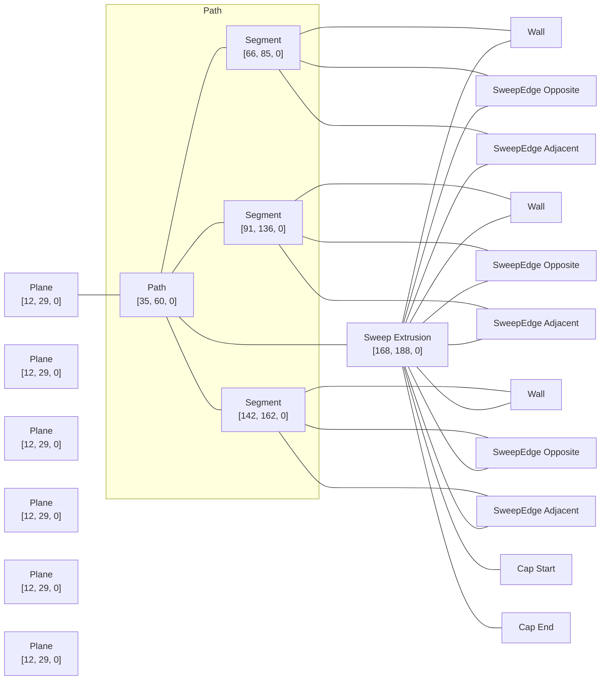

```mermaid
flowchart LR
  subgraph path7 [Path]
    7["Path<br>[35, 60, 0]"]
    8["Segment<br>[66, 85, 0]"]
    9["Segment<br>[91, 136, 0]"]
    10["Segment<br>[142, 162, 0]"]
  end
  1["Plane<br>[12, 29, 0]"]
  2["Plane<br>[12, 29, 0]"]
  3["Plane<br>[12, 29, 0]"]
  4["Plane<br>[12, 29, 0]"]
  5["Plane<br>[12, 29, 0]"]
  6["Plane<br>[12, 29, 0]"]
  11["Sweep Extrusion<br>[168, 188, 0]"]
  12[Wall]
  13[Wall]
  14[Wall]
  15["Cap Start"]
  16["Cap End"]
  17["SweepEdge Opposite"]
  18["SweepEdge Adjacent"]
  19["SweepEdge Opposite"]
  20["SweepEdge Adjacent"]
  21["SweepEdge Opposite"]
  22["SweepEdge Adjacent"]
  1 --- 7
  7 --- 8
  7 --- 9
  7 --- 10
  7 ---- 11
  8 --- 12
  8 --- 17
  8 --- 18
  9 --- 13
  9 --- 19
  9 --- 20
  10 --- 14
  10 --- 21
  10 --- 22
  11 --- 12
  11 --- 13
  11 --- 14
  11 --- 15
  11 --- 16
  11 --- 17
  11 --- 18
  11 --- 19
  11 --- 20
  11 --- 21
  11 --- 22
```
