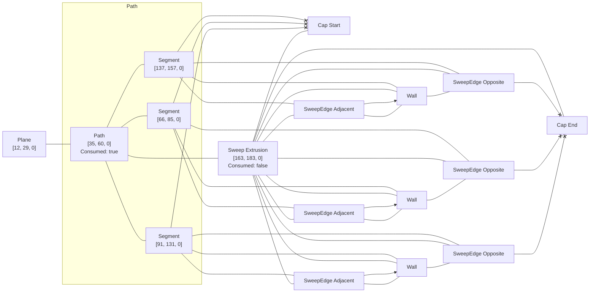

```mermaid
flowchart LR
  subgraph path3 [Path]
    3["Path<br>[35, 60, 0]<br>Consumed: true"]
      %% [ProgramBodyItem { index: 0 }, VariableDeclarationDeclaration, VariableDeclarationInit, PipeBodyItem { index: 1 }]
    5["Segment<br>[137, 157, 0]"]
      %% [ProgramBodyItem { index: 0 }, VariableDeclarationDeclaration, VariableDeclarationInit, PipeBodyItem { index: 4 }]
    6["Segment<br>[66, 85, 0]"]
      %% [ProgramBodyItem { index: 0 }, VariableDeclarationDeclaration, VariableDeclarationInit, PipeBodyItem { index: 2 }]
    7["Segment<br>[91, 131, 0]"]
      %% [ProgramBodyItem { index: 0 }, VariableDeclarationDeclaration, VariableDeclarationInit, PipeBodyItem { index: 3 }]
  end
  1["Cap End"]
    %% face_code_ref=Missing NodePath
  2["Cap Start"]
    %% face_code_ref=Missing NodePath
  4["Plane<br>[12, 29, 0]"]
    %% [ProgramBodyItem { index: 0 }, VariableDeclarationDeclaration, VariableDeclarationInit, PipeBodyItem { index: 0 }]
  8["Sweep Extrusion<br>[163, 183, 0]<br>Consumed: false"]
    %% [ProgramBodyItem { index: 0 }, VariableDeclarationDeclaration, VariableDeclarationInit, PipeBodyItem { index: 5 }]
  9["SweepEdge Adjacent"]
  10["SweepEdge Adjacent"]
  11["SweepEdge Adjacent"]
  12["SweepEdge Opposite"]
  13["SweepEdge Opposite"]
  14["SweepEdge Opposite"]
  15[Wall]
    %% face_code_ref=Missing NodePath
  16[Wall]
    %% face_code_ref=Missing NodePath
  17[Wall]
    %% face_code_ref=Missing NodePath
  8 --- 1
  12 <--x 1
  13 <--x 1
  14 <--x 1
  5 <--x 2
  6 <--x 2
  7 <--x 2
  8 --- 2
  4 --- 3
  3 --- 5
  3 --- 6
  3 --- 7
  3 ---- 8
  5 --- 9
  5 --- 12
  5 --- 15
  6 --- 10
  6 --- 13
  6 --- 16
  7 --- 11
  7 --- 14
  7 --- 17
  8 --- 9
  8 --- 10
  8 --- 11
  8 --- 12
  8 --- 13
  8 --- 14
  8 --- 15
  8 --- 16
  8 --- 17
  15 --- 9
  9 x--> 15
  16 --- 10
  10 x--> 16
  11 x--> 17
  17 --- 11
  15 --- 12
  16 --- 13
  17 --- 14
```
