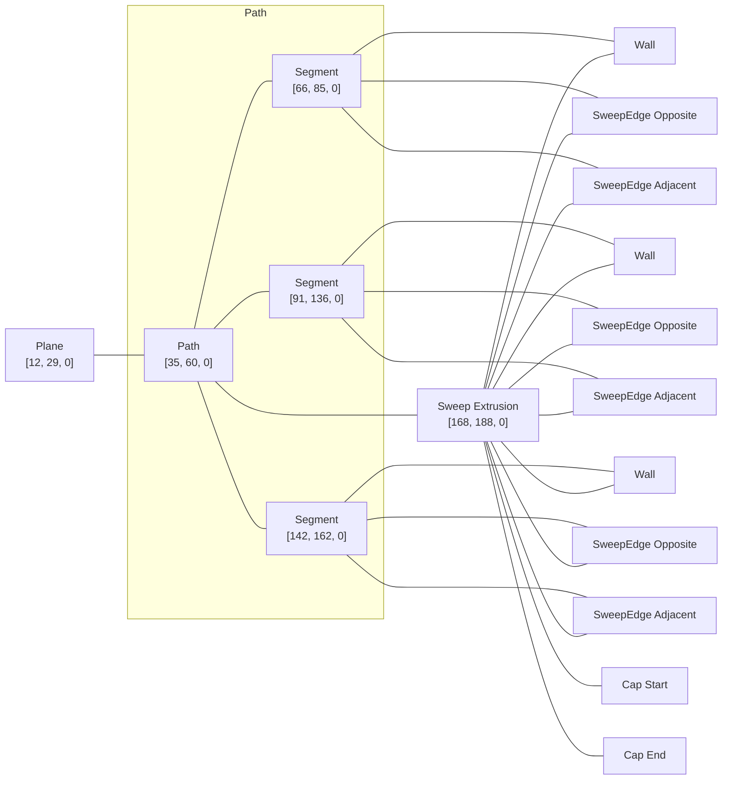

```mermaid
flowchart LR
  subgraph path2 [Path]
    2["Path<br>[35, 60, 0]"]
    3["Segment<br>[66, 85, 0]"]
    4["Segment<br>[91, 136, 0]"]
    5["Segment<br>[142, 162, 0]"]
  end
  1["Plane<br>[12, 29, 0]"]
  6["Sweep Extrusion<br>[168, 188, 0]"]
  7[Wall]
  8[Wall]
  9[Wall]
  10["Cap Start"]
  11["Cap End"]
  12["SweepEdge Opposite"]
  13["SweepEdge Adjacent"]
  14["SweepEdge Opposite"]
  15["SweepEdge Adjacent"]
  16["SweepEdge Opposite"]
  17["SweepEdge Adjacent"]
  1 --- 2
  2 --- 3
  2 --- 4
  2 --- 5
  2 ---- 6
  3 --- 7
  3 --- 12
  3 --- 13
  4 --- 8
  4 --- 14
  4 --- 15
  5 --- 9
  5 --- 16
  5 --- 17
  6 --- 7
  6 --- 8
  6 --- 9
  6 --- 10
  6 --- 11
  6 --- 12
  6 --- 13
  6 --- 14
  6 --- 15
  6 --- 16
  6 --- 17
```
