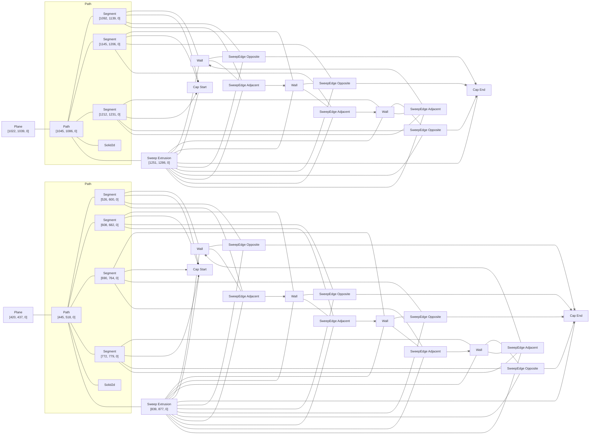

```mermaid
flowchart LR
  subgraph path3 [Path]
    3["Path<br>[445, 518, 0]"]
      %% [ProgramBodyItem { index: 7 }, VariableDeclarationDeclaration, VariableDeclarationInit, FunctionExpressionBody, FunctionExpressionBodyItem { index: 0 }, VariableDeclarationDeclaration, VariableDeclarationInit, PipeBodyItem { index: 1 }]
    5["Segment<br>[526, 600, 0]"]
      %% [ProgramBodyItem { index: 7 }, VariableDeclarationDeclaration, VariableDeclarationInit, FunctionExpressionBody, FunctionExpressionBodyItem { index: 0 }, VariableDeclarationDeclaration, VariableDeclarationInit, PipeBodyItem { index: 2 }]
    6["Segment<br>[608, 682, 0]"]
      %% [ProgramBodyItem { index: 7 }, VariableDeclarationDeclaration, VariableDeclarationInit, FunctionExpressionBody, FunctionExpressionBodyItem { index: 0 }, VariableDeclarationDeclaration, VariableDeclarationInit, PipeBodyItem { index: 3 }]
    7["Segment<br>[690, 764, 0]"]
      %% [ProgramBodyItem { index: 7 }, VariableDeclarationDeclaration, VariableDeclarationInit, FunctionExpressionBody, FunctionExpressionBodyItem { index: 0 }, VariableDeclarationDeclaration, VariableDeclarationInit, PipeBodyItem { index: 4 }]
    8["Segment<br>[772, 779, 0]"]
      %% [ProgramBodyItem { index: 7 }, VariableDeclarationDeclaration, VariableDeclarationInit, FunctionExpressionBody, FunctionExpressionBodyItem { index: 0 }, VariableDeclarationDeclaration, VariableDeclarationInit, PipeBodyItem { index: 5 }]
    13[Solid2d]
  end
  subgraph path4 [Path]
    4["Path<br>[1045, 1086, 0]"]
      %% [ProgramBodyItem { index: 9 }, VariableDeclarationDeclaration, VariableDeclarationInit, PipeBodyItem { index: 1 }]
    9["Segment<br>[1092, 1139, 0]"]
      %% [ProgramBodyItem { index: 9 }, VariableDeclarationDeclaration, VariableDeclarationInit, PipeBodyItem { index: 2 }]
    10["Segment<br>[1145, 1206, 0]"]
      %% [ProgramBodyItem { index: 9 }, VariableDeclarationDeclaration, VariableDeclarationInit, PipeBodyItem { index: 3 }]
    11["Segment<br>[1212, 1231, 0]"]
      %% [ProgramBodyItem { index: 9 }, VariableDeclarationDeclaration, VariableDeclarationInit, PipeBodyItem { index: 4 }]
    12[Solid2d]
  end
  1["Plane<br>[420, 437, 0]"]
    %% [ProgramBodyItem { index: 7 }, VariableDeclarationDeclaration, VariableDeclarationInit, FunctionExpressionBody, FunctionExpressionBodyItem { index: 0 }, VariableDeclarationDeclaration, VariableDeclarationInit, PipeBodyItem { index: 0 }]
  2["Plane<br>[1022, 1039, 0]"]
    %% [ProgramBodyItem { index: 9 }, VariableDeclarationDeclaration, VariableDeclarationInit, PipeBodyItem { index: 0 }]
  14["Sweep Extrusion<br>[839, 877, 0]"]
    %% [ProgramBodyItem { index: 7 }, VariableDeclarationDeclaration, VariableDeclarationInit, FunctionExpressionBody, FunctionExpressionBodyItem { index: 1 }, ReturnStatementArg]
  15["Sweep Extrusion<br>[1251, 1286, 0]"]
    %% [ProgramBodyItem { index: 10 }, VariableDeclarationDeclaration, VariableDeclarationInit, PipeBodyItem { index: 0 }]
  16[Wall]
    %% face_code_ref=Missing NodePath
  17[Wall]
    %% face_code_ref=Missing NodePath
  18[Wall]
    %% face_code_ref=Missing NodePath
  19[Wall]
    %% face_code_ref=Missing NodePath
  20[Wall]
    %% face_code_ref=Missing NodePath
  21[Wall]
    %% face_code_ref=Missing NodePath
  22[Wall]
    %% face_code_ref=Missing NodePath
  23["Cap Start"]
    %% face_code_ref=Missing NodePath
  24["Cap Start"]
    %% face_code_ref=Missing NodePath
  25["Cap End"]
    %% face_code_ref=Missing NodePath
  26["Cap End"]
    %% face_code_ref=Missing NodePath
  27["SweepEdge Opposite"]
  28["SweepEdge Opposite"]
  29["SweepEdge Opposite"]
  30["SweepEdge Opposite"]
  31["SweepEdge Opposite"]
  32["SweepEdge Opposite"]
  33["SweepEdge Opposite"]
  34["SweepEdge Adjacent"]
  35["SweepEdge Adjacent"]
  36["SweepEdge Adjacent"]
  37["SweepEdge Adjacent"]
  38["SweepEdge Adjacent"]
  39["SweepEdge Adjacent"]
  40["SweepEdge Adjacent"]
  1 --- 3
  2 --- 4
  3 --- 5
  3 --- 6
  3 --- 7
  3 --- 8
  3 --- 13
  3 ---- 14
  4 --- 9
  4 --- 10
  4 --- 11
  4 --- 12
  4 ---- 15
  5 --- 19
  5 x--> 23
  5 --- 27
  5 --- 34
  6 --- 17
  6 x--> 23
  6 --- 28
  6 --- 35
  7 --- 16
  7 x--> 23
  7 --- 29
  7 --- 36
  8 --- 18
  8 x--> 23
  8 --- 30
  8 --- 37
  9 --- 21
  9 x--> 24
  9 --- 31
  9 --- 38
  10 --- 22
  10 x--> 24
  10 --- 32
  10 --- 39
  11 --- 20
  11 x--> 24
  11 --- 33
  11 --- 40
  14 --- 16
  14 --- 17
  14 --- 18
  14 --- 19
  14 --- 23
  14 --- 25
  14 --- 27
  14 --- 28
  14 --- 29
  14 --- 30
  14 --- 34
  14 --- 35
  14 --- 36
  14 --- 37
  15 --- 20
  15 --- 21
  15 --- 22
  15 --- 24
  15 --- 26
  15 --- 31
  15 --- 32
  15 --- 33
  15 --- 38
  15 --- 39
  15 --- 40
  16 --- 29
  35 <--x 16
  16 --- 36
  17 --- 28
  34 <--x 17
  17 --- 35
  18 --- 30
  36 <--x 18
  18 --- 37
  19 --- 27
  19 --- 34
  37 <--x 19
  20 --- 33
  39 <--x 20
  20 --- 40
  21 --- 31
  21 --- 38
  40 <--x 21
  22 --- 32
  38 <--x 22
  22 --- 39
  27 <--x 25
  28 <--x 25
  29 <--x 25
  30 <--x 25
  31 <--x 26
  32 <--x 26
  33 <--x 26
```
