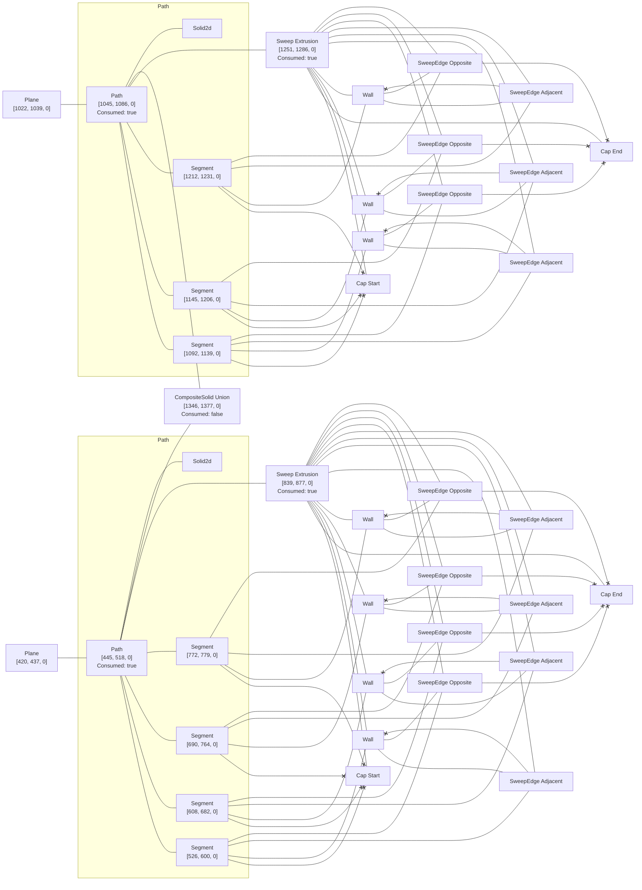

```mermaid
flowchart LR
  subgraph path13 [Path]
    13["Path<br>[445, 518, 0]<br>Consumed: true"]
      %% [ProgramBodyItem { index: 7 }, VariableDeclarationDeclaration, VariableDeclarationInit, FunctionExpressionBody, FunctionExpressionBodyItem { index: 0 }, VariableDeclarationDeclaration, VariableDeclarationInit, PipeBodyItem { index: 1 }]
    14["Segment<br>[526, 600, 0]"]
      %% [ProgramBodyItem { index: 7 }, VariableDeclarationDeclaration, VariableDeclarationInit, FunctionExpressionBody, FunctionExpressionBodyItem { index: 0 }, VariableDeclarationDeclaration, VariableDeclarationInit, PipeBodyItem { index: 2 }]
    15["Segment<br>[608, 682, 0]"]
      %% [ProgramBodyItem { index: 7 }, VariableDeclarationDeclaration, VariableDeclarationInit, FunctionExpressionBody, FunctionExpressionBodyItem { index: 0 }, VariableDeclarationDeclaration, VariableDeclarationInit, PipeBodyItem { index: 3 }]
    16["Segment<br>[690, 764, 0]"]
      %% [ProgramBodyItem { index: 7 }, VariableDeclarationDeclaration, VariableDeclarationInit, FunctionExpressionBody, FunctionExpressionBodyItem { index: 0 }, VariableDeclarationDeclaration, VariableDeclarationInit, PipeBodyItem { index: 4 }]
    17["Segment<br>[772, 779, 0]"]
      %% [ProgramBodyItem { index: 7 }, VariableDeclarationDeclaration, VariableDeclarationInit, FunctionExpressionBody, FunctionExpressionBodyItem { index: 0 }, VariableDeclarationDeclaration, VariableDeclarationInit, PipeBodyItem { index: 5 }]
    27[Solid2d]
  end
  subgraph path20 [Path]
    20["Path<br>[1045, 1086, 0]<br>Consumed: true"]
      %% [ProgramBodyItem { index: 9 }, VariableDeclarationDeclaration, VariableDeclarationInit, PipeBodyItem { index: 1 }]
    21["Segment<br>[1092, 1139, 0]"]
      %% [ProgramBodyItem { index: 9 }, VariableDeclarationDeclaration, VariableDeclarationInit, PipeBodyItem { index: 2 }]
    22["Segment<br>[1145, 1206, 0]"]
      %% [ProgramBodyItem { index: 9 }, VariableDeclarationDeclaration, VariableDeclarationInit, PipeBodyItem { index: 3 }]
    23["Segment<br>[1212, 1231, 0]"]
      %% [ProgramBodyItem { index: 9 }, VariableDeclarationDeclaration, VariableDeclarationInit, PipeBodyItem { index: 4 }]
    26[Solid2d]
  end
  1["Cap End"]
    %% face_code_ref=Missing NodePath
  2["Cap End"]
    %% face_code_ref=Missing NodePath
  3["Cap Start"]
    %% face_code_ref=Missing NodePath
  4["Cap Start"]
    %% face_code_ref=Missing NodePath
  5[Wall]
    %% face_code_ref=Missing NodePath
  6[Wall]
    %% face_code_ref=Missing NodePath
  7[Wall]
    %% face_code_ref=Missing NodePath
  8[Wall]
    %% face_code_ref=Missing NodePath
  9[Wall]
    %% face_code_ref=Missing NodePath
  10[Wall]
    %% face_code_ref=Missing NodePath
  11[Wall]
    %% face_code_ref=Missing NodePath
  12["Plane<br>[420, 437, 0]"]
    %% [ProgramBodyItem { index: 7 }, VariableDeclarationDeclaration, VariableDeclarationInit, FunctionExpressionBody, FunctionExpressionBodyItem { index: 0 }, VariableDeclarationDeclaration, VariableDeclarationInit, PipeBodyItem { index: 0 }]
  18["Sweep Extrusion<br>[839, 877, 0]<br>Consumed: true"]
    %% [ProgramBodyItem { index: 7 }, VariableDeclarationDeclaration, VariableDeclarationInit, FunctionExpressionBody, FunctionExpressionBodyItem { index: 1 }, ReturnStatementArg]
  19["Plane<br>[1022, 1039, 0]"]
    %% [ProgramBodyItem { index: 9 }, VariableDeclarationDeclaration, VariableDeclarationInit, PipeBodyItem { index: 0 }]
  24["Sweep Extrusion<br>[1251, 1286, 0]<br>Consumed: true"]
    %% [ProgramBodyItem { index: 10 }, VariableDeclarationDeclaration, VariableDeclarationInit, PipeBodyItem { index: 0 }]
  25["CompositeSolid Union<br>[1346, 1377, 0]<br>Consumed: false"]
    %% [ProgramBodyItem { index: 11 }, VariableDeclarationDeclaration, VariableDeclarationInit]
  28["SweepEdge Adjacent"]
  29["SweepEdge Adjacent"]
  30["SweepEdge Adjacent"]
  31["SweepEdge Adjacent"]
  32["SweepEdge Adjacent"]
  33["SweepEdge Adjacent"]
  34["SweepEdge Adjacent"]
  35["SweepEdge Opposite"]
  36["SweepEdge Opposite"]
  37["SweepEdge Opposite"]
  38["SweepEdge Opposite"]
  39["SweepEdge Opposite"]
  40["SweepEdge Opposite"]
  41["SweepEdge Opposite"]
  24 --- 1
  35 <--x 1
  36 <--x 1
  37 <--x 1
  18 --- 2
  38 <--x 2
  39 <--x 2
  40 <--x 2
  41 <--x 2
  21 <--x 3
  22 <--x 3
  23 <--x 3
  24 --- 3
  14 <--x 4
  15 <--x 4
  16 <--x 4
  17 <--x 4
  18 --- 4
  21 --- 5
  24 --- 5
  5 --- 28
  28 <--x 5
  5 --- 35
  22 --- 6
  24 --- 6
  6 --- 29
  29 <--x 6
  6 --- 36
  23 --- 7
  24 --- 7
  7 --- 30
  30 <--x 7
  7 --- 37
  14 --- 8
  18 --- 8
  8 --- 31
  31 <--x 8
  8 --- 38
  15 --- 9
  18 --- 9
  9 --- 32
  32 <--x 9
  9 --- 39
  16 --- 10
  18 --- 10
  10 --- 33
  33 <--x 10
  10 --- 40
  17 --- 11
  18 --- 11
  11 --- 34
  34 <--x 11
  11 --- 41
  12 --- 13
  13 --- 14
  13 --- 15
  13 --- 16
  13 --- 17
  13 ---- 18
  13 --- 25
  13 --- 27
  14 --- 31
  14 --- 38
  15 --- 32
  15 --- 39
  16 --- 33
  16 --- 40
  17 --- 34
  17 --- 41
  18 --- 31
  18 --- 32
  18 --- 33
  18 --- 34
  18 --- 38
  18 --- 39
  18 --- 40
  18 --- 41
  19 --- 20
  20 --- 21
  20 --- 22
  20 --- 23
  20 ---- 24
  20 --- 25
  20 --- 26
  21 --- 28
  21 --- 35
  22 --- 29
  22 --- 36
  23 --- 30
  23 --- 37
  24 --- 28
  24 --- 29
  24 --- 30
  24 --- 35
  24 --- 36
  24 --- 37
```
