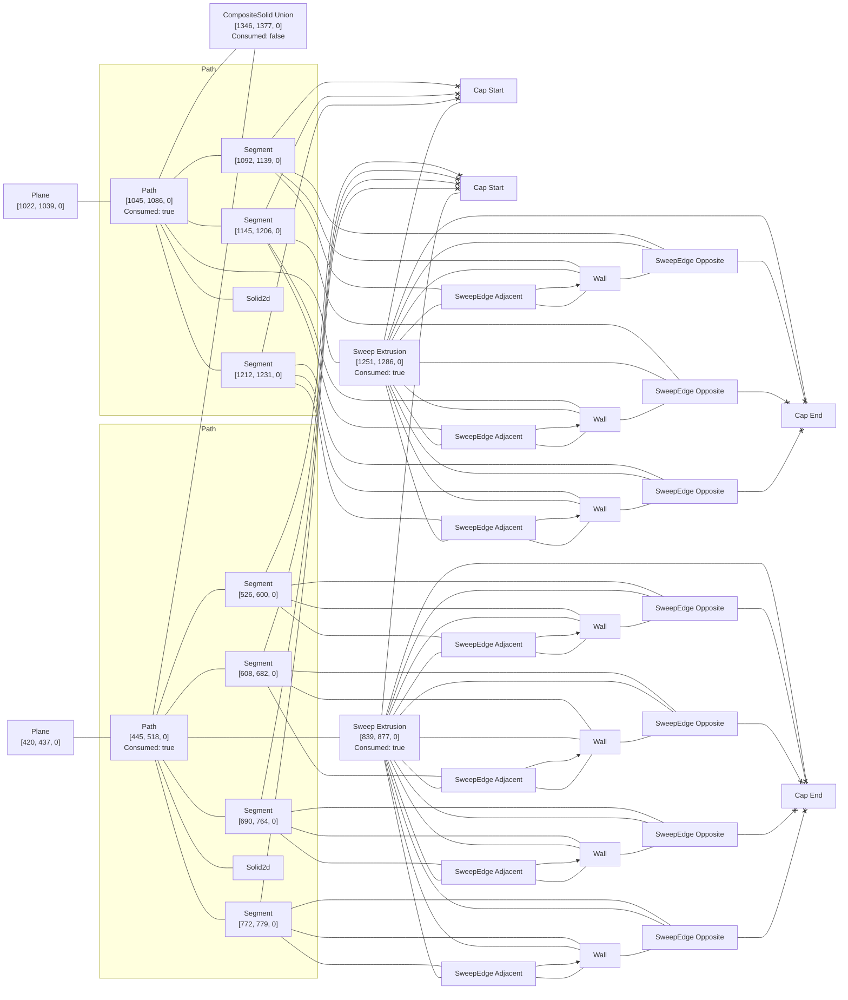

```mermaid
flowchart LR
  subgraph path7 [Path]
    7["Path<br>[445, 518, 0]<br>Consumed: true"]
      %% [ProgramBodyItem { index: 7 }, VariableDeclarationDeclaration, VariableDeclarationInit, FunctionExpressionBody, FunctionExpressionBodyItem { index: 0 }, VariableDeclarationDeclaration, VariableDeclarationInit, PipeBodyItem { index: 1 }]
    13["Segment<br>[526, 600, 0]"]
      %% [ProgramBodyItem { index: 7 }, VariableDeclarationDeclaration, VariableDeclarationInit, FunctionExpressionBody, FunctionExpressionBodyItem { index: 0 }, VariableDeclarationDeclaration, VariableDeclarationInit, PipeBodyItem { index: 2 }]
    14["Segment<br>[608, 682, 0]"]
      %% [ProgramBodyItem { index: 7 }, VariableDeclarationDeclaration, VariableDeclarationInit, FunctionExpressionBody, FunctionExpressionBodyItem { index: 0 }, VariableDeclarationDeclaration, VariableDeclarationInit, PipeBodyItem { index: 3 }]
    15["Segment<br>[690, 764, 0]"]
      %% [ProgramBodyItem { index: 7 }, VariableDeclarationDeclaration, VariableDeclarationInit, FunctionExpressionBody, FunctionExpressionBodyItem { index: 0 }, VariableDeclarationDeclaration, VariableDeclarationInit, PipeBodyItem { index: 4 }]
    16["Segment<br>[772, 779, 0]"]
      %% [ProgramBodyItem { index: 7 }, VariableDeclarationDeclaration, VariableDeclarationInit, FunctionExpressionBody, FunctionExpressionBodyItem { index: 0 }, VariableDeclarationDeclaration, VariableDeclarationInit, PipeBodyItem { index: 5 }]
    18[Solid2d]
  end
  subgraph path6 [Path]
    6["Path<br>[1045, 1086, 0]<br>Consumed: true"]
      %% [ProgramBodyItem { index: 9 }, VariableDeclarationDeclaration, VariableDeclarationInit, PipeBodyItem { index: 1 }]
    10["Segment<br>[1092, 1139, 0]"]
      %% [ProgramBodyItem { index: 9 }, VariableDeclarationDeclaration, VariableDeclarationInit, PipeBodyItem { index: 2 }]
    11["Segment<br>[1145, 1206, 0]"]
      %% [ProgramBodyItem { index: 9 }, VariableDeclarationDeclaration, VariableDeclarationInit, PipeBodyItem { index: 3 }]
    12["Segment<br>[1212, 1231, 0]"]
      %% [ProgramBodyItem { index: 9 }, VariableDeclarationDeclaration, VariableDeclarationInit, PipeBodyItem { index: 4 }]
    17[Solid2d]
  end
  9["Plane<br>[420, 437, 0]"]
    %% [ProgramBodyItem { index: 7 }, VariableDeclarationDeclaration, VariableDeclarationInit, FunctionExpressionBody, FunctionExpressionBodyItem { index: 0 }, VariableDeclarationDeclaration, VariableDeclarationInit, PipeBodyItem { index: 0 }]
  20["Sweep Extrusion<br>[839, 877, 0]<br>Consumed: true"]
    %% [ProgramBodyItem { index: 7 }, VariableDeclarationDeclaration, VariableDeclarationInit, FunctionExpressionBody, FunctionExpressionBodyItem { index: 1 }, ReturnStatementArg]
  38[Wall]
    %% face_code_ref=Missing NodePath
  39[Wall]
    %% face_code_ref=Missing NodePath
  40[Wall]
    %% face_code_ref=Missing NodePath
  41[Wall]
    %% face_code_ref=Missing NodePath
  4["Cap Start"]
    %% face_code_ref=Missing NodePath
  2["Cap End"]
    %% face_code_ref=Missing NodePath
  31["SweepEdge Opposite"]
  24["SweepEdge Adjacent"]
  32["SweepEdge Opposite"]
  25["SweepEdge Adjacent"]
  33["SweepEdge Opposite"]
  26["SweepEdge Adjacent"]
  34["SweepEdge Opposite"]
  27["SweepEdge Adjacent"]
  8["Plane<br>[1022, 1039, 0]"]
    %% [ProgramBodyItem { index: 9 }, VariableDeclarationDeclaration, VariableDeclarationInit, PipeBodyItem { index: 0 }]
  19["Sweep Extrusion<br>[1251, 1286, 0]<br>Consumed: true"]
    %% [ProgramBodyItem { index: 10 }, VariableDeclarationDeclaration, VariableDeclarationInit, PipeBodyItem { index: 0 }]
  35[Wall]
    %% face_code_ref=Missing NodePath
  36[Wall]
    %% face_code_ref=Missing NodePath
  37[Wall]
    %% face_code_ref=Missing NodePath
  3["Cap Start"]
    %% face_code_ref=Missing NodePath
  1["Cap End"]
    %% face_code_ref=Missing NodePath
  28["SweepEdge Opposite"]
  21["SweepEdge Adjacent"]
  29["SweepEdge Opposite"]
  22["SweepEdge Adjacent"]
  30["SweepEdge Opposite"]
  23["SweepEdge Adjacent"]
  5["CompositeSolid Union<br>[1346, 1377, 0]<br>Consumed: false"]
    %% [ProgramBodyItem { index: 11 }, VariableDeclarationDeclaration, VariableDeclarationInit]
  19 --- 1
  28 <--x 1
  29 <--x 1
  30 <--x 1
  20 --- 2
  31 <--x 2
  32 <--x 2
  33 <--x 2
  34 <--x 2
  10 <--x 3
  11 <--x 3
  12 <--x 3
  19 --- 3
  13 <--x 4
  14 <--x 4
  15 <--x 4
  16 <--x 4
  20 --- 4
  6 --- 5
  7 --- 5
  8 --- 6
  6 --- 10
  6 --- 11
  6 --- 12
  6 --- 17
  6 ---- 19
  9 --- 7
  7 --- 13
  7 --- 14
  7 --- 15
  7 --- 16
  7 --- 18
  7 ---- 20
  10 --- 21
  10 --- 28
  10 --- 35
  11 --- 22
  11 --- 29
  11 --- 36
  12 --- 23
  12 --- 30
  12 --- 37
  13 --- 24
  13 --- 31
  13 --- 38
  14 --- 25
  14 --- 32
  14 --- 39
  15 --- 26
  15 --- 33
  15 --- 40
  16 --- 27
  16 --- 34
  16 --- 41
  19 --- 21
  19 --- 22
  19 --- 23
  19 --- 28
  19 --- 29
  19 --- 30
  19 --- 35
  19 --- 36
  19 --- 37
  20 --- 24
  20 --- 25
  20 --- 26
  20 --- 27
  20 --- 31
  20 --- 32
  20 --- 33
  20 --- 34
  20 --- 38
  20 --- 39
  20 --- 40
  20 --- 41
  35 --- 21
  21 x--> 35
  36 --- 22
  22 x--> 36
  37 --- 23
  23 x--> 37
  38 --- 24
  24 x--> 38
  39 --- 25
  25 x--> 39
  40 --- 26
  26 x--> 40
  41 --- 27
  27 x--> 41
  35 --- 28
  36 --- 29
  37 --- 30
  38 --- 31
  39 --- 32
  40 --- 33
  41 --- 34
```
