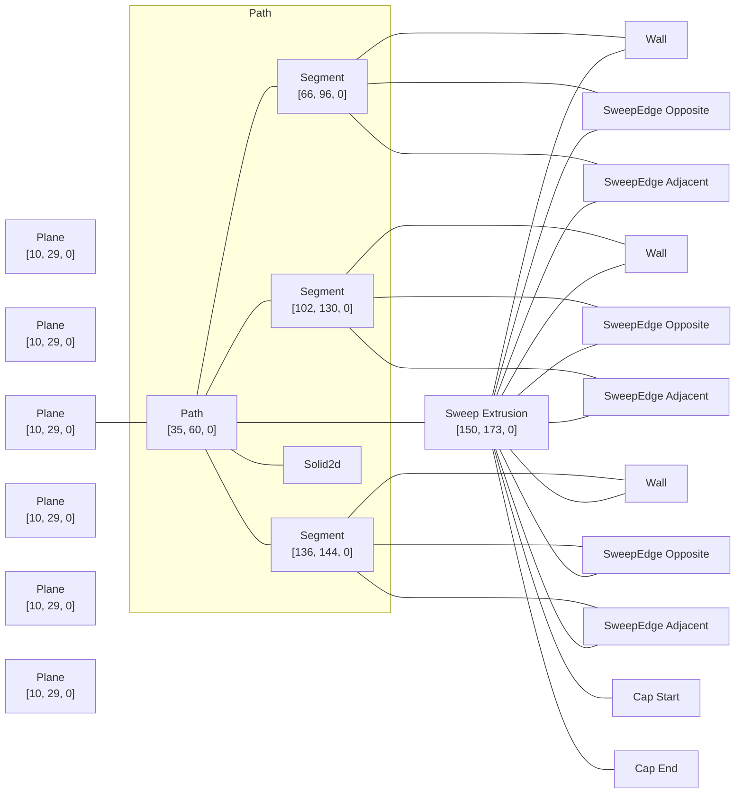

```mermaid
flowchart LR
  subgraph path7 [Path]
    7["Path<br>[35, 60, 0]"]
    8["Segment<br>[66, 96, 0]"]
    9["Segment<br>[102, 130, 0]"]
    10["Segment<br>[136, 144, 0]"]
    11[Solid2d]
  end
  1["Plane<br>[10, 29, 0]"]
  2["Plane<br>[10, 29, 0]"]
  3["Plane<br>[10, 29, 0]"]
  4["Plane<br>[10, 29, 0]"]
  5["Plane<br>[10, 29, 0]"]
  6["Plane<br>[10, 29, 0]"]
  12["Sweep Extrusion<br>[150, 173, 0]"]
  13[Wall]
  14[Wall]
  15[Wall]
  16["Cap Start"]
  17["Cap End"]
  18["SweepEdge Opposite"]
  19["SweepEdge Adjacent"]
  20["SweepEdge Opposite"]
  21["SweepEdge Adjacent"]
  22["SweepEdge Opposite"]
  23["SweepEdge Adjacent"]
  3 --- 7
  7 --- 8
  7 --- 9
  7 --- 10
  7 ---- 12
  7 --- 11
  8 --- 15
  8 --- 22
  8 --- 23
  9 --- 14
  9 --- 20
  9 --- 21
  10 --- 13
  10 --- 18
  10 --- 19
  12 --- 13
  12 --- 14
  12 --- 15
  12 --- 16
  12 --- 17
  12 --- 18
  12 --- 19
  12 --- 20
  12 --- 21
  12 --- 22
  12 --- 23
```
