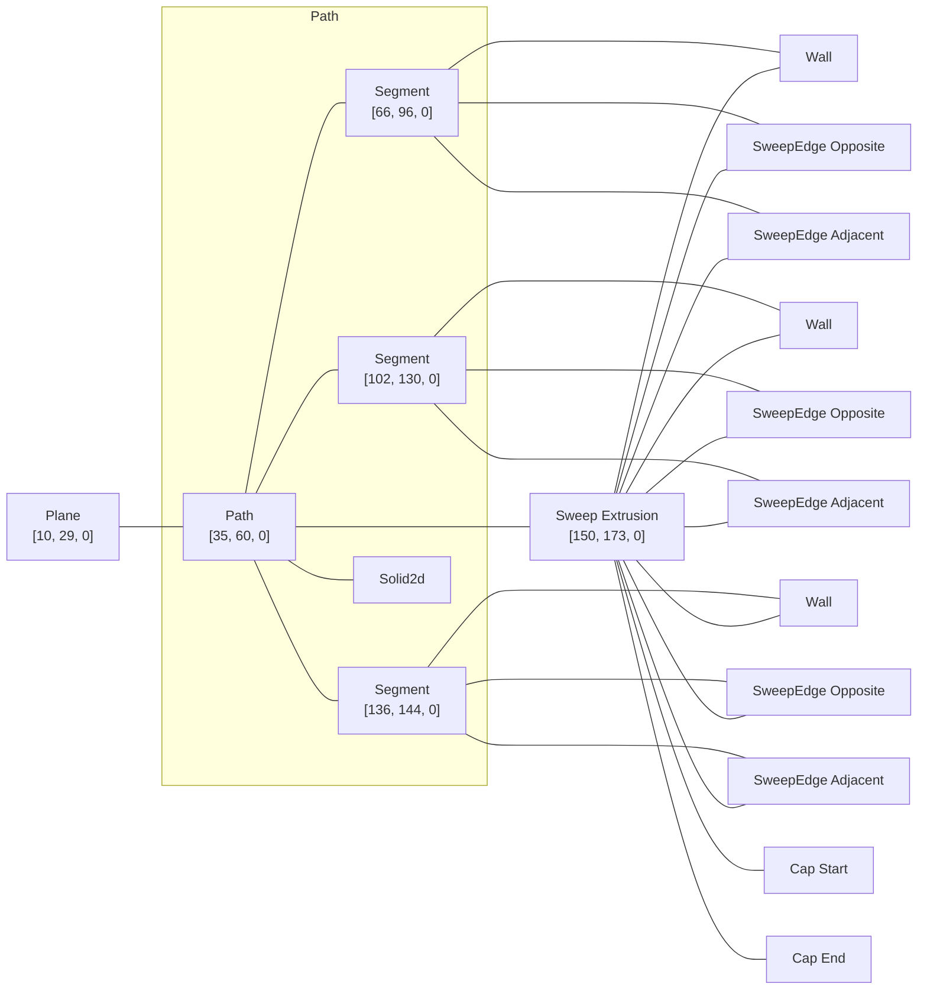

```mermaid
flowchart LR
  subgraph path2 [Path]
    2["Path<br>[35, 60, 0]"]
    3["Segment<br>[66, 96, 0]"]
    4["Segment<br>[102, 130, 0]"]
    5["Segment<br>[136, 144, 0]"]
    6[Solid2d]
  end
  1["Plane<br>[10, 29, 0]"]
  7["Sweep Extrusion<br>[150, 173, 0]"]
  8[Wall]
  9[Wall]
  10[Wall]
  11["Cap Start"]
  12["Cap End"]
  13["SweepEdge Opposite"]
  14["SweepEdge Adjacent"]
  15["SweepEdge Opposite"]
  16["SweepEdge Adjacent"]
  17["SweepEdge Opposite"]
  18["SweepEdge Adjacent"]
  1 --- 2
  2 --- 3
  2 --- 4
  2 --- 5
  2 ---- 7
  2 --- 6
  3 --- 10
  3 --- 17
  3 --- 18
  4 --- 9
  4 --- 15
  4 --- 16
  5 --- 8
  5 --- 13
  5 --- 14
  7 --- 8
  7 --- 9
  7 --- 10
  7 --- 11
  7 --- 12
  7 --- 13
  7 --- 14
  7 --- 15
  7 --- 16
  7 --- 17
  7 --- 18
```
