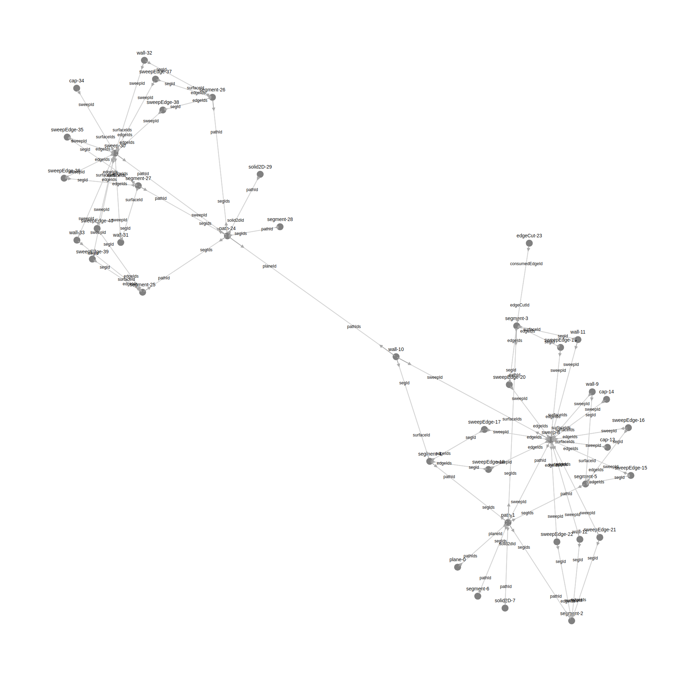

## Artifact Graph

#### What it does

The artifact graph's primary role is to map geometry artifacts in the 3d-scene/engine, to the code/AST such that when the engine sends the FE an id of some piece of geometry (say because the user clicked on something) then we know both what it is, and how it relates to the user's code.

Relating it to a user's code is important because this is how we drive our AST-mods, say a user clicks a segment and wants to constrain it horizontally, because of the artifact graph we know that their selection was in fact a specific `line(...)` callExpression, and now we're able to transform this to `xLine(...)` in order to constrain it.

#### How to reason about the graph

Here is what roughly what the artifact graph looks like

The best way to read this is starting with the plane at the bottom and going upwards, as this is roughly the command order (which the graph is based on).
Here's an explanation:

- plane is created (kcl:`startSketchOn`, command: `enable_sketch_mode`)
- path is created, needs to refer to the plane that the sketch is on (kcl:`startProfileAt`, command: `start_path`)
- each segment that is created (kcl: `line`, command: `extend_path`) must refer back to the path.
- Once we're read to extrude (kcl: `extrude`, command: `extrude`) it much refer to the path.
- The extrude created a bunch of faces, edges etc, each of these relates back to the extrude command and the segment call expression, but there's no direct bit of kcl to refer to.

The above is probably enough to give more examples of how the graph is used.

- When a user hovers over a segment, the engine sends us the id of the segment, we can look it up directly in the graph, and we store pointers to the code in the graph, This allows use to highlight the `line(...)` call expression in the code.
- Same as above but the user hovers over a extrude wall-face, the engine sends us this id, we look it up in the graph, but there's no pointer to the code in this node. We can then traverse to both the segment and the extrude nodes to get source ranges for `line(...)` and `extrude(...)` and highlight them both.

Other things to point out is that a new path can be created directly on a wall-face, i.e. this is sketch on face, and more than one path can point to the same plane, that is multiple profiles on the same plane.

#### Generated Graphs

The image above is hand drawn for grokablitiy, but it's useful to look at a real graph, take this bit of geometry

In `src/lang/std/artifactGraph.test.ts` we generate the graph for it

It's definitely harder to read, if you start at roughly the bottom center of the page and find the node `plane-0` and visually traverse from there you can see it has teh same structure, plane is connected to a path, which is connected to multiple segments and an extrusion etc.

Generating the graph here serves a couple of purposes

1. Allows us to sanity check the graph, in development or as a debug tool.
2. Is a form of test and regression check. The code that creates the node and edges would error if we tried to create an edge to a node that didn't exist, this gives us some confidence that the graph is correct. Also because we want want to be able to traverse the graph in both directions, checking each edge has an arrowhead going both directions is a good check. Lastly this images are generated and committed as part of CI, if something changes in the graph, we'll notice.

We'll need to add more sample code to `src/lang/std/artifactGraph.test.ts` to generate more graphs, to test more kcl API as the app continues development.
