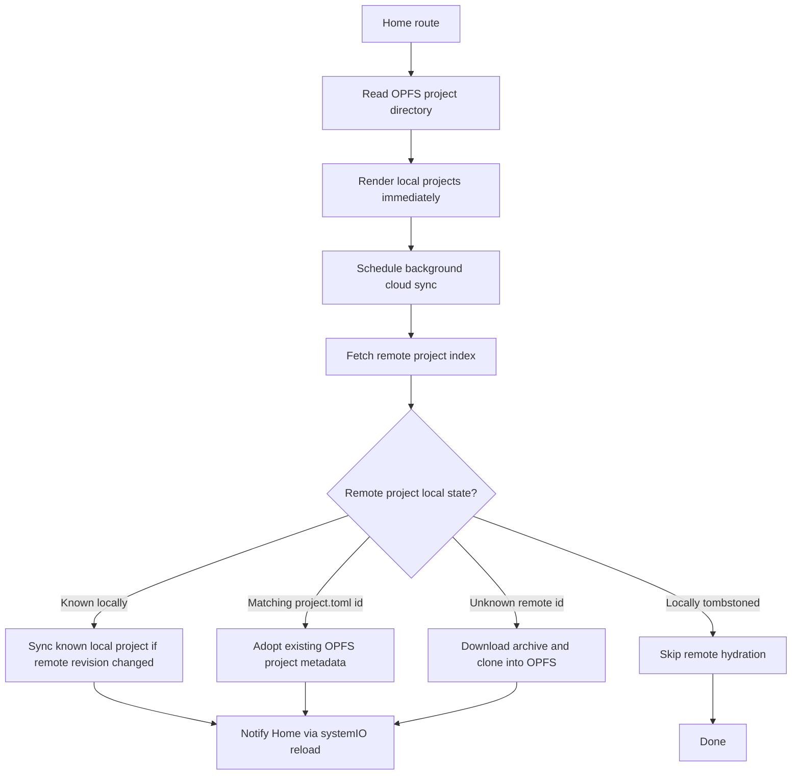
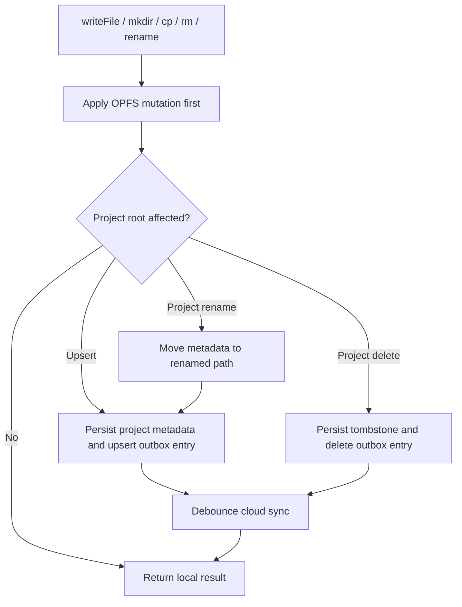
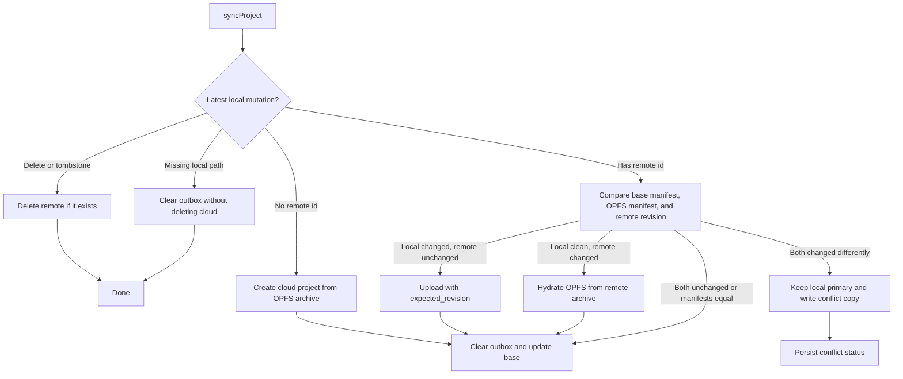
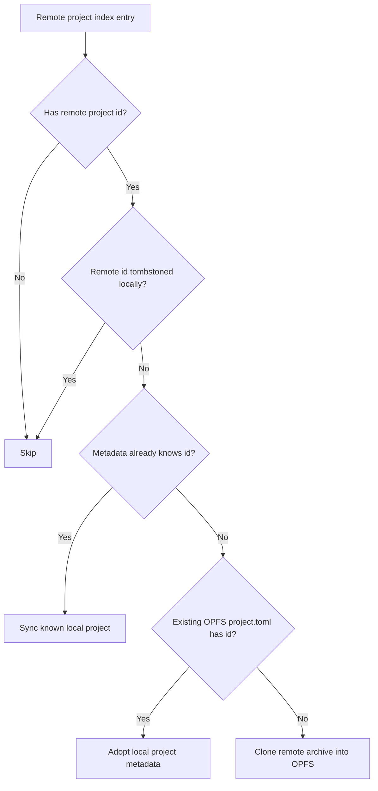

# Cloud Sync Engine

`src/lib/cloudSync` is the local-first sync engine used by the cloud sync plugin and service extension. User-visible file system operations go through the normal app filesystem first, while cloud replication runs in the background through a durable metadata store and outbox.

## Sync Flows

### Local Reads And Home Loading

### Local Mutations

### Project Sync Decisions

### Remote Index Decisions

## Invariants

- OPFS is the user-visible source of truth for reads, writes, and deletes.
- Cloud sync must not block local reads, local writes, local project creation, or local project open.
- Every local mutation that affects a project persists durable metadata and an outbox entry before cloud work runs.
- Returning to a visible browser tab schedules an immediate remote-index check, bypassing the normal remote-index throttle.
- Remote updates must send `expected_revision`; creates and deletes are the only unguarded remote writes.
- A remote-only project discovered from the cloud index must be cloned into OPFS so later loads can hit local storage first.
- A remotely deleted project may remove the local OPFS mirror only when that local mirror still matches the last synced base.
- Remote hydration may replace OPFS only when local is clean relative to the last synced base.
- If local and remote both changed differently, local remains primary and the remote archive is written as a conflict copy.
- Sync failures must preserve outbox and dirty metadata.
- Cloud project title is user-facing metadata; the OPFS folder name is an implementation detail that may be uniquified.

## Persistent State

Cloud sync state is stored outside React state so it can survive page reloads and tab closes.

- `ProjectMetadata.remoteProjectId` binds a local project directory to a cloud project.
- `ProjectMetadata.remoteRevision` stores the last cloud-acknowledged remote revision for the local base.
- `ProjectMetadata.remoteUpdatedAt` stores the cloud project's last updated timestamp for Home sorting while the local cache is clean.
- `ProjectMetadata.baseManifest` stores the last cloud-acknowledged local file manifest.
- `ProjectMetadata.tombstone` records an explicit local project delete.
- `ProjectMetadata.conflict` records a blocked sync and the local path of the remote conflict copy.
- `ProjectMetadata.lastFailure` records the latest sync error without clearing dirty state.
- The outbox records durable `upsert` and `delete` work by project path.

## Versioning Considerations

The engine treats `remoteRevision` plus `baseManifest` as the sync base. The base is updated only after a successful cloud create, guarded cloud update, clean remote pull, or equality check.

Local dirtiness is detected by comparing the current OPFS manifest with `baseManifest`. Remote dirtiness is detected by comparing the cloud project revision with `remoteRevision`. The cloud API's `revision` field is preferred; `updated_at` is only a fallback for older responses.

The OPFS directory modified time represents local cache writes. For cloud-backed projects, Home uses `remoteUpdatedAt` as the modified sort key only when the durable outbox has no pending local changes for that project. Pending local writes keep using the OPFS directory modified time so local edits sort immediately.

Remote updates use optimistic concurrency by sending `expected_revision`. The upload is only valid if the server is still at the revision recorded in `ProjectMetadata.remoteRevision`. If the server revision changed, the API must reject the update so this engine does not overwrite newer remote data.

Remote creates do not have an expected revision because there is no remote base yet. After create succeeds, the returned remote id and revision become the local sync base.

Remote deletes are intentionally not revision-guarded. A project-root `rm` records an explicit tombstone, then the sync worker deletes the remote project if it exists and ignores missing remote projects. Missing local directories are not treated as destructive cloud deletes unless there is a tombstone or queued delete.

If a remote project disappears from the cloud index, the local mirror is removed only when its manifest still matches `ProjectMetadata.baseManifest` and it has no pending local outbox work. Dirty or unverifiable local projects are detached from the missing remote id and queued as local-first projects so user data is preserved and the stale id does not keep retrying a 404.

Remote hydration is only allowed to replace OPFS when the local project is clean relative to `baseManifest`, or when an unknown remote project is being cloned into a new local path. If both local and remote changed since the base, the local project remains primary and the remote archive is written to a conflict project.

This implementation is whole-project archive based. It does not attempt file-level merging because the cloud API does not expose file-level revisions. A remote revision must therefore change on every successful project archive update; otherwise a remote change can be missed.

When a cloud title changes, the title is written into `project.toml` only when that can be done without overwriting local edits. The local project directory name is treated as an implementation detail and may differ from the cloud title when uniqueness requires it.
