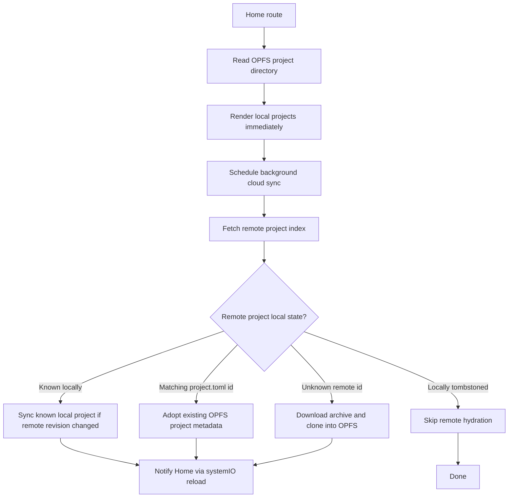
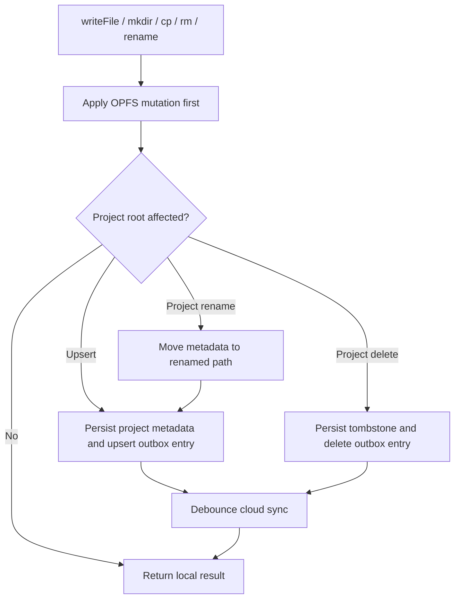
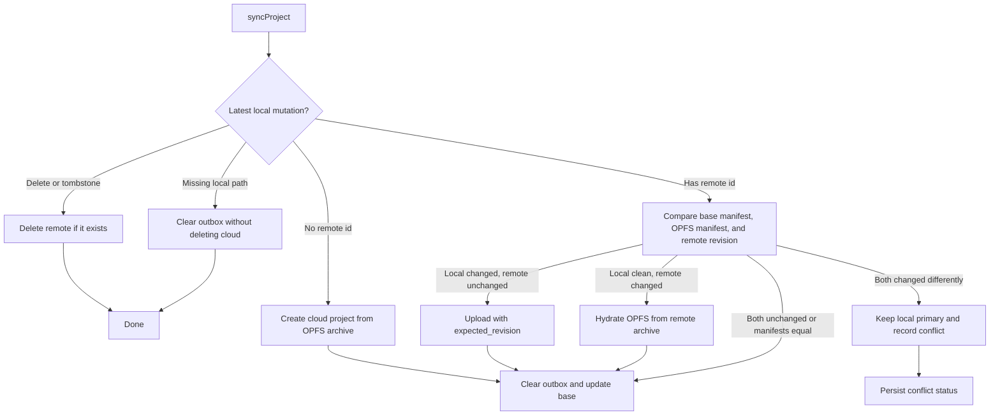
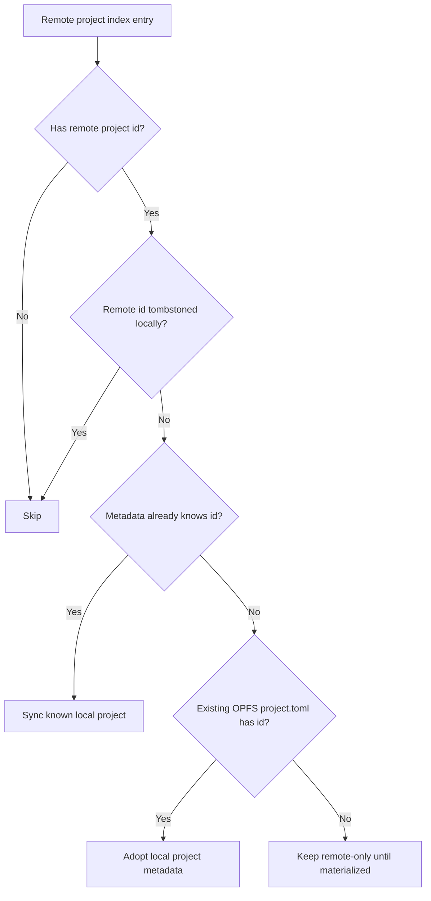

# Cloud Sync Engine

`src/lib/cloudSync` is the local-first sync engine used by the cloud sync plugin and service extension. User-visible file system operations go through the normal app filesystem first, while cloud replication runs in the background through a durable metadata store and outbox.

## Registry Shape

The cloud sync subsystem has both always-on infrastructure and toggleable runtime behavior. The implementation lives with the domain code:

- `registry/contract.ts` defines the service shape other app code can depend on.
- `registry/extension.ts` provides the always-on cloud sync service to the app registry.
- `registry/plugin.tsx` defines the user-toggleable plugin UI and status-bar contribution.

The files under `src/registry/extensions/cloudSync`, `src/registry/plugins/cloudSync`, and `src/registry/contracts/cloudSync.ts` are intentionally thin shims for registry discovery and compatibility with existing import paths.

## Libraries and disk persistence

The cloud sync system supports syncing on a per-project basis. However, cloud sync also pairs with our project library capability to register a "cloud" library type to the application, which maps local project directories to user cloud libraries. At present, we only support a "personal" cloud library in our API (see [our docs](https://zoo.dev/docs/developer-tools/api/projects)), and the location on the disk where this library's contents are synced locally is not editable by users. The chosen locations are:
- On web: `<opfs-root>/documents/zoo-design-studio-projects`
- Linux: `~/Zoo/personal`
- Windows: `%USERPROFILE%\Zoo\personal`
- macOS: `~/Library/CloudStorage/Zoo/personal`, by macOS convention

## Product Policies

Cloud sync is technically keyed by per-project `project.toml` IDs, but the user-facing model is library membership. A project is normally made cloud-backed by moving it into a cloud-type project library, and made local-only by moving it out of a cloud-type project library.

### Moving projects between libraries

- Directory -> Cloud: move the local project directory into the Personal Cloud storage directory. If cloud sync is enabled, explicitly enroll the moved project with `startProjectSync`. If the project already has a valid cloud project ID, the engine may bind to that remote project; otherwise the next sync creates one.
- Cloud -> Directory: treat this as "make local-only." Before the filesystem move, run the user-initiated disconnect flow: remove the local `project.toml` cloud project ID, clear pending cloud sync work, mark the local project `syncExcluded` with `reason: "user-disconnected"`, delete the remote cloud project, and update the remote project index. If remote deletion fails, the disconnect restores the local cloud link and the move should fail rather than leaving a half-detached project.
- Cloud -> Cloud: if we add multiple cloud-type libraries, moving between them should preserve the cloud binding. Do not disconnect unless the target library type is not cloud.
- Directory -> Directory: leave cloud sync state alone. This preserves support for individually synced projects outside cloud-type libraries.
- Library move availability is a declared library-type capability. Libraries whose type does not implement `moveProjectFrom` or `moveProjectTo` must not appear as move sources or targets. Future read-only/virtual types such as "recents" should omit both capabilities.

### Deleting projects

Deleting a cloud-backed project means deleting the project everywhere. This applies both to projects in cloud-type libraries and to individually synced projects shown in directory-type libraries.

- Local materialized cloud project: remove the local project directory and delete the linked remote cloud project before reporting success. The filesystem observer may enqueue a tombstone as part of the local delete, but product actions must not rely on background sync as the only remote deletion path.
- Remote-only cloud project: delete the remote cloud project. There is no local materialization to remove.
- Local-only directory project: remove only the local project directory.
- If the remote delete fails for a cloud-backed project, the delete action should fail rather than show success while the cloud project can still reappear from the remote index.

## Sync Flows

### Local Reads And Home Loading

```mermaid
flowchart TD
  Home["Home route"] --> ReadLocal["Read OPFS project directory"]
  ReadLocal --> RenderLocal["Render local projects immediately"]
  RenderLocal --> ScheduleSync["Schedule background cloud sync"]
  ScheduleSync --> RemoteIndex["Fetch remote project index"]
  RemoteIndex --> RemoteDecision{"Remote project local state?"}
  RemoteDecision -->|"Known locally"| ReconcileKnown["Sync known local project if remote revision changed"]
  RemoteDecision -->|"Matching project.toml id"| AdoptLocal["Adopt existing OPFS project metadata"]
  RemoteDecision -->|"Unknown remote id"| CloneRemote["Download archive and clone into OPFS"]
  RemoteDecision -->|"Locally tombstoned"| SkipRemote["Skip remote hydration"]
  ReconcileKnown --> NotifyHome["Notify Home via systemIO reload"]
  AdoptLocal --> NotifyHome
  CloneRemote --> NotifyHome
  SkipRemote --> Done["Done"]
```

### Local Mutations

```mermaid
flowchart TD
  Operation["writeFile / mkdir / cp / rm / rename"] --> ApplyOPFS["Apply OPFS mutation first"]
  ApplyOPFS --> DetermineRoot{"Project root affected?"}
  DetermineRoot -->|"No"| ReturnLocal["Return local result"]
  DetermineRoot -->|"Upsert"| PersistUpsert["Persist project metadata and upsert outbox entry"]
  DetermineRoot -->|"Project delete"| PersistTombstone["Persist tombstone and delete outbox entry"]
  DetermineRoot -->|"Project rename"| MoveMetadata["Move metadata to renamed path"]
  MoveMetadata --> PersistUpsert
  PersistUpsert --> SchedulePush["Debounce cloud sync"]
  PersistTombstone --> SchedulePush
  SchedulePush --> ReturnLocal
```

### Project Sync Decisions

```mermaid
flowchart TD
  SyncProject["syncProject"] --> LatestMutation{"Latest local mutation?"}
  LatestMutation -->|"Delete or tombstone"| DeleteRemote["Delete remote if it exists"]
  LatestMutation -->|"Missing local path"| ForgetLocal["Clear outbox without deleting cloud"]
  LatestMutation -->|"No remote id"| CreateRemote["Create cloud project from OPFS archive"]
  LatestMutation -->|"Has remote id"| CompareBase["Compare base manifest, OPFS manifest, and remote revision"]
  CompareBase -->|"Local changed, remote unchanged"| PushGuarded["Upload with expected_revision"]
  CompareBase -->|"Local clean, remote changed"| PullRemote["Hydrate OPFS from remote archive"]
  CompareBase -->|"Both unchanged or manifests equal"| MarkSynced["Clear outbox and update base"]
  CompareBase -->|"Both changed differently"| Conflict["Keep local primary and record conflict"]
  DeleteRemote --> Done["Done"]
  ForgetLocal --> Done
  CreateRemote --> MarkSynced
  PushGuarded --> MarkSynced
  PullRemote --> MarkSynced
  Conflict --> Blocked["Persist conflict status"]
```

### Remote Index Decisions

```mermaid
flowchart TD
  RemoteIndex["Remote project index entry"] --> HasId{"Has remote project id?"}
  HasId -->|"No"| Skip["Skip"]
  HasId -->|"Yes"| Tombstone{"Remote id tombstoned locally?"}
  Tombstone -->|"Yes"| Skip
  Tombstone -->|"No"| KnownMetadata{"Metadata already knows id?"}
  KnownMetadata -->|"Yes"| SyncKnown["Sync known local project"]
  KnownMetadata -->|"No"| MatchingToml{"Existing OPFS project.toml has id?"}
  MatchingToml -->|"Yes"| Adopt["Adopt local project metadata"]
  MatchingToml -->|"No"| IndexRemote["Keep remote-only until materialized"]
```

## Invariants

- OPFS is the user-visible source of truth for reads, writes, and deletes.
- Cloud sync must not block local reads, local writes, local project creation, or local project open.
- Every local mutation that affects a project persists durable metadata and an outbox entry before cloud work runs.
- Returning to a visible browser tab schedules an immediate remote-index check, bypassing the normal remote-index throttle.
- Remote updates must send `expected_revision`; creates and deletes are the only unguarded remote writes.
- A remote-only project discovered from the cloud index may remain remote-only; local materialization happens when a caller explicitly opens or moves it into a local library.
- A remotely deleted project may remove the local OPFS mirror only when that local mirror still matches the last synced base.
- Remote hydration may replace OPFS only when local is clean relative to the last synced base.
- If local and remote both changed differently, local remains primary and the conflict stores the remote revision/update metadata. The cloud archive is fetched on demand for inspection or resolution.
- Sync failures must preserve outbox and dirty metadata.
- Cloud project title is user-facing metadata; the OPFS folder name is an implementation detail that may be uniquified.
- Home rename of a cloud project acts on the local materialization when one exists and acts directly on the remote project when the project is still remote-only. Because the cloud API has no title-only update, a remote-only rename re-uploads the downloaded project archive with the new title under `expected_revision`.
- Home delete of a cloud-backed project must remove both the local materialization, when present, and the linked remote project before reporting success.

## Persistent State

Cloud sync state is stored outside React state so it can survive page reloads and tab closes.

- `ProjectMetadata.remoteProjectId` binds a local project directory to a cloud project.
- `ProjectMetadata.remoteRevision` stores the last cloud-acknowledged remote revision for the local base.
- `ProjectMetadata.remoteUpdatedAt` stores the cloud project's last updated timestamp for Home sorting while the local cache is clean.
- `ProjectMetadata.baseManifest` stores the last cloud-acknowledged local file manifest.
- `ProjectMetadata.tombstone` records an explicit local project delete.
- `ProjectMetadata.conflict` records a blocked sync plus the cloud revision/update metadata reviewed during conflict resolution. Legacy `conflictProjectPath` values are used only to clean up old conflict-copy folders after resolution.
- `ProjectMetadata.lastFailure` records the latest sync error without clearing dirty state. `lastFailure.kind = 'remote-upload-forbidden'` identifies a readable cloud project that the current account cannot update.
- The outbox records durable `upsert` and `delete` work by project path.

## Versioning Considerations

The engine treats `remoteRevision` plus `baseManifest` as the sync base. The base is updated only after a successful cloud create, guarded cloud update, clean remote pull, or equality check.

Local dirtiness is detected by comparing the current OPFS manifest with `baseManifest`. Remote dirtiness is detected by comparing the cloud project revision with `remoteRevision`. The cloud API's `revision` field is preferred; `updated_at` is only a fallback for older responses.

The OPFS directory modified time represents local cache writes. For cloud-backed projects, Home uses `remoteUpdatedAt` as the modified sort key only when the durable outbox has no pending local changes for that project. Pending local writes keep using the OPFS directory modified time so local edits sort immediately.

Remote updates use optimistic concurrency by sending `expected_revision`. The upload is only valid if the server is still at the revision recorded in `ProjectMetadata.remoteRevision`. If the server revision changed, the API must reject the update so this engine does not overwrite newer remote data.

Remote creates do not have an expected revision because there is no remote base yet. After create succeeds, the returned remote id and revision become the local sync base.

Remote deletes are intentionally not revision-guarded. A project-root `rm` records an explicit tombstone, then the sync worker deletes the remote project if it exists and ignores missing remote projects. Missing local directories are not treated as destructive cloud deletes unless there is a tombstone or queued delete.

If a remote project disappears from the cloud index, the local mirror is removed only when its manifest still matches `ProjectMetadata.baseManifest` and it has no pending local outbox work. Dirty or unverifiable local projects are detached from the missing remote id and queued as local-first projects so user data is preserved and the stale id does not keep retrying a 404.

Remote hydration is only allowed to replace OPFS when the local project is clean relative to `baseManifest`, or when the caller explicitly materializes a remote-only project into a local library. If both local and remote changed since the base, the local project remains primary and the remote archive is fetched live when the user inspects or resolves the conflict.

This implementation is whole-project archive based. It does not attempt file-level merging because the cloud API does not expose file-level revisions. A remote revision must therefore change on every successful project archive update; otherwise a remote change can be missed.

When a cloud title changes, the title is written into `project.toml` only when that can be done without overwriting local edits. The local project directory name is treated as an implementation detail and may differ from the cloud title when uniqueness requires it.
