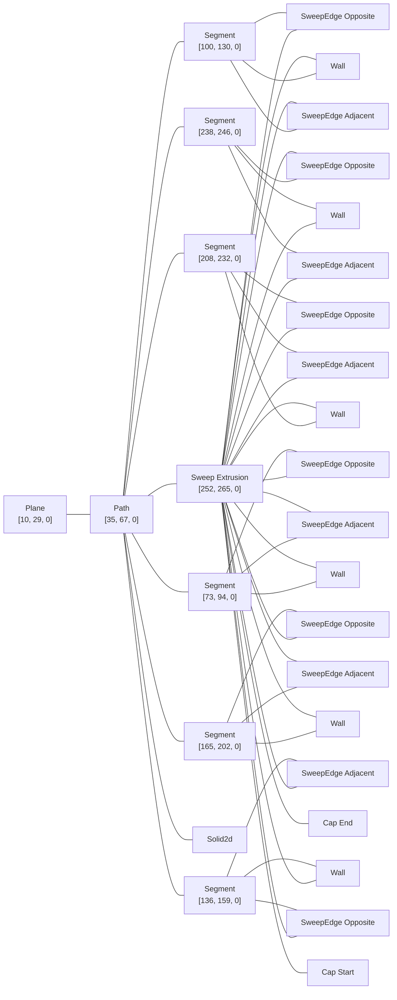

```mermaid
flowchart LR
  1["Plane<br>[10, 29, 0]"]
  2["Path<br>[35, 67, 0]"]
  3["Segment<br>[73, 94, 0]"]
  4["Segment<br>[100, 130, 0]"]
  5["Segment<br>[136, 159, 0]"]
  6["Segment<br>[165, 202, 0]"]
  7["Segment<br>[208, 232, 0]"]
  8["Segment<br>[238, 246, 0]"]
  9[Solid2d]
  10["Sweep Extrusion<br>[252, 265, 0]"]
  11[Wall]
  12[Wall]
  13[Wall]
  14[Wall]
  15[Wall]
  16[Wall]
  17["Cap Start"]
  18["Cap End"]
  19["SweepEdge Opposite"]
  20["SweepEdge Adjacent"]
  21["SweepEdge Opposite"]
  22["SweepEdge Adjacent"]
  23["SweepEdge Opposite"]
  24["SweepEdge Adjacent"]
  25["SweepEdge Opposite"]
  26["SweepEdge Adjacent"]
  27["SweepEdge Opposite"]
  28["SweepEdge Adjacent"]
  29["SweepEdge Opposite"]
  30["SweepEdge Adjacent"]
  10 --- 16
  2 --- 4
  6 --- 23
  10 --- 12
  1 --- 2
  7 --- 21
  10 --- 23
  5 --- 25
  4 --- 27
  3 --- 29
  10 --- 19
  10 --- 27
  5 --- 14
  2 --- 8
  2 --- 7
  8 --- 19
  10 --- 15
  10 --- 30
  2 --- 3
  7 --- 22
  8 --- 11
  10 --- 11
  3 --- 30
  10 --- 22
  5 --- 26
  10 --- 26
  10 --- 18
  4 --- 15
  2 --- 6
  10 --- 14
  10 --- 29
  10 --- 25
  10 --- 21
  2 --- 10
  7 --- 12
  10 --- 17
  2 --- 5
  10 --- 13
  10 --- 28
  3 --- 16
  10 --- 24
  8 --- 20
  6 --- 24
  10 --- 20
  4 --- 28
  6 --- 13
  2 --- 9
```
