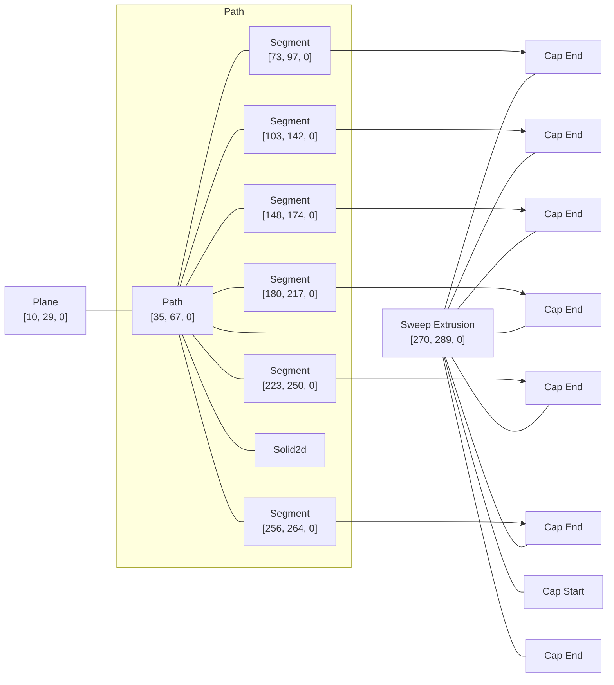

```mermaid
flowchart LR
  subgraph path2 [Path]
    2["Path<br>[35, 67, 0]"]
    3["Segment<br>[73, 97, 0]"]
    4["Segment<br>[103, 142, 0]"]
    5["Segment<br>[148, 174, 0]"]
    6["Segment<br>[180, 217, 0]"]
    7["Segment<br>[223, 250, 0]"]
    8["Segment<br>[256, 264, 0]"]
    9[Solid2d]
  end
  1["Plane<br>[10, 29, 0]"]
  10["Sweep Extrusion<br>[270, 289, 0]"]
  11["Cap End"]
  12["Cap End"]
  13["Cap End"]
  14["Cap End"]
  15["Cap End"]
  16["Cap End"]
  17["Cap Start"]
  18["Cap End"]
  1 --- 2
  2 --- 3
  2 --- 4
  2 --- 5
  2 --- 6
  2 --- 7
  2 --- 8
  2 ---- 10
  2 --- 9
  3 x--> 16
  4 x--> 15
  5 x--> 14
  6 x--> 13
  7 x--> 12
  8 x--> 11
  10 --- 11
  10 --- 12
  10 --- 13
  10 --- 14
  10 --- 15
  10 --- 16
  10 --- 17
  10 --- 18
```
