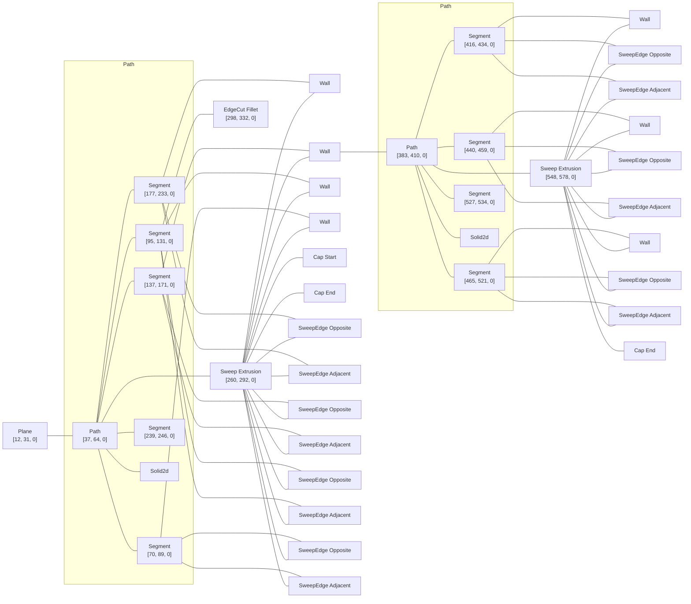

```mermaid
flowchart LR
  subgraph path2 [Path]
    2["Path<br>[37, 64, 0]"]
    3["Segment<br>[70, 89, 0]"]
    4["Segment<br>[95, 131, 0]"]
    5["Segment<br>[137, 171, 0]"]
    6["Segment<br>[177, 233, 0]"]
    7["Segment<br>[239, 246, 0]"]
    8[Solid2d]
  end
  subgraph path25 [Path]
    25["Path<br>[383, 410, 0]"]
    26["Segment<br>[416, 434, 0]"]
    27["Segment<br>[440, 459, 0]"]
    28["Segment<br>[465, 521, 0]"]
    29["Segment<br>[527, 534, 0]"]
    30[Solid2d]
  end
  1["Plane<br>[12, 31, 0]"]
  9["Sweep Extrusion<br>[260, 292, 0]"]
  10[Wall]
  11[Wall]
  12[Wall]
  13[Wall]
  14["Cap Start"]
  15["Cap End"]
  16["SweepEdge Opposite"]
  17["SweepEdge Adjacent"]
  18["SweepEdge Opposite"]
  19["SweepEdge Adjacent"]
  20["SweepEdge Opposite"]
  21["SweepEdge Adjacent"]
  22["SweepEdge Opposite"]
  23["SweepEdge Adjacent"]
  24["EdgeCut Fillet<br>[298, 332, 0]"]
  31["Sweep Extrusion<br>[548, 578, 0]"]
  32[Wall]
  33[Wall]
  34[Wall]
  35["Cap End"]
  36["SweepEdge Opposite"]
  37["SweepEdge Adjacent"]
  38["SweepEdge Opposite"]
  39["SweepEdge Adjacent"]
  40["SweepEdge Opposite"]
  41["SweepEdge Adjacent"]
  1 --- 2
  2 --- 3
  2 --- 4
  2 --- 5
  2 --- 6
  2 --- 7
  2 ---- 9
  2 --- 8
  3 --- 13
  3 --- 22
  3 --- 23
  4 --- 12
  4 --- 20
  4 --- 21
  4 --- 24
  5 --- 11
  5 --- 18
  5 --- 19
  6 --- 10
  6 --- 16
  6 --- 17
  9 --- 10
  9 --- 11
  9 --- 12
  9 --- 13
  9 --- 14
  9 --- 15
  9 --- 16
  9 --- 17
  9 --- 18
  9 --- 19
  9 --- 20
  9 --- 21
  9 --- 22
  9 --- 23
  11 --- 25
  25 --- 26
  25 --- 27
  25 --- 28
  25 --- 29
  25 ---- 31
  25 --- 30
  26 --- 34
  26 --- 40
  26 --- 41
  27 --- 33
  27 --- 38
  27 --- 39
  28 --- 32
  28 --- 36
  28 --- 37
  31 --- 32
  31 --- 33
  31 --- 34
  31 --- 35
  31 --- 36
  31 --- 37
  31 --- 38
  31 --- 39
  31 --- 40
  31 --- 41
```
